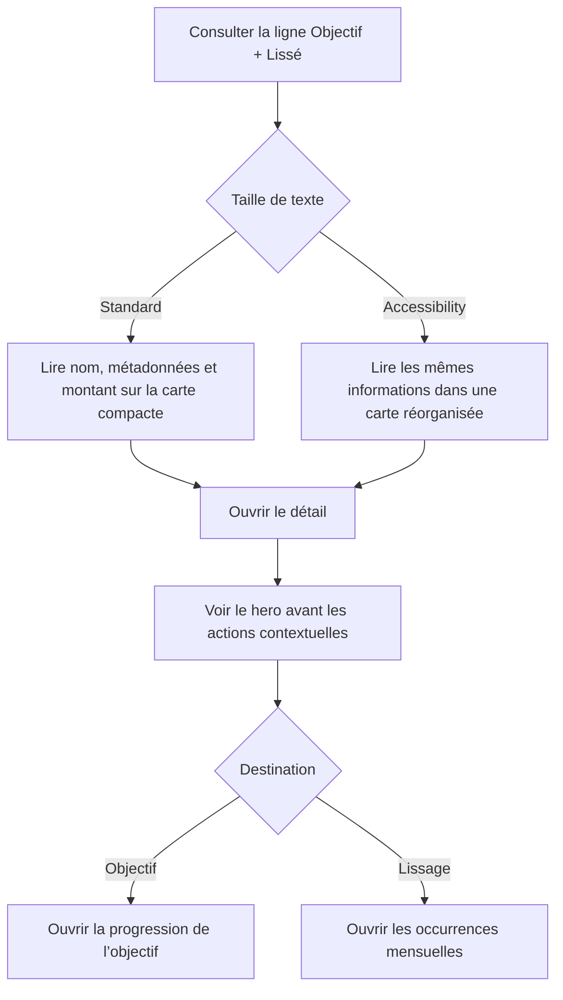

# Instruction: Rendre le correctif accessible, conforme et vérifiable

## Architecture projection

> Tree of the final files. ✅ create · ✏️ modify · ❌ delete

```txt
ios/
├── Pulpe/Features/Budgets/BudgetDetails/
│   ├── ✏️ BudgetLineMixedRow.swift                    # adapte la carte aux tailles Accessibility et revient sous 350 lignes
│   ├── ✏️ BudgetLineMixedRow+Previews.swift           # expose le cas combiné en taille standard et Accessibility 3
│   ├── ✏️ BudgetLineDetailPage.swift                  # délègue la section contextuelle et revient sous 350 lignes
│   ├── ✏️ BudgetLineDetailPage+SavingsGoalLink.swift  # possède la section objectif/lissage et son action accessible
│   └── Spread/
│       └── ✏️ SpreadAffordanceButton.swift            # porte la hitbox sur le Button
└── PulpeTests/Features/Budgets/BudgetDetails/
    └── ✏️ BudgetLinePresentationTests.swift           # aligne les noms de tests sur la convention
```

Aucun fichier de production ou de test n’est créé ni supprimé.

## User Journey



## Wireframe

### Liste du budget — taille standard

```txt
┌─────────────────────────────────────┐
│ (1) Contexte mensuel                │
├─────────────────────────────────────┤
│ (2) En-tête de section              │
│ ┌─────────────────────────────────┐ │
│ │ (3) Pointage · type             │ │
│ │     nom             montant · › │ │
│ │     métadonnées                 │ │
│ └─────────────────────────────────┘ │
│ (4) Lignes suivantes                │
└─────────────────────────────────────┘
```

1. Contexte mensuel : navigation, résumé et filtres existants.
2. En-tête de section : catégorie et nombre de Prévisions.
3. Prévision : identité et contexte à gauche, montant et indicateur de détail à droite.
4. Lignes suivantes : liste actuelle, hors périmètre du reflow.

### Liste du budget — grande taille de texte

```txt
┌─────────────────────────────────────┐
│ (1) Contexte mensuel                │
├─────────────────────────────────────┤
│ (2) En-tête de section              │
│ ┌─────────────────────────────────┐ │
│ │ (3) Pointage · type             │ │
│ │     nom                         │ │
│ │     métadonnées                 │ │
│ │     (4) montant             ›   │ │
│ └─────────────────────────────────┘ │
└─────────────────────────────────────┘
```

1. Contexte mensuel : structure existante conservée.
2. En-tête de section : repère de lecture inchangé.
3. Prévision : nom et métadonnées disposent de la largeur utile.
4. Montant : ligne dédiée qui évite la concurrence horizontale avec le texte.

### Détail d’une Prévision

```txt
┌─────────────────────────────────────┐
│ (1) Navigation                      │
├─────────────────────────────────────┤
│ (2) Identité de la Prévision        │
│                                     │
│ (3) Montant et progression          │
│                                     │
│ (4) Action contextuelle             │
│     icône · destination · ›         │
│     ─────────────────────────       │
│     icône · destination · ›         │
│                                     │
│ (5) Transactions ou état vide       │
├─────────────────────────────────────┤
│ (6) Action principale               │
└─────────────────────────────────────┘
```

1. Navigation : retour, titre et menu existants.
2. Identité : type, nom et tags de la Prévision.
3. Hero : montant et progression avant les destinations secondaires.
4. Actions contextuelles : objectif et lissage en lignes empilées qui peuvent grandir verticalement.
5. Contenu : transactions actuelles ou état vide.
6. Action principale : ajout d’une transaction, inchangé.

## Tasks to do

### `1)` Reproduire puis corriger le reflow Accessibility

> Éliminer la concurrence entre le texte et le montant sans modifier la carte standard.

1. Ajouter au fichier de previews existant une variante du cas combiné en Accessibility 3 et mode sombre ; garder la variante standard claire.
2. Sur une taille Accessibility, placer le montant et le chevron sur une ligne dédiée sous le nom et les métadonnées.
3. Autoriser le nom et les métadonnées à utiliser la hauteur nécessaire dans cette variante ; conserver le layout compact actuel aux tailles standard.
4. Préserver le pointage indépendant, les tags, les suffixes, VoiceOver et l’ouverture de la carte.
5. Condenser uniquement la documentation de layout devenue obsolète afin que `BudgetLineMixedRow.swift` reste sous la limite stricte de 350 lignes, sans créer de nouveau composant.

### `2)` Restaurer la frontière du détail et les hitboxes

> Fermer les écarts d’architecture et de cible tactile sans changer les routes.

1. Déplacer la composition complète de la section objectif/lissage dans l’extension existante `BudgetLineDetailPage+SavingsGoalLink.swift`.
2. Remplacer le bloc inline de `BudgetLineDetailPage` par un seul appel et maintenir ce fichier à 350 lignes maximum.
3. Déplacer `frame(minHeight:)` et `contentShape(Rectangle())` du label vers le `Button` pour les actions objectif et lissage.
4. Laisser le libellé objectif grandir verticalement à Accessibility 3 et conserver l’ordre objectif, séparateur éventuel, lissage.
5. Conserver les destinations exactes vers le bon objectif et le bon `spreadGroupId`.

### `3)` Fermer les preuves de revue

> Vérifier le vrai rendu sans ajouter de harness ou de suite de snapshots.

1. Renommer les trois méthodes de `BudgetLinePresentationTests` selon `descriptiveName_condition_expectedBehavior`, sans modifier leurs attentes.
2. Exécuter `BudgetLinePresentationTests` et `BudgetDetailsArchitectureTests`, puis les tests iOS ciblés de BudgetDetails.
3. Vérifier les deux écrans sur le plus petit simulateur iPhone disponible, en standard puis Accessibility 3, en modes clair et sombre.
4. Confirmer par interaction que chaque ligne contextuelle possède une cible d’au moins 44 pt et ouvre sa destination actuelle.
5. Exécuter SwiftLint strict, le build simulateur, `pnpm quality` et `git diff --check` sur le même état de travail avant la nouvelle revue.

## Test acceptance criteria

| Task | Acceptance criteria |
| --- | --- |
| 1 | À taille standard, la carte conserve la hiérarchie type → nom → métadonnées et sa colonne montant actuelle. |
| 1 | Sur le plus petit iPhone disponible à Accessibility 3, le nom, les métadonnées et le montant ne se chevauchent pas ; aucun élément utile n’est masqué par le chevron. |
| 1 | Le pointage, les tags, les suffixes, l’ouverture du détail et l’annonce VoiceOver restent identiques sur les deux layouts. |
| 1 | `BudgetLineMixedRow.swift` et tous les fichiers de BudgetDetails respectent la limite de 350 lignes sans désactivation SwiftLint. |
| 2 | `BudgetLineDetailPage.swift` contient un seul appel pour la section contextuelle et respecte la limite de 350 lignes. |
| 2 | Les actions objectif et lissage portent elles-mêmes une hitbox rectangulaire d’au moins 44 pt ; leur contenu peut grandir sans chevauchement à Accessibility 3. |
| 2 | Avec les deux destinations, l’ordre et l’unique séparateur restent cohérents ; chaque action ouvre le même objectif ou groupe de lissage qu’avant. |
| 3 | La preview combinée couvre un état clair standard et un état sombre Accessibility 3 sans dupliquer la vue de production. |
| 3 | Les tests de présentation suivent la convention de nommage et leurs attentes métier restent inchangées. |
| 3 | Les deux écrans sont lisibles en clair et sombre sur petit iPhone, et les tests ciblés, l’architecture, SwiftLint, le build et les contrôles dépôt ne rapportent aucun nouveau warning. |
