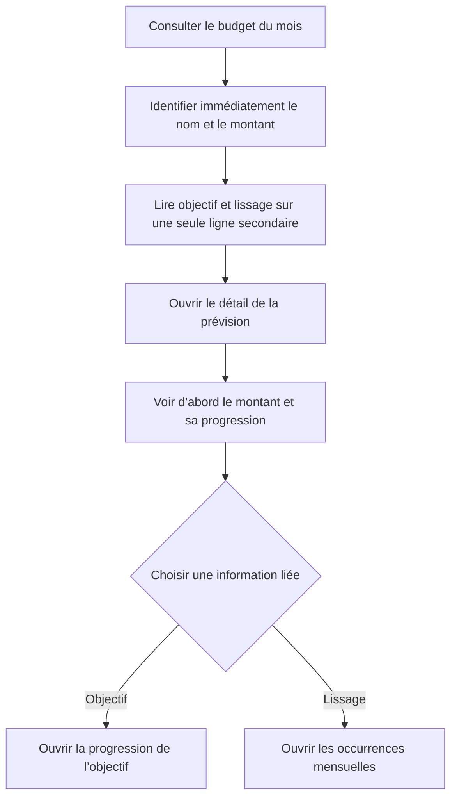

# Instruction: Compacter les métadonnées et restaurer la hiérarchie

## Architecture projection

> Tree of the final files. ✅ create · ✏️ modify · ❌ delete

```txt
ios/
├── Pulpe/
│   └── Features/Budgets/BudgetDetails/
│       ├── ✏️ BudgetLineMixedRow.swift
│       ├── ✏️ BudgetLineMixedRow+Previews.swift
│       ├── ✏️ BudgetLineDetailPage.swift
│       ├── ✏️ BudgetLineDetailPage+SavingsGoalLink.swift
│       ├── ✏️ EditTransactionPage.swift
│       └── Spread/
│           └── ✏️ SpreadAffordanceButton.swift
└── PulpeTests/Features/Budgets/BudgetDetails/
    └── ✅ BudgetLinePresentationTests.swift
```

## User Journey



## Wireframe

### Liste du budget

```txt
┌─────────────────────────────────────┐
│ (1) Navigation et résumé mensuel    │
├─────────────────────────────────────┤
│ (2) En-tête de section              │
│ ┌─────────────────────────────────┐ │
│ │ (3) Pointage · type             │ │
│ │     Libellé        montant · ›  │ │
│ │     Métadonnées liées           │ │
│ └─────────────────────────────────┘ │
│ (4) Lignes suivantes                │
└─────────────────────────────────────┘
```

1. Navigation et résumé mensuel : contexte, progression et filtres existants.
2. En-tête de section : catégorie et nombre de Prévisions.
3. Prévision : nom et montant dominants, objectif et lissage réunis en information secondaire.
4. Lignes suivantes : densité et alignements habituels de la liste.

### Détail d’une Prévision

```txt
┌─────────────────────────────────────┐
│ (1) Navigation                      │
├─────────────────────────────────────┤
│ (2) Libellé et type                 │
│                                     │
│ (3) Montant et progression          │
│                                     │
│ (4) Liens contextuels               │
│     icône · destination · ›         │
│     ─────────────────────────       │
│     icône · destination · ›         │
│                                     │
│ (5) Transactions ou état vide       │
├─────────────────────────────────────┤
│ (6) Action principale               │
└─────────────────────────────────────┘
```

1. Navigation : retour, titre inline et menu existants.
2. Libellé et type : identité de la Prévision.
3. Montant et progression : information primaire, avant toute navigation secondaire.
4. Liens contextuels : objectif et occurrences dans un groupe aligné, sans capsules concurrentes.
5. Transactions ou état vide : contenu actuel de la Prévision.
6. Action principale : ajout d’une transaction, inchangé.

## Tasks to do

### `1)` Verrouiller le cas Objectif + Lissé

> Reproduire la combinaison signalée avant de modifier les vues.

1. Ajouter un test Swift Testing pour la projection de métadonnées d’une Prévision à la fois lissée et liée à un objectif.
2. Attendre une seule chaîne ordonnée, avec le lissage et le nom de l’objectif, plutôt que deux présentations indépendantes.
3. Verrouiller aussi le libellé de navigation `Épargne lissée` pour `.saving` et `Dépense lissée` pour `.expense`.
4. Ajouter au fichier de previews existant un cas combiné représentatif de la capture.

### `2)` Compacter la ligne du budget

> Rendre le nom et le montant immédiatement scannables sans perdre les deux informations.

1. Placer le nom directement après le type de Prévision.
2. Remplacer les pills `Lissé` et objectif par une unique ligne de texte secondaire sous le nom.
3. Composer cette ligne depuis les états existants, sans nouveau modèle, store ou composant partagé.
4. Conserver les tags, le sous-titre métier, le pointage et la colonne montant actuels.
5. Inclure le lissage et l’objectif dans le libellé VoiceOver complet, même si le texte visuel est tronqué.

### `3)` Reclasser les actions du détail

> Faire passer le montant avant les destinations secondaires et unifier leurs affordances.

1. Retirer les deux pills situées entre le titre et le hero.
2. Insérer après le hero un groupe de lignes de navigation pleine largeur pour les destinations disponibles.
3. Rendre chaque ligne alignée sur la même grille, avec icône, libellé, chevron, cible tactile minimale et séparateur seulement lorsque les deux liens existent.
4. Faire accepter le `TransactionKind` à `SpreadAffordanceButton` afin d’afficher le bon nom métier, puis le fournir depuis le détail de Prévision et l’édition de Réel.
5. Conserver exactement les routes existantes vers l’objectif et les occurrences de lissage.

### `4)` Vérifier le rendu et les régressions

> Valider la densité, l’accessibilité et les parcours sans élargir le périmètre.

1. Exécuter le test ciblé puis les tests iOS du module BudgetDetails.
2. Construire l’app et vérifier les deux écrans sur le plus petit simulateur iPhone disponible, en taille de texte standard puis Accessibility 3.
3. Vérifier aussi le mode sombre, le contraste sémantique et les cibles tactiles de 44 pt.
4. Ouvrir successivement l’objectif et les occurrences pour confirmer que les destinations n’ont pas changé.
5. Lancer les contrôles qualité du dépôt avant commit.

## Test acceptance criteria

| Task | Acceptance criteria |
| ---- | ------------------- |
| 1 | Le cas combiné produit une seule métadonnée ordonnée et le test échoue tant que les deux états restent projetés séparément. |
| 1 | Une épargne lissée est nommée « Épargne lissée » et une dépense lissée « Dépense lissée ». |
| 2 | Dans la liste, le nom suit immédiatement le type et précède une seule ligne secondaire contenant objectif et lissage. |
| 2 | La carte combinée ne contient plus de `PulpeChip` pour ces métadonnées ; les lignes sans objectif ou sans lissage restent lisibles sans espace vide. |
| 2 | Le pointage, les tags, les montants, les suffixes et l’ouverture du détail restent inchangés. |
| 2 | VoiceOver annonce le nom, le montant, le pointage, le lissage et l’objectif sans dépendre de la couleur. |
| 3 | Dans le détail, le hero montant/progression apparaît avant le groupe objectif/lissage. |
| 3 | Chaque destination est une ligne de navigation cohérente d’au moins 44 pt ; avec deux destinations, un seul séparateur les distingue. |
| 3 | Les actions ouvrent toujours la progression du bon objectif et les occurrences du bon groupe de lissage. |
| 4 | En largeur étroite et Accessibility 3, le nom, le montant et les actions ne se chevauchent pas et restent actionnables. |
| 4 | Le rendu reste lisible en modes clair et sombre, et les contrôles ciblés passent sans nouveau warning de qualité. |
