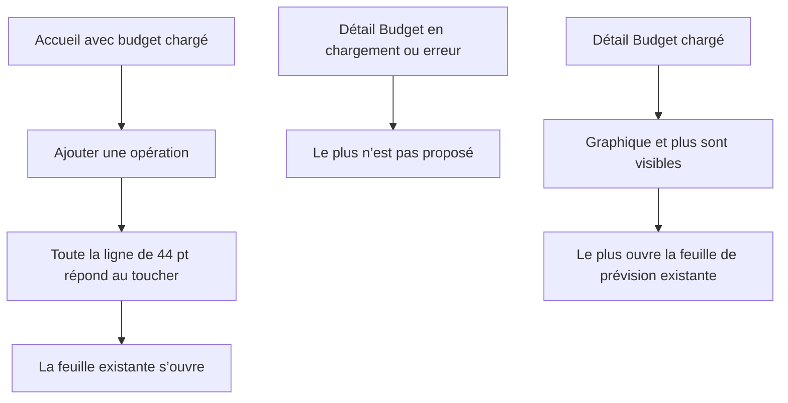

# Instruction: Corriger les contrats d’interaction

## Architecture projection

```text
ios/
├── Pulpe/
│   └── Features/
│       ├── CurrentMonth/
│       │   └── CurrentMonthView.swift                         ✏️ modify
│       └── Budgets/
│           └── BudgetDetails/
│               └── BudgetDetailsView.swift                    ✏️ modify
└── PulpeTests/
    ├── App/
    │   └── MainTabViewLayoutTests.swift                        ✏️ modify
    └── Architecture/
        └── BudgetDetailsArchitectureTests.swift                ✏️ modify
```

## User Journey



## Wireframe

```text
ACCUEIL — rendu inchangé
┌──────────────────────────────────┐
│ Solde projeté + graphique        │
│                                  │
│ ＋ Ajouter une opération          │  ← ligne visuelle actuelle
│ ──────────────────────────────── │  ← hitbox pleine largeur, ≥ 44 pt
│ À pointer / Activité             │
└──────────────────────────────────┘

BUDGET — états de toolbar
┌──────────────────────────────────┐
│ Chargement / erreur        [▥]   │  ← aucun plus sans budget
├──────────────────────────────────┤
│ Juillet                  [▥] [+] │  ← plus seulement si chargé
└──────────────────────────────────┘
```

## Tasks to do

### `1)` Verrouiller les deux régressions par test

- Étendre `MainTabViewNavigationOwnershipTests` pour isoler la chaîne de modificateurs du bouton « Ajouter une opération » et exiger, dans cet ordre fonctionnel, une hauteur minimale, `.contentShape(Rectangle())` puis `plainPressedButtonStyle`.
- Étendre `BudgetDetailsArchitectureTests` pour exiger que l’appel `router.present(.addBudgetLine)` appartienne à une branche `if screenState.isBudgetPresent` de la toolbar.
- Faire échouer les deux assertions sur l’état actuel avant de modifier les vues.

### `2)` Rendre toute la ligne Accueil activable

- Ajouter `.contentShape(Rectangle())` au `Button` « Ajouter une opération », après sa frame pleine largeur et avant `plainPressedButtonStyle`.
- Conserver la typographie, la couleur, l’alignement, la hauteur minimale et le libellé VoiceOver actuels.
- Ne pas extraire de nouveau composant : le défaut est local à cette chaîne de modificateurs.

### `3)` Masquer l’ajout Budget sans budget chargé

- Dans `ToolbarItemGroup(placement: .topBarTrailing)`, envelopper uniquement le bouton qui présente `.addBudgetLine` avec `if screenState.isBudgetPresent`.
- Conserver le bouton graphique, les labels d’accessibilité, la destination de feuille et le contenu du Budget inchangés.
- Vérifier que les états skeleton et erreur terminale ne peuvent plus ouvrir une création avec un identifiant ou une période absents.

### `4)` Exécuter les vérifications ciblées

- Régénérer le projet avec `xcodegen generate --use-cache`.
- Exécuter `xcodebuild test -scheme PulpeLocal -destination 'platform=iOS Simulator,name=iPhone 17 Pro Max,OS=26.5' -only-testing:PulpeTests/MainTabViewNavigationOwnershipTests -only-testing:PulpeTests/BudgetDetailsArchitectureTests CODE_SIGNING_ALLOWED=NO`.
- Construire avec `xcodebuild build -scheme PulpeLocal -destination 'platform=iOS Simulator,name=iPhone 17 Pro Max,OS=26.5' CODE_SIGNING_ALLOWED=NO`.

## Test acceptance criteria

| Scenario | Expected observable behavior |
|---|---|
| Accueil avec budget chargé | La ligne « Ajouter une opération » garde le même rendu et toute sa surface pleine largeur d’au moins 44 pt est interactive. |
| Accueil sans budget | L’action reste absente, comme avant le correctif. |
| Budget en chargement | La toolbar n’affiche pas « Ajouter une prévision ». |
| Budget en erreur terminale | La toolbar n’affiche pas « Ajouter une prévision ». |
| Budget chargé | Les actions « Suivi du budget » et « Ajouter une prévision » sont présentes ; le plus ouvre le routage existant. |
| Non-régression | Les deux tests ciblés et le build `PulpeLocal` réussissent sur iOS 26.5. |
