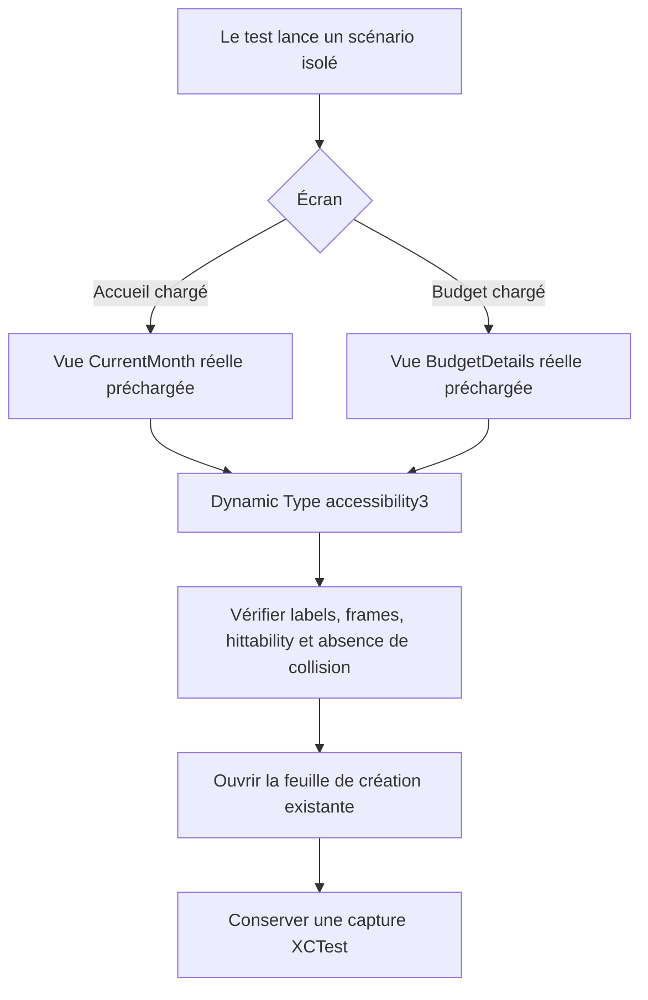

# Instruction: Prouver l’accessibilité sur les vues réelles

## Architecture projection

```text
ios/
├── Pulpe/
│   └── App/
│       ├── BudgetLongPressUITestHarness.swift                 ✏️ modify
│       ├── ContextualCreationUITestHarness.swift               ✨ create
│       └── PulpeApp.swift                                      ✏️ modify
└── PulpeUITests/
    └── ContextualCreationUITests.swift                         ✨ create
```

## User Journey



## Wireframe

```text
iPhone SE · Dynamic Type accessibility3
┌────────────────────────────┐
│ Solde projeté              │
│ …                          │
│ ＋ Ajouter une opération    │  ← visible, hittable, ≥ 44 pt
│                            │
└────────────────────────────┘

┌────────────────────────────┐
│ ‹  Juillet         [▥] [+] │  ← deux frames distinctes
│                            │
│ Résumé du budget           │
│ Prévisions                 │
└────────────────────────────┘
```

## Tasks to do

### `1)` Ajouter deux scénarios UI sans authentification

- Ajouter à `UITestLaunchScenario` deux cas explicites : Accueil avec budget chargé et détail Budget avec budget chargé.
- Router ces cas depuis `PulpeApp.uiTestHarness(for:)` vers un `ContextualCreationUITestHarness`.
- Garder l’enum dans son fichier actuel : la déplacer serait un refactor sans valeur pour ce correctif.

### `2)` Rendre les vraies vues avec des données locales

- Pour Accueil, créer les stores d’environnement existants puis précharger `CurrentMonthStore` avec `populateForTesting` et un budget de la période courante.
- Pour le détail Budget, précharger `BudgetDetailCache.shared` avec un budget minimal et `storeAllBudgets`, puis rendre `BudgetDetailsView` dans une `NavigationStack` avec son vrai `BudgetDetailsRouter`.
- Injecter les environnements déjà attendus par chaque vue et appliquer `UITEST_DYNAMIC_TYPE=accessibility3`, comme dans `SavingsGoalIntervalUITestHarness`.
- Ne pas dupliquer le bouton Accueil ou la toolbar dans le harness. Le scénario doit rester indépendant du PIN et ne pas dépendre d’une réponse backend pour afficher l’état testé.

### `3)` Tester la lisibilité et l’actionnabilité

- Dans `ContextualCreationUITests`, interroger les éléments par leurs labels VoiceOver existants : « Ajouter une opération », « Suivi du budget » et « Ajouter une prévision ».
- Vérifier pour chaque action `exists`, `isHittable` et une frame d’au moins 44 × 44 pt.
- Sur le Budget, vérifier que les frames des deux boutons trailing ne se chevauchent pas à `accessibility3`.
- Appuyer sur chaque action de création et vérifier qu’un contrôle stable de la feuille existante apparaît.
- Joindre une capture XCTest de chaque écran avant l’ouverture de la feuille.

### `4)` Valider petit écran, fallback et iOS courant

- Si aucun petit simulateur n’existe, créer une fois `Pulpe Small iOS 18.5` avec `com.apple.CoreSimulator.SimDeviceType.iPhone-SE-3rd-generation` et `com.apple.CoreSimulator.SimRuntime.iOS-18-5`.
- Exécuter `xcodebuild test -scheme PulpeUITests -destination 'platform=iOS Simulator,name=Pulpe Small iOS 18.5,OS=18.5' -only-testing:PulpeUITests/ContextualCreationUITests CODE_SIGNING_ALLOWED=NO`.
- Réexécuter le même test sur `platform=iOS Simulator,name=iPhone 17 Pro Max,OS=26.5` pour couvrir la toolbar Liquid Glass actuelle.
- Inspecter les deux captures dans le résultat XCTest ou le Simulator ; aucun parcours de login/PIN n’est nécessaire.

## Test acceptance criteria

| Scenario | Expected observable behavior |
|---|---|
| Accueil, iPhone SE, `accessibility3` | « Ajouter une opération » reste identifiable, entièrement activable et ouvre la feuille existante sans chevauchement avec le contenu. |
| Budget chargé, iPhone SE, `accessibility3` | Les deux actions trailing restent distinctes, chacune mesure au moins 44 × 44 pt et le plus ouvre l’ajout de prévision. |
| Labels d’accessibilité | Les trois actions sont retrouvées par leurs libellés VoiceOver explicites, sans identifier de test propre au rendu. |
| Authentification indisponible | Les scénarios atteignent directement les vraies vues grâce aux données locales ; aucun PIN ou token backend n’est requis. |
| Compatibilité | Les mêmes assertions réussissent sur iOS 18.5 petit écran et iOS 26.5. |
| Preuve visuelle | Deux captures XCTest exploitables montrent Accueil et Budget à la taille de texte d’accessibilité. |
