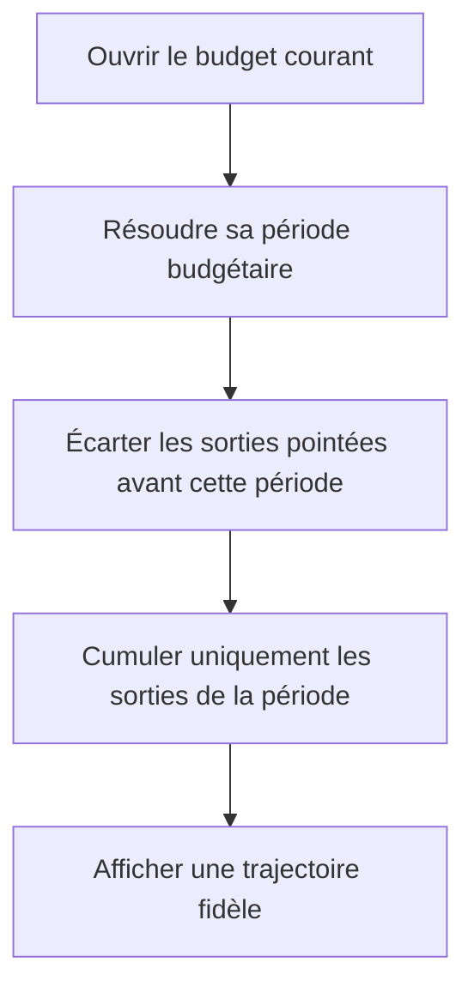

# Instruction: Borner les sorties pointées à la période

## Architecture projection

> Tree of the final files. ✅ create · ✏️ modify · ❌ delete

```txt
ios/
├── Pulpe/
│   └── Domain/
│       └── Formulas/
│           └── BalanceTrajectory.swift                         ✏️ appliquer la borne basse déjà utilisée pour les transactions
└── PulpeTests/
    └── Features/
        └── CurrentMonth/
            └── HomeHeroCardTests.swift                          ✏️ reproduire la fuite hors période et aligner le vocabulaire des fixtures
```

Aucun fichier source n’est créé ou supprimé.

## User Journey



## Tasks to do

### `1)` Verrouiller la régression avant le correctif

> Reproduire le cas que les tests de transactions ne couvrent pas.

1. Ajouter une prévision de dépense pointée la veille du début d’une période décalée.
2. Ajouter une prévision de dépense pointée exactement le premier jour de cette période.
3. Vérifier que seule la seconde réduit le tracé à partir du jour correspondant.
4. Garder le test dans `HomeHeroCardTests`, au plus près des autres frontières de trajectoire.

### `2)` Appliquer la fenêtre temporelle complète

> Utiliser la même fenêtre inclusive-exclusive pour une prévision pointée et une transaction.

1. Exiger que `BudgetLine.checkedAt` soit supérieur ou égal à `periodStart`.
2. Conserver la borne haute exclusive `checkedAt < endExclusive`.
3. Ne pas modifier la règle d’enveloppe `max(line.amount, consumed)`.
4. Ne pas modifier les transactions, déjà bornées correctement.

### `3)` Aligner le vocabulaire des tests

> Faire correspondre les fixtures au modèle `tracked` et `remainingPlan`.

1. Renommer les paramètres `actual` et `projected` du helper de trajectoire.
2. Mettre à jour uniquement ses appels existants.

## Test acceptance criteria

| Task | Acceptance criteria |
| ---- | ------------------- |
| 1 | Une prévision pointée avant le début de période ne modifie aucun point du tracé. |
| 1 | Une prévision pointée exactement au début de période réduit le tracé à partir du premier jour, une seule fois. |
| 2 | Une prévision pointée dans la période continue d’utiliser le maximum entre son montant prévu et ses transactions affectées. |
| 2 | Les transactions avant la période restent ignorées et les transactions dans la période restent cumulées au jour correspondant. |
| 3 | Les fixtures de trajectoire n’emploient plus `actual` ou `projected` pour nommer `tracked` et `remainingPlan`. |
