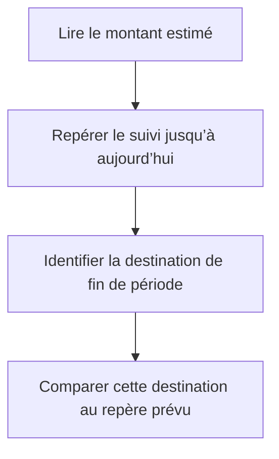

# Instruction: Rendre les annotations distinctes et testables

## Architecture projection

> Tree of the final files. ✅ create · ✏️ modify · ❌ delete

```txt
ios/
├── Pulpe/
│   └── Features/
│       └── CurrentMonth/
│           └── Components/
│               └── HomeHeroCard.swift                          ✏️ séparer les voies et adapter les libellés au Dynamic Type
└── PulpeTests/
    └── Features/
        └── CurrentMonth/
            └── HomeHeroCardTests.swift                          ✏️ tester la politique réellement consommée par le chart
```

Aucun fichier source n’est créé ou supprimé.

## User Journey



## Wireframe

```txt
┌─────────────────────────────────────┐
│ (1) Synthèse financière              │
│                                     │
│ (2) Repère du plan ───────────────  │
│                     (3) ●──────○ (4)│
│                         │            │
│                     (5) Repère actuel│
│                                     │
│ (6) Accès au budget                  │
└─────────────────────────────────────┘
```

1. Synthèse : conserve le montant et le verdict comme information dominante.
2. Repère du plan : occupe une voie distincte sous sa ligne horizontale.
3. Suivi : se termine sur le marqueur de la date courante.
4. Destination : occupe une voie distincte au-dessus du point final.
5. Repère actuel : reste attaché au bas de la ligne verticale.
6. Accès au budget : conserve l’action secondaire existante.

## Tasks to do

### `1)` Définir une politique d’annotation minimale

> Centraliser uniquement les choix variables que la vue et les tests doivent partager.

1. Garder le repère prévu sous sa ligne, aligné au début.
2. Garder la destination au-dessus de son point, alignée à la fin.
3. Conserver le repère d’aujourd’hui au bas de sa ligne verticale.
4. Utiliser les libellés complets aux tailles standard et des libellés courts mais explicites aux tailles d’accessibilité.
5. Conserver une seule ligne par libellé sans ajouter de légende, d’axe ou de conteneur.

### `2)` Remplacer le test de fragments de source

> Vérifier la décision de layout réellement consommée par le chart.

1. Exposer la politique d’annotation comme une valeur interne pure dans `HomeHeroCard`.
2. Vérifier les voies, alignements et variantes de libellé pour `.large` et `.accessibility3`.
3. Supprimer le test qui ouvre `HomeHeroCard.swift` comme une chaîne de caractères.
4. Conserver les tests existants sur la microcopie retirée, le domaine du chart, VoiceOver et le masquage.

### `3)` Contrôler le rendu ciblé

> Valider les cas où les deux valeurs de fin se rejoignent.

1. Vérifier le cas conforme où la destination finale égale le prévu.
2. Vérifier un cas où la destination est au-dessus ou en dessous du prévu.
3. Contrôler les tailles standard et accessibilité en clair puis en sombre.
4. Contrôler une période civile et une période décalée sans modifier les données métier pour compenser le layout.

## Test acceptance criteria

| Task | Acceptance criteria |
| ---- | ------------------- |
| 1 | Lorsque la destination égale le prévu, leurs libellés restent sur deux voies verticales distinctes. |
| 1 | Aux tailles d’accessibilité, chaque annotation reste sur une seule ligne avec un libellé court et compréhensible. |
| 1 | Aujourd’hui, la destination et le prévu restent identifiables sans axe, légende, tooltip ou montant supplémentaire. |
| 2 | Un test déterministe échoue si le prévu et la destination retrouvent la même voie d’annotation. |
| 2 | Aucun test du chart ne lit le fichier source pour inférer son layout. |
| 3 | Le rendu reste sans collision en clair et sombre, aux tailles standard et accessibilité, pour une période civile ou décalée. |
| 3 | La courbe, le connecteur pointillé, les deux marqueurs, le masquage et le résumé VoiceOver restent inchangés. |
