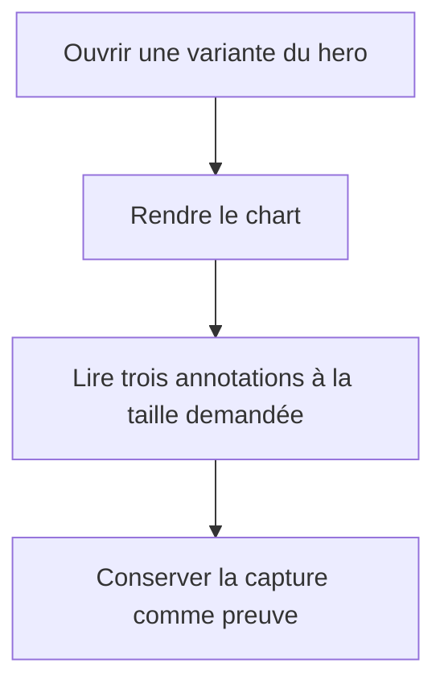

# Instruction: Rendre le chart obligatoire et pleinement adaptatif

## Architecture projection

> Tree of the final files. ✅ create · ✏️ modify · ❌ delete

```txt
ios/
├── Pulpe/
│   ├── App/
│   │   └── ContextualCreationUITestHarness.swift              ✏️ refuser une fixture sans trajectoire
│   └── Features/CurrentMonth/Components/
│       └── HomeHeroCard.swift                                 ✏️ exposer le chart au test et respecter Dynamic Type
└── PulpeUITests/
    └── ContextualCreationUITests.swift                         ✏️ attendre le chart avant chaque capture
```

## User Journey



## Wireframe

```txt
┌─────────────────────────────────────┐
│ (1) Résumé du budget                │
│                                     │
│ (2) Prévu ────────────────────────  │
│               ┆                     │
│       courbe  ○╌╌╌╌╌╌╌╌╌╌● Fin     │
│               Aujourd’hui           │
│                                     │
│ (3) Action vers le budget           │
└─────────────────────────────────────┘
```

1. Résumé: contenu existant du hero, inchangé.
2. Chart: trois annotations sur leurs voies existantes, à la taille Dynamic Type demandée.
3. Action: repère stable existant, sans rôle dans la preuve du chart.

## Tasks to do

### `1)` Rendre la preuve du chart stricte

> Un test réussi garantit qu’une trajectoire et le chart sont réellement présents.

1. Faire échouer la fixture immédiatement si la formule de production ne retourne aucune trajectoire.
2. Donner au chart un identifiant UI stable sans réintroduire son contenu dans le parcours VoiceOver.
3. Attendre cet identifiant avant chaque capture de la matrice.

### `2)` Respecter la taille de texte demandée

> Les annotations utilisent `.accessibility3` sans réduction silencieuse.

1. Retirer les plafonds Dynamic Type des trois annotations.
2. Conserver les voies et libellés courts déjà définis par `ChartAnnotationLayout`.
3. Rejouer la matrice complète et n’ajuster que cette politique si une collision apparaît.

### `3)` Vérifier les non-régressions

> Fermer la phase uniquement avec les contrôles ciblés au vert.

1. Exécuter le test UI de matrice en série sur un simulateur explicitement ciblé.
2. Exécuter `HomeHeroCardTests`, le build `PulpeLocal` et SwiftLint.
3. Vérifier que les deux parcours de création contextuelle restent inchangés.

## Test acceptance criteria

| Task | Acceptance criteria |
| ---- | ------------------- |
| 1 | La fixture de matrice ne peut pas construire le hero sans trajectoire et le test attend le chart, pas un autre élément du hero. |
| 1 | Le chart reste masqué comme contenu redondant pour VoiceOver, tandis que son identifiant de test est détectable par XCTest. |
| 2 | Aucun des trois libellés du chart ne plafonne Dynamic Type sous la taille choisie par l’utilisateur. |
| 2 | En clair et sombre, pour `.large` et `.accessibility3`, sur période civile et décalée, `Prévu`, `Aujourd’hui` et `Fin` restent distincts et sur une ligne. |
| 3 | Les huit captures sont conservées avec leurs noms existants et le test échoue si le chart disparaît. |
| 3 | Les deux tests de création contextuelle, `HomeHeroCardTests`, le build `PulpeLocal` et SwiftLint réussissent. |
