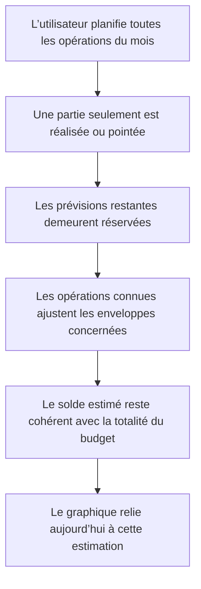

# Instruction: Source financière et trajectoire

## Architecture projection

> Tree of the final files. ✅ create · ✏️ modify · ❌ delete

```txt
ios/
├── Pulpe/
│   └── Domain/
│       ├── Formulas/
│       │   └── BalanceTrajectory.swift                         ✏️ relier le réalisé au solde estimé issu du budget restant
│       └── Store/
│           └── CurrentMonthStore.swift                         ✏️ exposer l’estimation et la référence planifiée sans projection journalière
└── PulpeTests/
    ├── Domain/Store/
    │   └── CurrentMonthStoreDashboardTests.swift               ✏️ reproduire le cas des dépenses prévues en seconde quinzaine
    └── Features/CurrentMonth/
        └── HomeHeroCardTests.swift                              ✏️ verrouiller la trajectoire réelle puis le reste du plan
```

Aucun fichier source n’est créé ou supprimé.

## User Journey



## Tasks to do

### `1)` Reproduire la fausse embellie de mi-mois

> Écrire le test financier avant de modifier le flux de l’accueil.

1. Construire un budget dont les revenus et toutes les dépenses prévues donnent un solde final de `2’500 CHF`.
2. Ne réaliser qu’une partie des dépenses à mi-mois, en laissant le reste sous forme de prévisions non pointées.
3. Vérifier que l’estimation reste `2’500 CHF` au lieu de créer un gain artificiel à partir du faible montant déjà réalisé.
4. Ajouter un cas avec dépassement ou opération libre connue pour vérifier que l’estimation se dégrade réellement lorsque le budget courant l’exige.

### `2)` Séparer estimation courante et référence planifiée

> Réutiliser la formule d’enveloppes existante comme source unique des deux valeurs comparables.

1. Conserver `store.metrics.remaining` comme estimation de fin de mois : prévisions non consommées réservées, transactions connues intégrées et dépassements absorbés.
2. Exposer dans `CurrentMonthStore` un solde planifié de référence calculé avec les mêmes lignes et le même report, mais sans transactions.
3. Ne pas faire dépendre ces deux valeurs de `checkedAt` : pointer change la confiance et le suivi, pas l’existence d’une prévision ou d’une transaction déjà connue.
4. Retirer `store.projection` du calcul de la trajectoire affichée sur l’accueil ; laisser l’ancienne formule disponible hors du parcours actif.

### `3)` Refaire la trajectoire sans rythme inventé

> Montrer le réalisé jusqu’à aujourd’hui puis le reste du budget jusqu’à la fin du mois.

1. Conserver la série réelle construite à partir des sorties pointées jusqu’au jour courant.
2. Dériver le jour courant et la durée du mois directement du budget, avec une date de référence injectable pour les tests.
3. Faire terminer la série future sur `metrics.remaining`, et conserver le solde planifié sans transactions comme référence horizontale.
4. Renommer les données de trajectoire si nécessaire pour qu’elles expriment « reste du plan » plutôt que « projection au rythme ».
5. Ne créer aucun point intermédiaire daté pour les prévisions : aucune échéance n’existe dans `BudgetLine`.

## Test acceptance criteria

| Task | Acceptance criteria |
| ---- | ------------------- |
| 1 | À mi-mois, des dépenses prévues mais encore non réalisées restent intégralement déduites du solde estimé. |
| 1 | Une transaction dépassant son enveloppe ou une dépense libre connue réduit immédiatement le solde estimé. |
| 2 | Le solde planifié de référence et le solde estimé utilisent la même logique d’enveloppes ; seules les transactions connues les différencient. |
| 2 | L’accueil ne dépend plus du rythme journalier des dépenses réalisées pour déterminer sa valeur de fin de mois. |
| 3 | La courbe pleine s’arrête aujourd’hui et la liaison future termine exactement sur le solde estimé de fin de mois. |
| 3 | Aucun point futur ne prétend connaître la date d’une prévision dépourvue d’échéance. |
| 3 | Les tests peuvent fixer la date de référence et restent déterministes quel que soit le jour d’exécution. |
