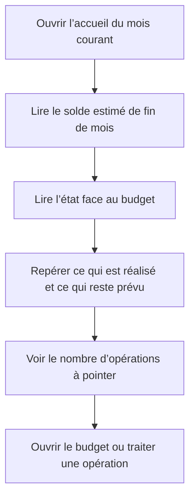

# Instruction: Hiérarchie du hero et validation iOS

## Architecture projection

> Tree of the final files. ✅ create · ✏️ modify · ❌ delete

```txt
ios/
├── DESIGN.md                                                   ✏️ aligner la règle du hero sur l’estimation issue du budget restant
├── Pulpe/
│   └── Features/CurrentMonth/
│       ├── CurrentMonthView.swift                              ✏️ transmettre la référence planifiée au hero
│       └── Components/
│           └── HomeHeroCard.swift                              ✏️ afficher une estimation dominante et simplifier la comparaison
└── PulpeTests/
    └── Features/CurrentMonth/
        └── HomeHeroCardTests.swift                              ✏️ verrouiller microcopie, états et accessibilité
```

Aucun fichier source n’est créé ou supprimé.

## User Journey



## Wireframe

```txt
┌─────────────────────────────────────┐
│ (1) Période · compte                 │
│                                     │
│ (2) Solde de fin de mois             │
│     Montant principal                │
│                                     │
│ (3) État face au budget · à traiter  │
│                                     │
│ (4) Trajectoire mensuelle            │
│     réalisé ───────●┄┄┄ reste       │
│                    │                │
│     ┄┄ référence du budget ┄┄┄┄┄   │
│                                     │
│ (5) Accès au détail du budget        │
├─────────────────────────────────────┤
│ (6) Opérations à traiter             │
│ (7) Activité récente                 │
└─────────────────────────────────────┘
```

1. En-tête : situe le mois et conserve l’accès au compte.
2. Synthèse : donne une seule réponse financière dominante.
3. État : explique la comparaison et conserve le volume à traiter sans créer deux KPI concurrents.
4. Graphique : sépare le réalisé du budget restant et garde une référence commune.
5. Détail : conserve l’accès au budget.
6. Traitement : garde les opérations nécessitant une action.
7. Activité : conserve l’historique récent.

## Tasks to do

### `1)` Donner une seule réponse dominante

> Faire du solde estimé de fin de mois le point focal sans addition mentale.

1. Afficher `metrics.remaining` comme grand montant signé, avec le libellé « estimé fin de mois ».
2. Supprimer les KPI côte à côte « Plan » et « Écart estimé ».
3. Calculer la comparaison par `solde estimé - solde planifié de référence`.
4. Afficher « Conforme à ton budget » lorsque l’écart est nul, « X de mieux que prévu » lorsqu’il est positif et « X de moins que prévu » lorsqu’il est négatif.
5. Conserver le nombre « À pointer » comme information distincte mais secondaire, avec accord singulier/pluriel.
6. Garder le déficit global comme seul état rouge ; exprimer chaque état avec du texte et pas uniquement par la couleur.

### `2)` Simplifier le graphique et l’accès au budget

> Éviter que la vue réintroduise la projection journalière sous une autre forme.

1. Rendre la série réalisée en trait plein et la liaison du reste du plan en trait pointillé, avec extrémités arrondies natives.
2. Conserver un seul marqueur « Aujourd’hui » et la référence horizontale du solde planifié.
3. Supprimer du lien Budget le montant « CHF/jour » issu de l’ancienne projection ; conserver un accès textuel clair avec chevron.
4. Ne pas ajouter d’axe, de légende, de grille, de tooltip ou d’animation de dessin.
5. Maintenir le graphique masqué à VoiceOver et faire porter toute la signification financière par le résumé accessible du hero.

### `3)` Couvrir les états et valider sur simulateur

> Prouver la compréhension et la robustesse du nouveau hero dans les conditions iOS réelles.

1. Mettre à jour les tests de présentation pour les états conforme, meilleur, moins bon, déficit et montants masqués.
2. Vérifier que VoiceOver annonce le mois, le solde estimé, la comparaison et le nombre à pointer sans révéler un montant masqué.
3. Vérifier l’empilement à partir des tailles Dynamic Type d’accessibilité et conserver les zones tactiles de 44 pt.
4. Exécuter les tests ciblés, puis construire et lancer `PulpeLocal` sur un simulateur iPhone disponible avec le compte seed.
5. Capturer au minimum un état conforme, un dépassement connu et un déficit global en clair ; contrôler aussi le sombre, les montants masqués et une taille de texte d’accessibilité.
6. Mettre à jour uniquement le paragraphe Dashboard de `ios/DESIGN.md` pour remplacer les anciennes notions de projection journalière, plan et écart.

## Test acceptance criteria

| Task | Acceptance criteria |
| ---- | ------------------- |
| 1 | Le premier montant visible correspond au solde estimé après toutes les prévisions restantes et les opérations connues. |
| 1 | Aucun bloc « Plan » ou « Écart estimé » n’apparaît dans le hero. |
| 1 | La comparaison s’exprime en français courant et reste compréhensible sans couleur. |
| 1 | Le nombre d’éléments à pointer reste visible sans concurrencer le montant principal. |
| 2 | Le graphique distingue le réalisé du reste du plan sans extrapoler un rythme quotidien ni inventer des échéances. |
| 2 | Le lien vers le budget ne présente plus de montant journalier dérivé de l’ancienne projection. |
| 3 | VoiceOver, Dynamic Type, thème sombre et masquage des montants préservent la signification et la confidentialité du hero. |
| 3 | Les tests ciblés passent, la build `PulpeLocal` réussit et les trois états financiers contrôlés sur simulateur correspondent aux valeurs calculées. |
