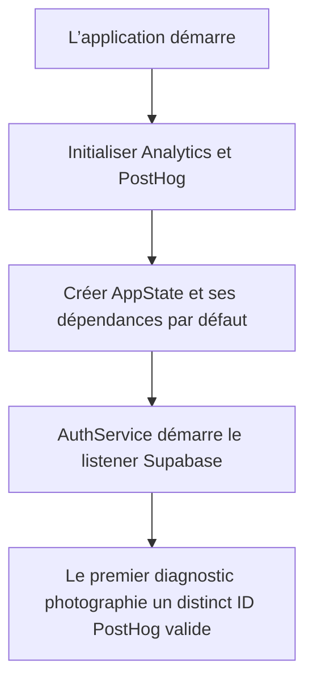

# Instruction: Initialiser Analytics avant le listener Auth

## Architecture projection

> Tree of the final files. ✅ create · ✏️ modify · ❌ delete

```txt
ios/
├── Pulpe/App/
│   └── ✏️ PulpeApp.swift                              # initialise PostHog avant les dépendances Auth
└── PulpeTests/Architecture/
    └── ✅ AuthDiagnosticsStartupTests.swift           # verrouille l’ordre d’initialisation au cold start

❌ Aucun fichier supprimé
```

## User Journey



## Tasks to do

### `1)` Reproduire la course d’initialisation

> Le test doit échouer tant que `AppState()` est créé avant le setup Analytics.

1. Créer un test Swift Testing dans `PulpeTests/Architecture` en réutilisant le pattern de lecture par `#filePath`.
2. Lire `PulpeApp.swift` et exiger que l’appel à `AnalyticsService.shared.initialize()` précède la première construction de `AppState()`.
3. Exiger un seul appel d’initialisation dans `PulpeApp.init`.
4. Garder le test local, déterministe et sans initialiser le singleton PostHog.

### `2)` Corriger l’ordre de démarrage

> Le setup Analytics doit terminer avant que `AppStateDependencies.default` ne touche `AuthService.shared`.

1. Déplacer l’appel existant à `AnalyticsService.shared.initialize()` au début de `PulpeApp.init`, avant `let appState = AppState()`.
2. Supprimer l’ancien appel en fin d’initialiseur pour conserver une seule initialisation.
3. Ne modifier ni `AnalyticsService`, ni `AuthService`, ni leurs files ou gardes internes.
4. Conserver l’ordre relatif de TipKit, des background tasks, des stores et du câblage applicatif.

### `3)` Vérifier le correctif

> La correction ne doit changer que l’attribution des premiers diagnostics.

1. Exécuter le nouveau test d’architecture puis les suites Analytics et Auth ciblées.
2. Exécuter SwiftLint strict sur les deux fichiers Swift touchés.
3. Construire `PulpeProd` en configuration optimisée.
4. Vérifier qu’aucune nouvelle violation n’est ajoutée au baseline SwiftLint global.

## Test acceptance criteria

| Task | Acceptance criteria |
| --- | --- |
| 1 | Le test échoue sur l’ordre actuel et ne passe que si Analytics est initialisé avant la construction de `AppState`. |
| 1 | `PulpeApp.init` contient exactement un appel à `AnalyticsService.shared.initialize()`. |
| 2 | `AppStateDependencies.default` ne peut plus instancier `AuthService.shared` avant la fin du setup PostHog. |
| 2 | Quand PostHog est configuré et activé, le premier diagnostic SDK du cold start photographie un distinct ID non vide. |
| 2 | Aucun mécanisme de queue, garde Analytics ou dépendance supplémentaire n’est ajouté. |
| 3 | Le test d’architecture, les suites Analytics/Auth ciblées, SwiftLint strict ciblé et le build optimisé `PulpeProd` passent sur le même état. |
