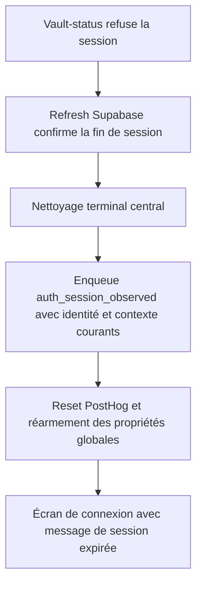

# Instruction: Fermer le chemin terminal et capturer avant reset

## Architecture projection

> Tree of the final files. ✅ create · ✏️ modify · ❌ delete

```txt
ios/
├── Pulpe/
│   ├── App/
│   │   ├── ✏️ AppState+Auth.swift                  # route l’expiration post-auth vers le nettoyage terminal
│   │   └── ✏️ AppState+SessionReset.swift          # enqueue le diagnostic avant la rotation PostHog
│   └── Core/Analytics/
│       └── ✏️ AnalyticsService.swift               # partage l’enqueue synchrone et réarme les propriétés globales
└── PulpeTests/
    ├── App/
    │   └── ✏️ ResolvePostAuthOrThrowTests.swift     # reproduit le chemin terminal actuellement contourné
    └── Core/Analytics/
        └── ✏️ AnalyticsServiceTests.swift           # verrouille snapshot et contexte immuable
```

## User Journey



## Tasks to do

### `1)` Reproduire l’expiration post-auth hors taxonomie

> Le test doit échouer tant que `unauthenticatedSessionExpired` conserve un utilisateur en mémoire.

1. Étendre `ResolvePostAuthOrThrowTests` avec l’état utilisateur, le message et les effets de reset attendus.
2. Attendre `currentUser == nil` après l’erreur `sessionExpired`.
3. Conserver le contrat de throw et l’état UI `unauthenticated`.

### `2)` Réutiliser le nettoyage terminal existant

> Une expiration confirmée ne doit plus écrire directement l’état d’authentification.

1. Déléguer `unauthenticatedSessionExpired` au chemin `handleSessionExpired`.
2. Réutiliser `.sessionExpiry` au lieu d’ajouter une raison équivalente.
3. Conserver le diagnostic `post_auth_destination` comme contexte amont.
4. Garantir un seul diagnostic terminal `session_reset` classé `is_expected_user_action=false`.

### `3)` Enqueue le terminal avant la rotation analytics

> Le snapshot doit être ajouté à la queue PostHog pendant que son contexte authentifié existe encore.

1. Ajouter dans `AnalyticsService` un enqueue MainActor synchrone réutilisé par le wrapper non isolé.
2. Garder la photographie du distinct ID et du timestamp au point du signal.
3. Appeler l’enqueue synchrone depuis `resetSession` avant `AnalyticsService.reset()`.
4. Continuer à passer les propriétés par `sanitizeProperties`.
5. Ne pas ajouter de flush bloquant, de queue parallèle ou de dépendance.

### `4)` Réarmer le contexte global après reset

> Les événements du prochain écran de connexion et du prochain compte gardent leur contexte de build.

1. Centraliser l’enregistrement de `environment`, `app_version`, `build_number` et `platform`.
2. L’appeler à l’initialisation et immédiatement après le reset PostHog.
3. Étendre le test pur existant pour verrouiller les valeurs immuables sans réseau PostHog.

## Test acceptance criteria

| Task | Acceptance criteria |
| --- | --- |
| 1 | `unauthenticatedSessionExpired` lance toujours `AuthServiceError.sessionExpired`, affiche le même message et laisse `currentUser == nil`. |
| 2 | Ce chemin produit exactement un terminal `api_session_expired` avec `is_expected_user_action=false` via le reset central. |
| 2 | Le nettoyage biométrique, client key, stores, widget et navigation reste celui de `handleSessionExpired`. |
| 3 | Le terminal est enqueue avant `reset()` avec le distinct ID, le timestamp et la session PostHog présents au signal. |
| 3 | Tous les diagnostics, synchrones ou différés, restent sanitisés et non bloquants. |
| 4 | `environment`, `app_version`, `build_number` et `platform` accompagnent le terminal et les événements émis après un reset. |
