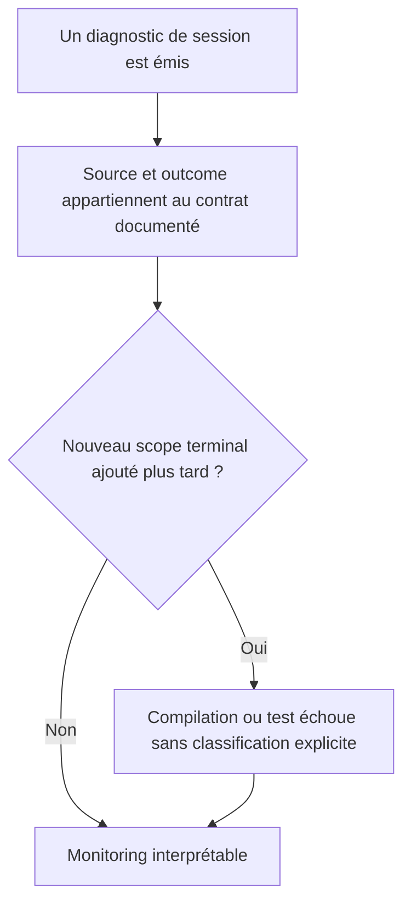

# Instruction: Rendre le contrat exhaustif et le garde qualité honnête

## Architecture projection

> Tree of the final files. ✅ create · ✏️ modify · ❌ delete

```txt
.
├── .claude/rules/05-workflows-and-processes/
│   └── ✏️ posthog-events.md                         # reflète toutes les valeurs réellement émises
└── ios/
    ├── Pulpe/App/
    │   └── ✏️ AppState+SessionReset.swift           # force la classification de chaque futur scope
    └── PulpeTests/App/
        └── ✏️ AppStateLogoutScopeTests.swift        # prouve l’exhaustivité et l’unicité de la taxonomie
```

## User Journey



## Tasks to do

### `1)` Rendre la classification exhaustive

> Un futur scope ne doit pas hériter silencieusement de `false`.

1. Rendre `SessionResetScope` itérable.
2. Retirer le `default` de `isExpectedUserAction`.
3. Énumérer explicitement les scopes attendus et anormaux.
4. Faire comparer la table de test à `allCases` avant de vérifier valeurs et unicité.

### `2)` Aligner le catalogue analytics

> Le catalogue devient le contrat exact du code livré.

1. Recenser chaque `source` et `outcome` de `captureAuthSessionDiagnostic`.
2. Ajouter les sources API, vault, startup, post-auth, deep-link et keychain manquantes.
3. Supprimer `api_401_refresh` ou aligner l’émetteur sur ce nom unique.
4. Documenter tous les outcomes manquants.
5. Documenter `source` sur `logout_completed`.

### `3)` Appliquer un garde qualité proportionné

> Le lot ne doit ni prétendre réparer ni aggraver les 19 violations étrangères déjà recensées.

1. Exécuter SwiftLint strict sur chaque fichier Swift touché.
2. Relancer le lint global et vérifier qu’aucune nouvelle violation ne provient du diff.
3. Exécuter les suites Analytics, post-auth, reset, PIN et Face ID concernées.
4. Construire `PulpeProd` en configuration optimisée.
5. Rapporter séparément le baseline global préexistant au lieu de le déclarer vert.

## Test acceptance criteria

| Task | Acceptance criteria |
| --- | --- |
| 1 | Ajouter un nouveau `SessionResetScope` sans classification explicite provoque une erreur de compilation. |
| 1 | La table couvre exactement `SessionResetScope.allCases`; chaque raison reste unique et stable. |
| 2 | Le catalogue contient toutes les sources et outcomes émis, aucune valeur fantôme, et la propriété `source` de `logout_completed`. |
| 3 | Chaque fichier Swift touché passe SwiftLint strict sans violation. |
| 3 | Le lint global n’ajoute aucune violation au baseline de 19 constaté par la revue. |
| 3 | Les suites ciblées passent et le build optimisé `PulpeProd` réussit sur le même état de travail. |
