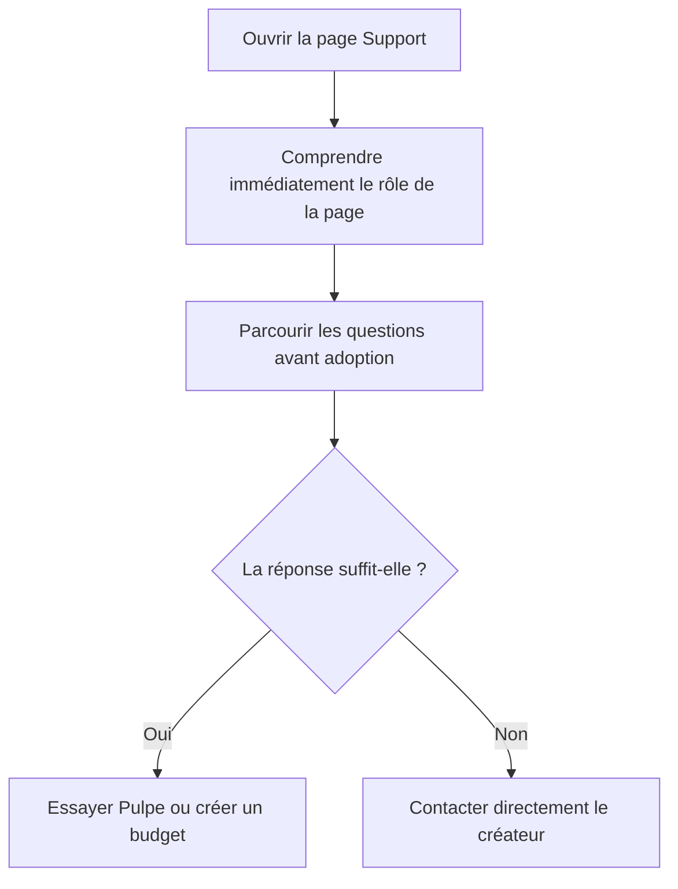

# Instruction: Réaligner la page et ses réponses

## Architecture projection

> Tree of the final files. ✅ create · ✏️ modify · ❌ delete

```txt
landing
├── app
│   ├── accessibility.test.tsx ✏️
│   └── support
│       └── page.tsx ✏️
└── components
    └── sections
        └── FAQ.tsx ✏️
```

- `landing/app/support/page.tsx` : reprendre la composition de la landing, raccourcir la FAQ et synchroniser le JSON-LD.
- `landing/components/sections/FAQ.tsx` : corriger les réponses partagées avec la page Support.
- `landing/app/accessibility.test.tsx` : verrouiller les repères d'accessibilité, de composition et de contenu.
- Création : aucune.
- Suppression : aucune.

## User Journey



## Wireframe

```txt
┌──────────────────────────────────────────────┐
│ (1) En-tête flottant partagé                 │
├──────────────────────────────────────────────┤
│ (2) Intro support large                      │
│     titre + courte mise en contexte          │
├──────────────────────────────────────────────┤
│ (3) Questions fréquentes                     │
│     ┌────────────────────────────────────┐   │
│     │ accordéon                          │   │
│     ├────────────────────────────────────┤   │
│     │ accordéon                          │   │
│     └────────────────────────────────────┘   │
├──────────────────────────────────────────────┤
│ (4) Contact direct                           │
├──────────────────────────────────────────────┤
│ (5) CTA final partagé                        │
├──────────────────────────────────────────────┤
│ (6) Pied de page partagé                     │
└──────────────────────────────────────────────┘
```

1. En-tête : navigation existante de la landing.
2. Intro : titre, promesse de réponse et rythme typographique de la landing.
3. Questions : objections principales dans l'accordéon existant.
4. Contact : email et GitHub quand la réponse manque.
5. CTA : composant `FinalCTA` déjà utilisé sur la landing.
6. Pied de page : composant partagé existant.

## Tasks to do

### `1)` Verrouiller le contrat de la page Support

> Étendre le test source existant avant de modifier la page.

1. Ajouter `support/page.tsx` aux sources lues par `accessibility.test.tsx`.
2. Attendre un lien d'évitement vers `#main-content`, la cible correspondante et une structure de titres cohérente.
3. Attendre la réutilisation de `hero-mesh`, de la largeur FAQ de la landing, de `AccordionItem` et de `FinalCTA`.
4. Verrouiller la raison réelle de l'absence de connexion bancaire et l'absence des anciennes justifications.

### `2)` Recomposer la page avec les primitives existantes

> Retrouver la respiration de la landing sans nouveau composant ni nouveau style global.

1. Ajouter le lien d'évitement et l'identifiant `main-content` déjà présents sur la page d'accueil.
2. Composer l'intro, la FAQ et le contact avec `hero-mesh`, `Section` et `Container`, puis rendre chaque question avec le même `AccordionItem` que `components/sections/FAQ.tsx`.
3. Élargir la FAQ à `max-w-3xl` et garder ses réponses lisibles sur mobile.
4. Remplacer le CTA local par `FinalCTA`, puis conserver `Header` et `Footer`.
5. Ne dupliquer aucun markup d'accordéon et ne modifier ni `AccordionItem`, ni `globals.css`, ni les autres composants UI partagés.

### `3)` Remplacer les questions par un ensemble plus utile

> Partir du vécu exprimé dans la publication et retirer les formulations promotionnelles ou inexactes.

1. Utiliser les questions et réponses finales suivantes dans la page Support :

   1. **À quoi sert Pulpe, concrètement ?**
      Tu poses ton année une fois, puis tu ajustes au fur et à mesure. Si tu déplaces une dépense, rediriges de l'épargne ou décales un projet, tu vois ce que ça change sur les mois suivants sans repartir de zéro.
   2. **Pourquoi Pulpe plutôt qu'Excel ?**
      Excel fait le job, mais les formules deviennent vite fragiles dès que tu bouges une ligne. Et sur mobile, c'est pénible. Pulpe garde la vue d'ensemble et recalcule la suite quand tu ajustes ton budget.
   3. **Pourquoi Pulpe ne se connecte pas à ma banque ?**
      J'aurais aimé proposer une synchronisation bancaire. Pour le faire correctement en Suisse et en France, il faut passer par des prestataires externes et gérer des contraintes réglementaires. Pour un projet que je développe seul, le soir après le boulot, le coût est trop élevé. Donc, pour l'instant, la saisie reste manuelle.
   4. **Pourquoi confier mes chiffres à Pulpe ?**
      Tes montants ne sont jamais stockés en clair. Pour les déchiffrer, il faut deux clés conservées séparément, dont une dérivée de ton code PIN. Une fuite de la base seule ne suffit donc pas à les lire. Le code source est public, tu peux vérifier son fonctionnement au lieu de me croire sur parole.
   5. **Est-ce que je peux essayer sans créer de compte ?**
      Oui. Le mode démo te laisse utiliser Pulpe sans compte et sans saisir tes propres chiffres.
   6. **C'est vraiment gratuit ?**
      Oui. Pulpe est gratuit, sans publicité ni abonnement. C'est un projet solo et son code source est public.
   7. **Pulpe fonctionne-t-il en Suisse et en France ?**
      Oui. Pulpe fonctionne avec les francs suisses et les euros, sur le web et sur iPhone.
   8. **Comment retrouver mes budgets entre le web et l'iPhone ?**
      Connecte-toi au même compte sur les deux. Tes budgets et tes modifications sont synchronisés automatiquement.
   9. **Comment supprimer mon compte et mes données ?**
      Tu peux demander la suppression depuis les paramètres. Le compte est alors programmé pour être supprimé dans trois jours, ce qui te laisse ce délai pour changer d'avis. Après ça, la suppression est définitive.

2. Conserver les liens utiles vers le mode démo, le code source et les paramètres quand la réponse les mentionne.
3. Mettre chaque `plainAnswer` au même contenu factuel que la réponse visible afin de garder le JSON-LD fidèle.
4. Retirer les expressions `choix délibéré`, `même standard utilisé par les banques et les armées`, `chiffrement de bout en bout`, `zero-knowledge` et la comparaison avec Google Drive.
5. Mettre à jour la description SEO de `/support` avec les mêmes termes simples.

### `4)` Garder la FAQ de la landing cohérente

> Corriger les réponses dupliquées sans créer une source partagée pour deux usages.

1. Reprendre dans `FAQ.tsx` les mêmes raisons pour la connexion bancaire et la protection des montants.
2. Raccourcir la question Excel pour parler de Pulpe plutôt que d'ajouter une comparaison avec YNAB.
3. Conserver six questions sur la landing et la liste plus complète sur `/support`.

### `5)` Vérifier la page

> Prouver le résultat avec le contrôle existant et deux largeurs représentatives.

1. Exécuter les tests, le lint et le contrôle de types du package landing.
2. Vérifier `/support` à 390 px et 1440 px : aucun débordement, titre lisible, accordéons utilisables, contact et CTA dans le bon ordre.
3. Vérifier au clavier le lien d'évitement, les accordéons, les liens externes et le CTA.
4. Vérifier que les nouvelles réponses ne contiennent ni tiret cadratin ni tiret demi-cadratin.

## Test acceptance criteria

| Task | Acceptance criteria |
| ---- | ------------------- |
| 1 | La page expose un lien d'évitement fonctionnel, un `main` ciblable et une hiérarchie de titres sans saut. |
| 2 | `/support` reprend le champ ambiant, la largeur FAQ, le rythme des sections et le CTA final de la landing sans nouveau composant ni nouvelle règle CSS. |
| 2 | Toutes les questions de `/support` sont rendues par le même `AccordionItem` que la FAQ de la page d'accueil, sans duplication de son markup ni modification du composant. |
| 2 | À 390 px et 1440 px, le contenu ne déborde pas et l'ordre intro, FAQ, contact, CTA reste lisible. |
| 3 | La page Support affiche les neuf questions prévues et son JSON-LD contient les mêmes réponses factuelles. |
| 3 | La réponse bancaire cite les prestataires externes, les contraintes réglementaires, le coût d'un projet solo et la saisie manuelle actuelle. |
| 3 | La réponse sécurité indique le stockage chiffré, les deux clés séparées, la clé dérivée du PIN, la résistance à une fuite de base seule et le code public, sans promesse plus large. |
| 4 | La FAQ de la page d'accueil et la page Support ne se contredisent plus sur Excel, la connexion bancaire ou le chiffrement. |
| 5 | Les tests, le lint et le contrôle de types du package landing passent. |
| 5 | Le parcours clavier atteint l'intro, chaque accordéon, les liens de contact et le CTA avec un focus visible. |
