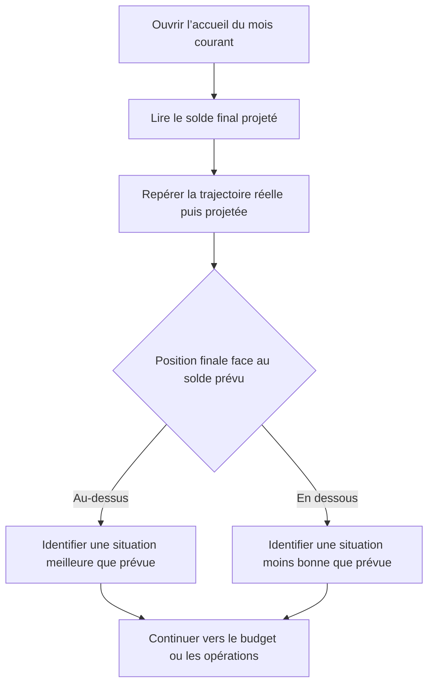

# Instruction: Référence du solde prévu

## Architecture projection

> Tree of the final files. ✅ create · ✏️ modify · ❌ delete

```txt
ios/
├── DESIGN.md                                                   ✏️ documenter la ligne de référence du solde prévu
├── Pulpe/
│   └── Features/CurrentMonth/Components/
│       └── HomeHeroCard.swift                                  ✏️ rendre et mettre à l’échelle la référence horizontale
└── PulpeTests/
    └── Features/CurrentMonth/
        └── HomeHeroCardTests.swift                              ✏️ verrouiller le domaine incluant le plan
```

## User Journey



## Wireframe

```txt
┌─────────────────────────────────────┐
│ (1) Période · compte                 │
│                                     │
│ (2) Résultat projeté · comparaison   │
│                                     │
│ (3) Trajectoire mensuelle            │
│     réel ─────────○┄┄┄ projection   │
│                   │                 │
│     ┄┄┄ référence prévue ┄┄┄┄┄┄┄   │
│                aujourd’hui           │
│                                     │
│ (4) Accès au budget                  │
├─────────────────────────────────────┤
│ (5) Opérations à traiter             │
│ (6) Activité                         │
└─────────────────────────────────────┘
```

1. En-tête : situe le mois et conserve l’accès au compte.
2. Résultat : garde le solde projeté et sa comparaison comme informations dominantes.
3. Graphique : ajoute une seule référence horizontale au tracé réel puis projeté.
4. Budget : conserve l’accès et le rythme quotidien sous le graphique.
5. Opérations : reste le premier bloc actionnable.
6. Activité : conserve la lecture récente sans changement.

## Tasks to do

### `1)` Ajouter la référence du solde prévu

> Situer la trajectoire face au plan sans transformer le graphique en panneau analytique.

1. Ajouter dans le `Chart` un `RuleMark` horizontal positionné sur `trajectory.plannedBalance`.
2. Utiliser un trait fin, discret et différencié de la projection ; conserver le réel plein, le futur pointillé et l’unique marqueur d’aujourd’hui.
3. Nommer la ligne « Solde prévu » à son extrémité sans afficher de montant, d’axe, de grille, de légende ou de callout supplémentaire.
4. Inclure `plannedBalance` dans le calcul du domaine vertical afin que la référence reste visible lorsqu’elle se trouve au-dessus ou sous toute la trajectoire.
5. Réutiliser les couleurs, épaisseurs, pointillés et typographies existants ; ne créer aucun token ou composant pour cet usage unique.
6. Conserver le graphique masqué à VoiceOver : le résumé existant annonce déjà projection, plan et écart avec leurs montants.
7. Ne pas ajouter d’animation de dessin, de pulsation ou de transition propre aux marques du graphique.

### `2)` Verrouiller les cas limites

> Empêcher la référence de disparaître ou d’écraser la trajectoire.

1. Rendre le calcul du domaine vertical testable sans exposer de nouvel état produit.
2. Vérifier un plan inférieur à toute la trajectoire, un plan supérieur à toute la trajectoire et un domaine plat où plan et projection sont égaux.
3. Conserver un padding vertical minimal lorsque toutes les valeurs sont identiques ou très proches.
4. Ne pas rendre de référence hors du graphique existant lorsque la trajectoire est indisponible.

### `3)` Valider la lecture réelle

> Prouver que la ligne aide la comparaison sans ramener le bruit du premier mockup.

1. Exécuter `HomeHeroCardTests` puis construire `PulpeLocal` sur le simulateur iPhone 17 Pro Max disponible.
2. Capturer les états projection au-dessus du plan, projection sous le plan et déficit global.
3. Vérifier en trois secondes que le grand montant reste le premier point focal et que la ligne « Solde prévu » reste secondaire.
4. Contrôler clair, sombre, Dynamic Type standard et accessibilité, montants masqués et Réduire les animations.
5. Mettre à jour uniquement le paragraphe Dashboard de `ios/DESIGN.md` qui affirme actuellement que le plan n’est pas répété sur le graphique.

## Test acceptance criteria

| Task | Acceptance criteria |
| ---- | ------------------- |
| 1 | Une ligne horizontale « Solde prévu » traverse le graphique à la valeur exacte de `trajectory.plannedBalance`. |
| 1 | Le tracé ne contient toujours qu’un réel plein, une projection pointillée, le marqueur d’aujourd’hui et la référence prévue. |
| 1 | Aucun montant, axe, grille, légende ou callout n’est ajouté dans le graphique. |
| 1 | Le graphique n’ajoute aucune animation de dessin ou de pulsation aux marques statiques. |
| 2 | Le domaine vertical contient toujours le plan, chaque point réel et chaque point projeté avec un padding non nul. |
| 2 | Un plan supérieur, inférieur ou égal à toute la trajectoire reste visible sans écraser les courbes. |
| 3 | Après trois secondes, un lecteur identifie le solde projeté avant le graphique puis sait dire si la fin projetée est au-dessus ou sous le prévu. |
| 3 | Le rendu reste lisible en clair, sombre et grandes tailles de texte ; VoiceOver continue d’annoncer projection, plan et écart sans parcourir les marques du graphique. |
| 3 | Les tests ciblés passent et la build `PulpeLocal` réussit sans modification des formules financières. |
