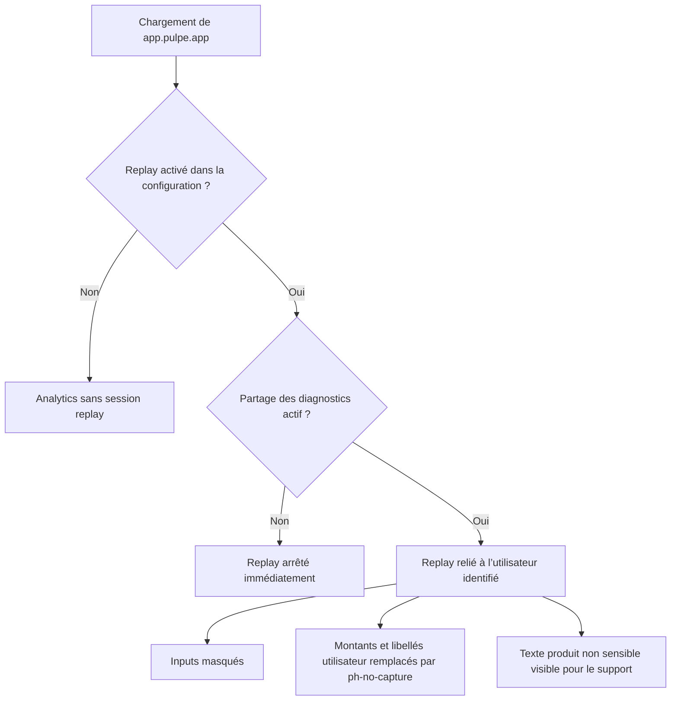

# Instruction: Autoriser le replay production avec le masquage existant

## Architecture projection

> Tree of the final files. ✅ create · ✏️ modify · ❌ delete

```txt
frontend/projects/webapp/src/app/
├── core/analytics/
│   ├── posthog.ts ✏️
│   └── posthog.spec.ts ✏️
└── feature/
    ├── budget/budget-details/
    │   ├── budget-line/spread-existing/dialog.ts ✏️
    │   └── components/
    │       ├── budget-action-menu.ts ✏️
    │       ├── transaction-action-menu.ts ✏️
    │       ├── budget-table/cells/actions-cell.ts ✏️
    │       └── tag-history/
    │           ├── tag-history-chart.ts ✏️
    │           └── tag-history-chart.spec.ts ✏️
    ├── complete-profile/
    │   ├── complete-profile-page.ts ✏️
    │   └── complete-profile-page.spec.ts ✏️
    └── savings-goals/detail/components/
        ├── goal-plan-simulator-toolbar.ts ✏️
        ├── goal-plan-simulator-toolbar.spec.ts ✏️
        ├── goal-projection-chart.ts ✏️
        └── goal-projection-chart.spec.ts ✏️
```

## User Journey



## Tasks to do

### `1)` Retirer uniquement l’interdiction spécifique à la production

> La configuration existante doit être l’unique gate technique du replay web.

1. Calculer `#sessionReplayEnabled` depuis `config.sessionRecording.enabled`, sans exception pour l’environnement `production`.
2. Conserver `disable_session_recording`, `maskAllInputs`, `recordCrossOriginIframes: false`, l’opt-out immédiat et la restauration du replay après opt-in.
3. Ne modifier ni `identify`, ni les propriétés utilisateur, ni les événements, ni les persistences distinctes de la landing et de l’application.
4. Vérifier la valeur déployée de `PUBLIC_POSTHOG_SESSION_RECORDING_ENABLED` pour `app.pulpe.app`; ne changer la configuration distante que si elle n’est pas déjà à `true`.

### `2)` Fermer les trous de masquage réellement observés

> La convention reste `ph-no-capture`; aucun nouveau composant ou helper n’est créé.

1. Ajouter `ph-no-capture` aux noms utilisateur et soldes rendus dans les trois menus d’action budget/transaction.
2. Faire porter la même classe par l’overlay des tooltips dont le contenu provient d’un nom utilisateur, sans placer la classe sur les boutons interactifs.
3. Protéger l’écho mensuel du dialogue de lissage et l’annonce de budget du parcours de profil.
4. Protéger le hint, les annonces `aria-live` et les résumés accessibles qui interpolent des montants dans le simulateur et les graphiques d’objectif/historique.
5. Ne pas masquer globalement tout le texte et ne pas activer la capture canvas ou réseau dans ce changement.

### `3)` Prouver le contrat sans construire une nouvelle suite de conformité

> Les tests reproduisent les deux régressions possibles : replay encore coupé en production ou texte financier oublié.

1. Remplacer le test « production toujours désactivée » par un test où la production respecte `sessionRecording.enabled: true`.
2. Ajouter le cas inverse : toute plateforme garde le replay coupé lorsque le réglage vaut `false`.
3. Conserver les assertions montrant que l’opt-out arrête immédiatement le replay et que l’opt-in le relance lorsqu’il est configuré.
4. Étendre les specs de composants déjà présentes pour vérifier `ph-no-capture` sur un montant visible et sur sa copie accessible; éviter un scanner global fragile du code source.

## Test acceptance criteria

| Task | Acceptance criteria |
| ---- | ------------------- |
| 1 | Avec `environment=production` et `sessionRecording.enabled=true`, PostHog reçoit `disable_session_recording: false`. |
| 1 | Avec `sessionRecording.enabled=false`, PostHog reçoit `disable_session_recording: true` en local, preview et production. |
| 1 | Désactiver « Partager les diagnostics » appelle immédiatement `stopSessionRecording`, reset l’identité et bloque les captures; le réactiver relance le replay configuré. |
| 1 | Aucun événement, propriété d’identification, nom de persistence ou comportement landing n’est modifié. |
| 2 | Les inputs restent masqués et les montants, noms utilisateur, tooltips dynamiques et textes `aria-live` recensés portent réellement `ph-no-capture` dans le DOM rendu. |
| 2 | Les boutons de menu restent cliquables lorsque le mode « masquer les montants » est actif. |
| 3 | Les specs PostHog et les specs Angular ciblées passent sans nouvelle dépendance ni nouveau harness transversal. |
