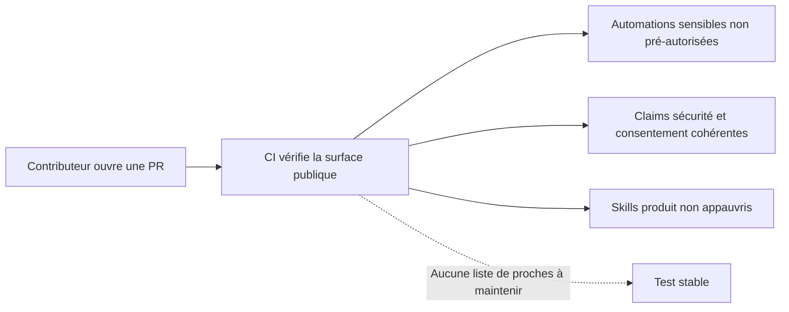

# Instruction: Retirer les sentinelles nominatives sans affaiblir les contrôles structurels

## Architecture projection

> Tree of the final files. ✅ create · ✏️ modify · ❌ delete

```txt
.github/
└── scripts/
    └── public-surface.test.mjs ✏️
```

## User Journey



## Tasks to do

### `1)` Supprimer les assertions liées à une identité précise

> Le test ne doit plus embarquer un inventaire de personnes ou d’anecdotes privées.

1. Retirer la regex contenant l’adresse, le nom et le mot de passe de seed historiques; conserver uniquement la vérification positive du compte de démonstration.
2. Retirer le chemin utilisateur absolu construit dans le test.
3. Retirer la liste Sylvie/Julie/Maman/Collègue/Ismaël et le `git grep` associé.
4. Retirer la regex d’anecdotes et de métriques internes figées.

### `2)` Préserver les contrôles qui évitent une vraie régression

> Le nettoyage du test ne doit pas réautoriser les problèmes de sécurité déjà corrigés.

1. Conserver le contrôle des hooks et permissions projet sensibles, du fichier local gitignoré et de l’absence de `bypassPermissions`.
2. Conserver la cohérence des affirmations publiques sur le chiffrement, la suppression et le consentement.
3. Conserver l’alignement du guide CI avec le workflow réel.
4. Conserver l’exclusion des archives locales et schémas obsolètes.
5. Conserver les assertions ciblées qui empêchent d’appauvrir les skills `product-designer` et `product-owner`.
6. Renommer le dernier test si nécessaire pour décrire ces invariants restants plutôt que la recherche d’informations privées.

## Test acceptance criteria

| Task | Acceptance criteria |
| ---- | ------------------- |
| 1 | `public-surface.test.mjs` ne contient plus aucun nom de proche, chemin utilisateur personnel, adresse personnelle ou anecdote interne figée. |
| 1 | L’ajout futur d’un prénom arbitraire dans une landing ou une fixture légitime ne casse plus la CI. |
| 2 | Une réintroduction du hook de synchronisation `.env` partagé, d’une permission de bypass ou d’une claim publique trompeuse fait toujours échouer le test. |
| 2 | La suppression des méthodes et références restaurées dans les skills produit fait toujours échouer le test. |
| 2 | `node --test .github/scripts/public-surface.test.mjs` passe. |
