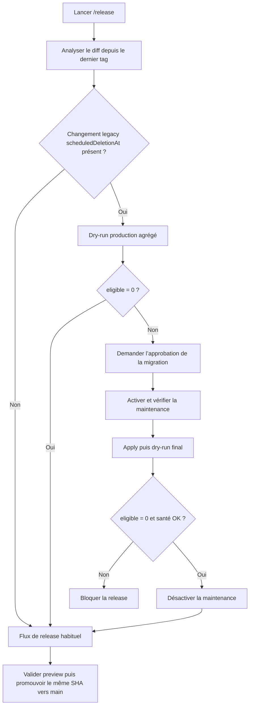

# Instruction: Intégrer la migration ponctuelle avant la release

## Architecture projection

> Tree of the final files. ✅ create · ✏️ modify · ❌ delete

```txt
.claude/
└── skills/
    └── release/
        └── SKILL.md ✏️
docs/
└── DEPLOYMENT.md ✏️
```

## User Journey



## Tasks to do

### `1)` Détecter automatiquement la release concernée

> Le gate doit être ponctuel sans marker, état persistant ou nouvelle commande.

1. Réutiliser `BASE_REF` et la liste des fichiers déjà calculés par `/release`.
2. Déclencher le gate lorsque le diff de la release contient l’outil `migrate-scheduled-deletion-metadata.ts` ou le changement de runtime qui abandonne la claim client.
3. Ne pas le rejouer sur les releases suivantes lorsque ces fichiers ne sont plus dans le diff depuis le dernier tag.
4. Placer le gate avant le commit de release et avant tout push vers `main`.

### `2)` Automatiser le contrôle et garder l’écriture explicitement approuvée

> Il ne doit rester aucune action post-release à se rappeler.

1. Faire exécuter par `/release` le dry-run production depuis le checkout backend revu, avec seulement les compteurs agrégés.
2. Si `eligible: 0`, poursuivre automatiquement sans maintenance ni action utilisateur.
3. Si `eligible > 0`, arrêter la promotion et présenter l’impact exact; demander une approbation explicite avant toute modification de Railway ou Auth Admin.
4. Après accord, réutiliser le runbook existant : activer la maintenance, attendre le déploiement, vérifier le statut public et le `503` protégé, exécuter apply, puis un dry-run final.
5. Ne désactiver la maintenance et ne reprendre la release qu’après `eligible: 0`, endpoint de maintenance revenu à `false` et `/health` valide.
6. En cas de capability, credential ou preuve manquante, bloquer avant production au lieu de reporter une étape après la release.

### `3)` Rendre le timing explicite dans la documentation

> La documentation doit répondre sans ambiguïté à « quand dois-je lancer cet outil ? ».

1. Qualifier l’opération de gate pré-release ponctuel de la release qui introduit le modèle `app_metadata`.
2. Préciser que `/release` orchestre le contrôle et qu’aucune exécution post-release n’est attendue.
3. Préciser que le job CI de migrations SQL n’est pas concerné : l’outil agit sur les metadata Auth via l’API Admin.
4. Conserver les garanties existantes de pagination, idempotence, relecture fraîche, absence de PII et maintenance obligatoire pour `--apply`.

## Test acceptance criteria

| Task | Acceptance criteria |
| ---- | ------------------- |
| 1 | Une simulation de diff contenant la migration déclenche le gate avant Step 9; un diff d’une release ultérieure ne le déclenche pas. |
| 1 | Aucun marker, secret, nouveau script wrapper ou état « migration exécutée » n’est ajouté au dépôt. |
| 2 | Un dry-run à `eligible: 0` laisse le flux `/release` continuer sans approbation supplémentaire. |
| 2 | Un dry-run à `eligible > 0`, une capability absente ou un contrôle de maintenance invalide bloque toute promotion vers `main`. |
| 2 | `--apply` ne peut être exécuté qu’après approbation explicite et maintenance vérifiée; la release ne reprend qu’après le dry-run final à zéro et le retour à la santé. |
| 3 | `docs/DEPLOYMENT.md` indique explicitement « avant la release concernée » et « aucune action post-release ». |
| 3 | Le flux normal de release, la CI preview, le push du SHA immuable et les déploiements automatiques Vercel/Railway restent inchangés hors de ce gate ponctuel. |
