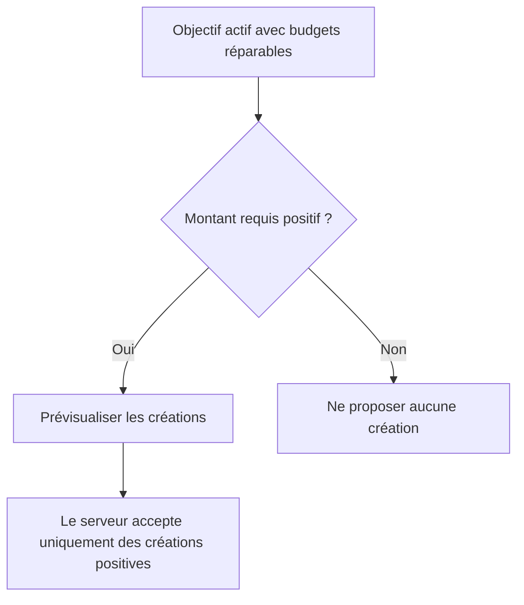

# Instruction: Durcir le contrat des prévisions manquantes

## Architecture projection

> Tree of the final files. ✅ create · ✏️ modify · ❌ delete

```txt
.
├── shared
│   ├── ✏️ schemas.ts
│   └── src
│       └── ✏️ savings-goal-schema.spec.ts
├── frontend/projects/webapp/src/app/feature/savings-goals/detail
│   ├── ✏️ savings-goal-detail-page.ts
│   └── ✏️ savings-goal-detail-page.spec.ts
├── ios
│   ├── Pulpe
│   │   ├── Domain/Models
│   │   │   └── ✏️ SavingsGoalPlan.swift
│   │   └── Features/SavingsGoals
│   │       └── ✏️ SavingsGoalDetailView.swift
│   └── PulpeTests/Features/SavingsGoals
│       └── ✏️ SavingsGoalDetailViewModelTests.swift
└── ✏️ docs/SAVINGS.md
```

- Création : aucune.
- Suppression : aucune.

## User Journey



## Tasks to do

### `1)` Verrouiller la frontière métier

1. Ajouter le test qui refuse une création manquante à zéro.
2. Rendre son montant strictement positif sans changer `monthAdjustments`.
3. Conserver la compatibilité des créations positives.

### `2)` Aligner les clients

1. Masquer la récupération web quand `required <= 0`.
2. Refuser le payload iOS quand `required <= 0`.
3. Couvrir les deux régressions.

### `3)` Aligner la documentation

1. Décrire `missingMonthAdjustments` comme une période sans Prévision liée.
2. Mentionner le montant strictement positif dans le contrat d’application.

## Test acceptance criteria

| Task | Acceptance criteria |
| --- | --- |
| 1 | Une création manquante à 0 est rejetée au contrat partagé, tandis qu’une ligne existante peut toujours être ajustée à 0. |
| 2 | Web et iOS ne proposent ni n’envoient de récupération lorsque `required` vaut 0. |
| 3 | Les commentaires et `docs/SAVINGS.md` couvrent les budgets absents ou matérialisés avec un montant de création positif. |
