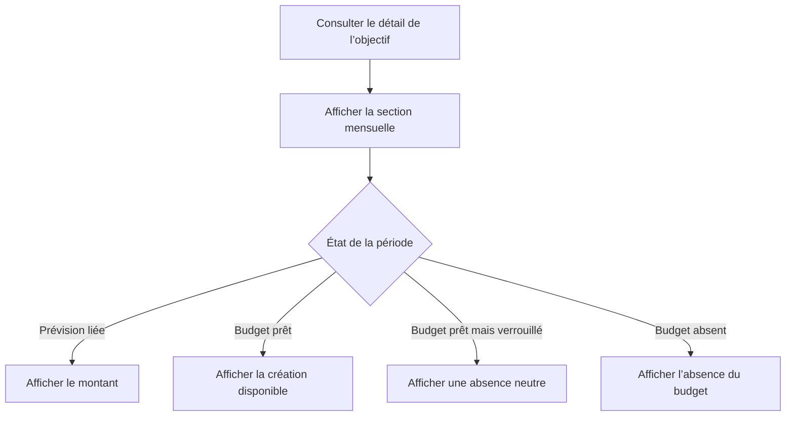

# Instruction: Rendre chaque état de récupération exact et accessible

## Architecture projection

> Tree of the final files. ✅ create · ✏️ modify · ❌ delete

```txt
.
├── frontend/projects/webapp
│   ├── public/i18n
│   │   └── ✏️ fr.json
│   └── src/app/feature/savings-goals/detail/components
│       ├── ✏️ goal-plan-timeline.ts
│       └── ✏️ goal-plan-timeline.spec.ts
└── ios
    ├── Pulpe/Features/SavingsGoals
    │   └── ✏️ SavingsGoalDetailView.swift
    └── PulpeTests/Features/SavingsGoals
        └── ✏️ SavingsGoalDetailViewModelTests.swift
```

- Création : aucune.
- Suppression : aucune.

## User Journey



## Wireframe

```txt
┌────────────────────────────────────────────┐
│ (1) Résumé de l’objectif                   │
│ (2) État vide éventuel                     │
│                                            │
│ (3) Section du plan              [Action]  │
│ ┌────────────────────────────────────────┐ │
│ │ (4) Résumé des périodes actionnables   │ │
│ └────────────────────────────────────────┘ │
│ (5) Périodes : liée · absente · budget    │
└────────────────────────────────────────────┘
```

1. Résumé : conserve les métriques actuelles.
2. État vide : reste visible tant qu’aucune Prévision n’est liée.
3. Plan : existe dès qu’une timeline est disponible.
4. Résumé : expose les budgets réparables même sans contribution initiale.
5. Périodes : porte un libellé distinct pour chaque disponibilité.

## Tasks to do

### `1)` Corriger les quatre états web

1. Ajouter le cas budget matérialisé mais non provisionnable.
2. Réserver « Pas de budget » à `hasBudget=false`.
3. Utiliser un libellé neutre quand le budget existe sans action possible.

### `2)` Débloquer le premier rattachement iOS

1. Ajouter un test de présentation avec `linkedLineCount=0` et mois réparable.
2. Afficher la timeline et l’encart indépendamment du compteur de lignes.
3. Garder trajectoire et contributions conditionnées aux données liées.

## Test acceptance criteria

| Task | Acceptance criteria |
| --- | --- |
| 1 | Web distingue Prévision liée, Épargne à ajouter, aucune Épargne prévue et Pas de budget sans confondre présence et actionnabilité. |
| 2 | Sur iOS, un objectif à zéro Prévision liée expose sa timeline et la récupération dès qu’un budget devient réparable. |
| 1–2 | Les libellés visibles et accessibles restent cohérents avec l’état réel. |
