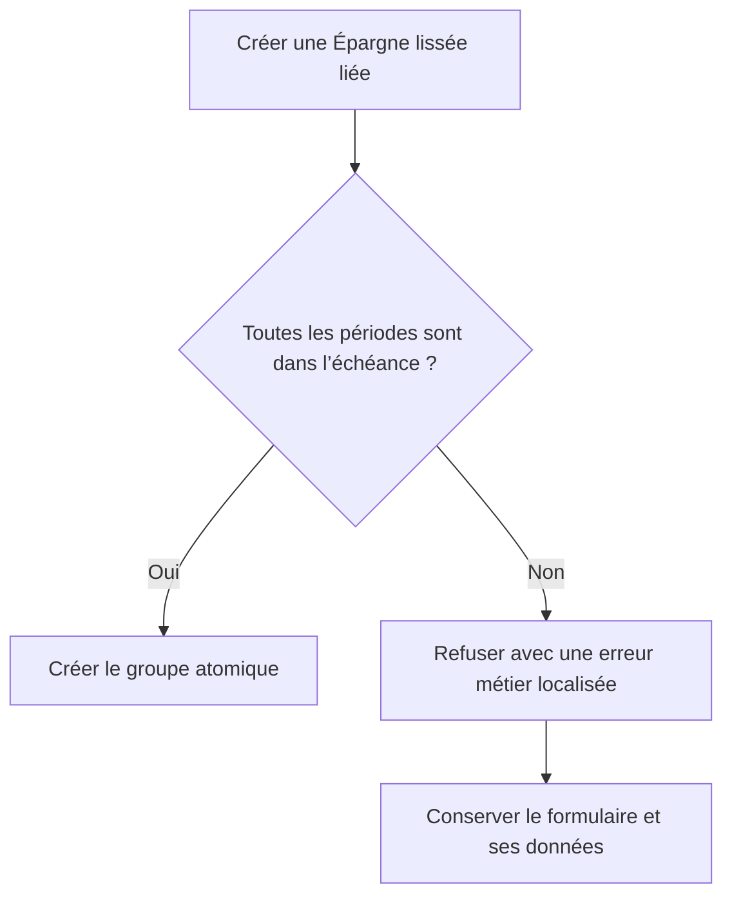

# Instruction: Sécuriser et localiser le lissage lié

## Architecture projection

> Tree of the final files. ✅ create · ✏️ modify · ❌ delete

```txt
.
├── shared/src
│   └── ✏️ error-codes.ts
├── backend-nest/src
│   ├── common
│   │   ├── constants
│   │   │   └── ✏️ error-definitions.ts
│   │   └── utils
│   │       ├── ✏️ savings-goal-link.ts
│   │       └── ✏️ savings-goal-link.spec.ts
│   └── modules/budget-line/infrastructure/persistence
│       ├── ✏️ supabase-budget-line.repository.ts
│       └── ✏️ supabase-budget-line.repository.spec.ts
├── frontend/projects/webapp
│   ├── public/i18n
│   │   └── ✏️ fr.json
│   └── src/app/core/api
│       ├── ✏️ api-error-localizer.ts
│       └── ✏️ api-error-localizer.spec.ts
├── ios
│   ├── Pulpe
│   │   ├── Core/Network
│   │   │   └── ✏️ APIError.swift
│   │   └── Features/Budgets/BudgetDetails
│   │       ├── ✏️ AddBudgetLineSheet.swift
│   │       └── Spread
│   │           └── ✏️ AddBudgetLineSpreadLogic.swift
│   └── PulpeTests/Features/Budgets/BudgetDetails/Spread
│       └── ✏️ AddBudgetLineSpreadSavingsGoalTests.swift
└── ✏️ docs/SPREAD.md
```

- Création : aucune.
- Suppression : aucune.

## User Journey



## Wireframe

```txt
┌──────────────────────────────────────────┐
│ (1) Type et mode                         │
│ (2) Montant et périodes                  │
│ (3) Sélecteur d’objectif                 │
│ (4) Message métier éventuel              │
│                              (5) [Action] │
└──────────────────────────────────────────┘
```

1. Type et mode : conservent les contrôles actuels.
2. Montant et périodes : conservent la preview existante.
3. Objectif : reste facultatif.
4. Message : explique une échéance incompatible.
5. Action : nomme correctement la nature Épargne ou Dépense.

## Tasks to do

### `1)` Exposer le refus d’horizon

1. Détecter séparément le message exact du trigger.
2. Le traduire en erreur métier 422 dédiée.
3. Prouver que les autres refus et l’atomicité restent inchangés.

### `2)` Localiser sur les deux clients

1. Ajouter le code à la localisation web et son test.
2. Ajouter le mapping iOS et son test.
3. Documenter le refus dans le contrat de lissage.

### `3)` Corriger l’action iOS

1. Nommer l’action selon `kind`.
2. Garder le libellé Dépense inchangé.
3. Tester les deux libellés.

## Test acceptance criteria

| Task | Acceptance criteria |
| --- | --- |
| 1 | Une tranche après l’échéance retourne une erreur métier 422 dédiée et ne crée aucun groupe partiel. |
| 2 | Web et iOS présentent une explication française actionnable pour ce code. |
| 3 | L’action iOS dit « Lisser l’épargne » pour une Épargne et « Lisser la dépense » pour une Dépense. |
