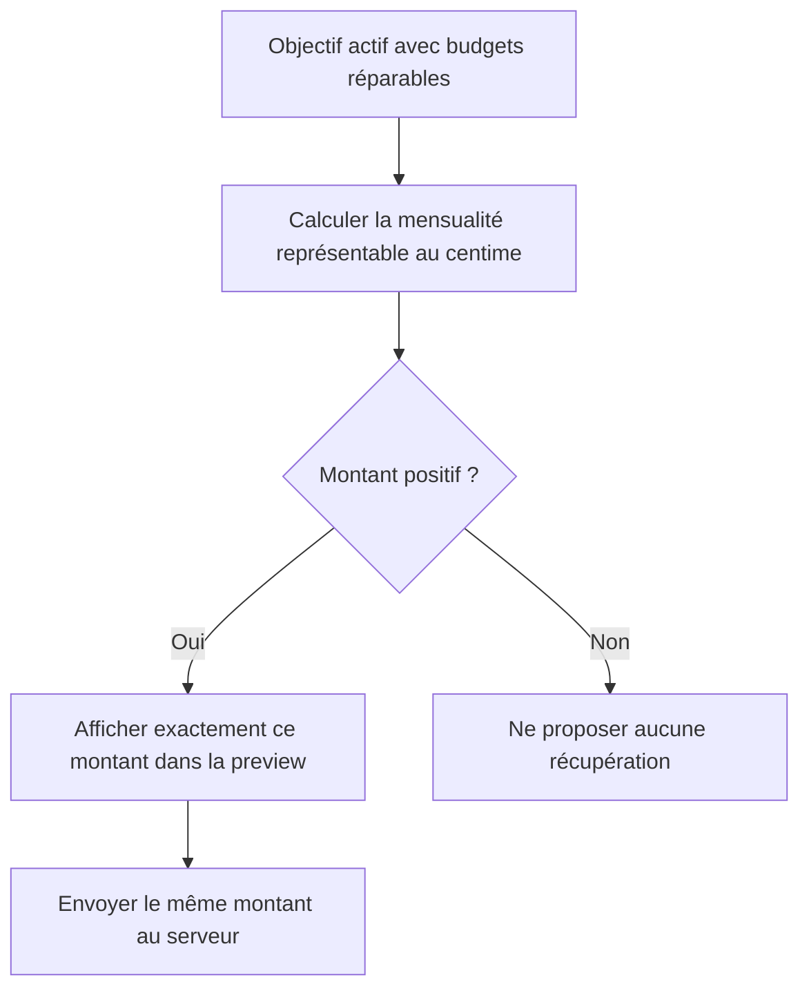

# Instruction: Garantir une mensualité de récupération positive

## Architecture projection

> Tree of the final files. ✅ create · ✏️ modify · ❌ delete

```txt
.
├── frontend/projects/webapp/src/app/feature/savings-goals/detail
│   ├── ✏️ savings-goal-detail-page.ts
│   └── ✏️ savings-goal-detail-page.spec.ts
├── ios
│   ├── Pulpe/Features/SavingsGoals
│   │   └── ✏️ SavingsGoalDetailView.swift
│   └── PulpeTests/Features/SavingsGoals
│       └── ✏️ SavingsGoalDetailViewModelTests.swift
└── ✏️ docs/SAVINGS.md
```

- Création : aucune.
- Suppression : aucune.

## User Journey



## Tasks to do

### `1)` Unifier le montant monétaire

1. Arrondir `required` au centime supérieur sur web et iOS.
2. Réutiliser ce montant unique pour la disponibilité, la preview, la projection et le payload.
3. Conserver l’absence de récupération quand le montant représentable vaut zéro.

### `2)` Verrouiller les cas limites

1. Ajouter le cas `required = 0,004` sur les deux clients.
2. Conserver les cas `required = 0` et le montant nominal déjà arrondi.
3. Aligner `docs/SAVINGS.md` sur l’arrondi supérieur appliqué aux nouvelles Prévisions.

## Test acceptance criteria

| Task | Acceptance criteria |
| --- | --- |
| 1–2 | Pour `required = 0,004`, web et iOS affichent puis envoient `0,01`, jamais `0`. |
| 1–2 | Pour `required = 0`, aucun CTA ni payload de récupération n’est produit. |
| 1–2 | La preview, sa projection et `missingMonthAdjustments` utilisent exactement le même montant positif au centime. |
