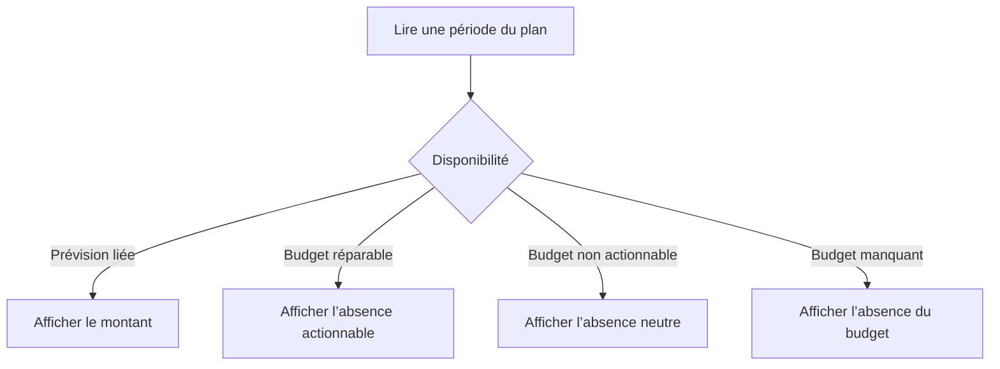

# Instruction: Distinguer l’absence iOS actionnable et neutre

## Architecture projection

> Tree of the final files. ✅ create · ✏️ modify · ❌ delete

```txt
ios
├── Pulpe/Features/SavingsGoals/Components
│   └── ✏️ GoalPlanMonthRow.swift
└── PulpeTests/Features/SavingsGoals
    └── ✏️ GoalPlanTimelinePresentationTests.swift
```

- Création : aucune.
- Suppression : aucune.

## User Journey



## Wireframe

```txt
┌──────────────────────────────────────┐
│ (1) Période liée             montant │
├──────────────────────────────────────┤
│ (2) Période · état actionnable       │
├──────────────────────────────────────┤
│ (3) Période · état neutre · verrou   │
├──────────────────────────────────────┤
│ (4) Période · budget manquant        │
└──────────────────────────────────────┘
```

1. Liée : période et montant de la Prévision existante.
2. Actionnable : période avec budget et capacité de création.
3. Neutre : période avec budget mais sans création possible.
4. Manquante : période sans budget matérialisé.

## Tasks to do

### `1)` Porter les quatre disponibilités

1. Dériver l’état actionnable depuis `SavingsGoalPlanMonth.isRepairable`.
2. Garder un état neutre distinct pour `hasBudget=true` non réparable.
3. Conserver les états Prévision liée et budget manquant.

### `2)` Aligner texte et accessibilité

1. Réserver « Épargne à ajouter » aux périodes réparables.
2. Annoncer « Aucune épargne prévue » pour un budget non actionnable.
3. Utiliser le même état dans le texte visible et le libellé VoiceOver.
4. Couvrir une période verrouillée et une période non provisionnable.

## Test acceptance criteria

| Task | Acceptance criteria |
| --- | --- |
| 1–2 | Une période réparable reste annoncée « Épargne à ajouter » visuellement et par VoiceOver. |
| 1–2 | Une période avec budget mais verrouillée ou non provisionnable est annoncée « Aucune épargne prévue », jamais comme actionnable. |
| 1 | Une Prévision liée conserve son montant et une période sans budget conserve « Pas de budget ». |
