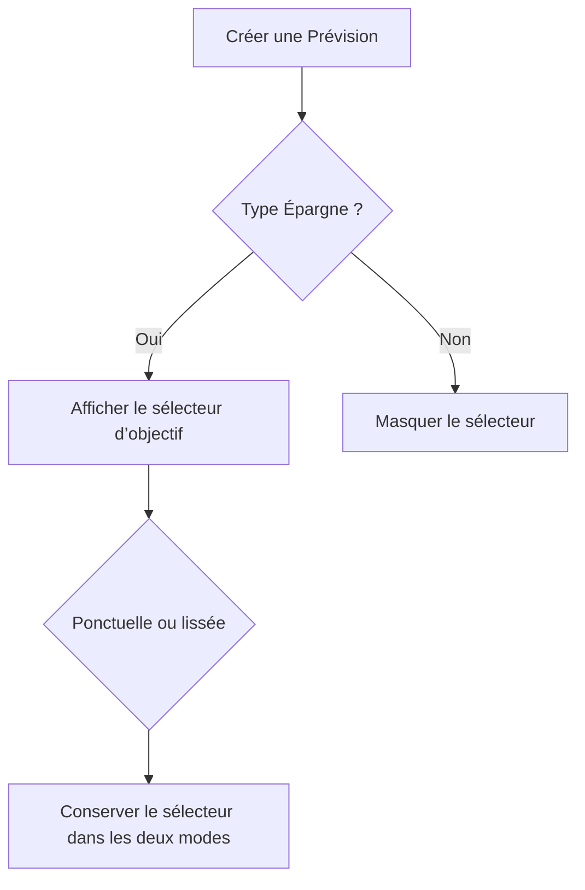

# Instruction: Restaurer la limite BudgetDetails

## Architecture projection

> Tree of the final files. ✅ create · ✏️ modify · ❌ delete

```txt
ios
├── Pulpe/Features/Budgets/BudgetDetails
│   └── ✏️ AddBudgetLineSheet.swift
└── PulpeTests/Features/Budgets/BudgetDetails
    └── ✏️ AddBudgetLineSheetTests.swift
```

- Création : aucune.
- Suppression : aucune.

## User Journey



## Tasks to do

### `1)` Réduire sans déplacer le comportement

1. Ramener le prédicat de visibilité à une ligne fondée uniquement sur `kind`, sur le modèle de `showsTagPicker`, et retirer son argument `spread` inutilisé.
2. Supprimer au moins trois lignes de commentaire ou d’espacement redondantes dans la sheet, sans déplacer du code.
3. Ne créer aucun helper ou fichier uniquement pour contourner le compteur.
4. Ne désactiver aucune règle de longueur.

### `2)` Conserver le rattachement

1. Adapter le test de visibilité au prédicat fondé uniquement sur `kind`.
2. Conserver le picker pour Épargne ponctuelle et lissée.
3. Conserver les libellés de lissage Épargne et Dépense.

## Test acceptance criteria

| Task | Acceptance criteria |
| --- | --- |
| 1 | `AddBudgetLineSheet.swift` contient au plus 350 lignes et le test d’architecture BudgetDetails passe sans désactivation. |
| 1–2 | Le sélecteur d’objectif reste visible pour toute Épargne, ponctuelle ou lissée, et absent pour les autres types. |
| 2 | Les payloads et libellés du lissage restent inchangés. |
