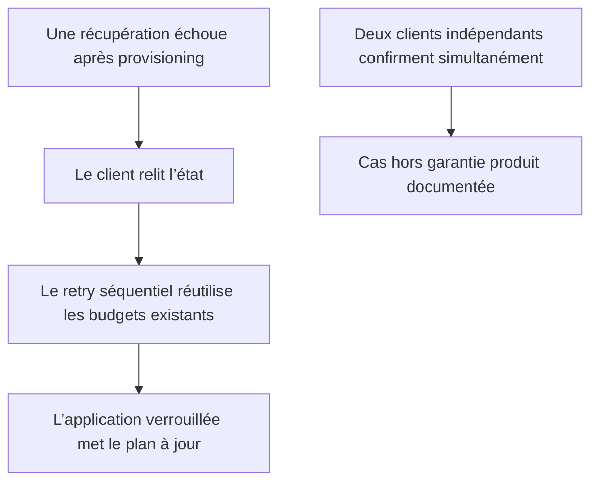

# Instruction: Cadrer l’idempotence réellement supportée

## Architecture projection

> Tree of the final files. ✅ create · ✏️ modify · ❌ delete

```txt
.
└── ✏️ docs/SAVINGS.md
```

- Création : aucune.
- Suppression : aucune.

## User Journey



## Tasks to do

### `1)` Qualifier la garantie de reprise

1. Remplacer la formulation d’idempotence générale par une garantie explicite de retry séquentiel.
2. Distinguer le provisioning préalable de l’application finale sérialisée par objectif.
3. Conserver les garanties existantes de validation, chiffrement et invalidation des caches.

### `2)` Enregistrer la limite acceptée

1. Indiquer que deux demandes indépendantes et simultanées sur le même compte ne sont pas sérialisées pendant le provisioning.
2. Ne pas ajouter de clé d’idempotence, contrainte DB, verrou applicatif, RPC ou test concurrent.
3. Ne pas modifier le comportement serveur ni les payloads clients.

## Test acceptance criteria

| Task | Acceptance criteria |
| --- | --- |
| 1 | `docs/SAVINGS.md` ne qualifie plus tout le flux de concurrent-idempotent ; il décrit précisément la reprise séquentielle et le verrou de l’application finale. |
| 2 | La limite multi-client simultanée est explicite et aucun fichier d’exécution, migration ou contrat API n’est modifié. |
