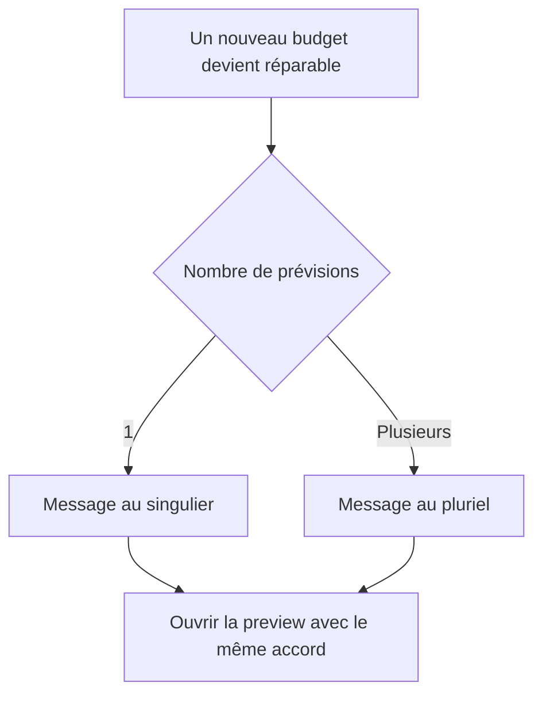

# Instruction: Naturaliser les compteurs web

## Architecture projection

> Tree of the final files. ✅ create · ✏️ modify · ❌ delete

```txt
frontend/projects/webapp
├── public/i18n
│   └── ✏️ fr.json
└── src/app/feature/savings-goals/detail
    ├── ✏️ savings-goal-detail-page.ts
    ├── ✏️ savings-goal-detail-page.spec.ts
    └── components
        └── ✏️ goal-plan-apply-dialog.ts
```

- Création : aucune.
- Suppression : aucune.

## User Journey



## Tasks to do

### `1)` Ajouter les variantes françaises minimales

1. Remplacer `repairMessage` et `createCount` par des clés singulier/pluriel selon le modèle `countOne` / `countMany` déjà présent.
2. Garder les interpolations de compte et tous les autres libellés inchangés.
3. Ne pas ajouter de bibliothèque de pluralisation ni de helper générique.

### `2)` Sélectionner la bonne variante

1. Choisir la clé du callout depuis le nombre de mois réparables.
2. Étendre `countKey` du récap uniquement pour le mode création.
3. Ajouter au test de page existant la reproduction du singulier ; conserver le pluriel comme chemin nominal.

## Test acceptance criteria

| Task | Acceptance criteria |
| --- | --- |
| 1–2 | Pour un mois réparable, le callout et la preview affichent « 1 prévision Épargne » avec verbe au singulier. |
| 1–2 | Pour plusieurs mois, ils affichent « N prévisions Épargne » avec verbe au pluriel. |
| 2 | Les modes d’ajustement, les payloads et le comportement de confirmation restent inchangés. |
| 2 | Le test ciblé de la page objectif et la vérification JSON passent. |
