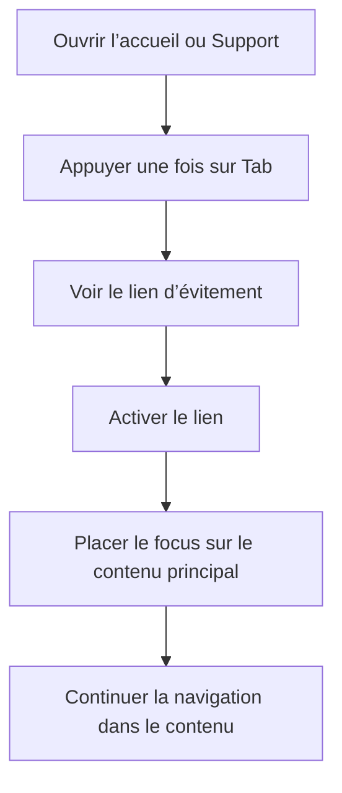

# Instruction: Fiabiliser le lien d’évitement partagé par les deux pages

## Architecture projection

> Tree of the final files. ✅ create · ✏️ modify · ❌ delete

```txt
landing
└── app
    ├── ✏️ accessibility.test.tsx
    ├── ✏️ page.tsx
    └── support
        └── ✏️ page.tsx
```

- Création : aucune.
- Suppression : aucune.

## User Journey



## Wireframe

```txt
┌──────────────────────────────────────────────┐
│ (1) Lien d’évitement                         │
├──────────────────────────────────────────────┤
│ (2) Navigation principale                    │
├──────────────────────────────────────────────┤
│ (3) Contenu principal                        │
│     Titre · contenu · actions                │
└──────────────────────────────────────────────┘
```

1. Lien d’évitement : premier contrôle de la page, placé avant la navigation répétée.
2. Navigation principale : bloc que le lien permet de contourner.
3. Contenu principal : destination du lien et point de reprise de la navigation.

## Tasks to do

### `1)` Reproduire le défaut dans le test landing existant

> Verrouiller le comportement des deux pages avant de corriger leurs classes et leur cible.

1. Étendre le contrat d’accessibilité pour couvrir l’accueil et Support.
2. Attendre que chaque lien soit révélé par `focus-visible`, pas par tout type de focus.
3. Attendre que chaque élément `main` portant `main-content` accepte le focus programmatique sans entrer dans l’ordre de tabulation.
4. Vérifier que le test échoue avec l’implémentation actuelle.

### `2)` Corriger le lien et sa destination sur les deux pages

> Conserver le mécanisme d’accessibilité sans laisser son contrôle flotter après un clic.

1. Remplacer les variantes de visibilité et de placement `focus:*` par leurs variantes `focus-visible:*` sur les deux liens.
2. Rendre les deux éléments `main` ciblés focalisables programmatiquement avec `tabIndex={-1}`.
3. Garder le lien comme premier contrôle du document et conserver son libellé.
4. Ne créer ni composant partagé, ni script client, ni nouvelle règle CSS pour deux occurrences.

### `3)` Valider le parcours clavier et pointeur

> Prouver que le défaut disparaît sans retirer le raccourci d’accessibilité.

1. Exécuter le test landing ciblé, puis les tests du package.
2. Exécuter le lint, le contrôle de types et `pnpm quality`.
3. Vérifier dans le navigateur l’accueil et Support au clavier : premier `Tab`, activation, puis reprise de la navigation dans le contenu.
4. Vérifier qu’un clic ou une navigation vers `#main-content` ne laisse pas le lien au-dessus du header.

## Test acceptance criteria

| Task | Acceptance criteria |
| ---- | ------------------- |
| 1 | Le test échoue si l’accueil ou Support réintroduit `focus:not-sr-only` ou perd sa cible focalisable. |
| 2 | Au repos et après un clic, le lien d’évitement n’est pas visible au-dessus du header. |
| 2 | Au premier `Tab`, le lien devient visible et son libellé annonce clairement sa destination. |
| 2 | Après activation, le focus quitte le lien pour le contenu principal sans ajouter `main` à l’ordre de tabulation normal. |
| 2 | L’accueil et Support utilisent le même contrat sans nouveau composant, script ou style global. |
| 3 | La navigation suivante continue dans le contenu principal sur les deux pages. |
| 3 | Les tests landing, le lint, le contrôle de types et `pnpm quality` passent. |
