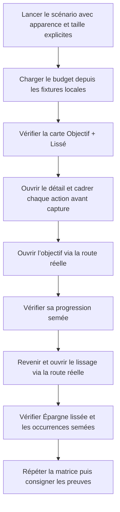

# Instruction: Rendre le journey autonome, déterministe et probant

## Architecture projection

> Tree of the final files. ✅ create · ✏️ modify · ❌ delete

```txt
ios/
├── Pulpe/
│   ├── App/
│   │   ├── ✏️ BudgetLongPressUITestHarness.swift  # fixtures budget, tags et occurrences sans réseau
│   │   └── ✏️ MainTabView.swift                   # injecte les services dans les routes réelles de BudgetsTab
│   └── Features/Budgets/BudgetDetails/
│       ├── ✏️ BudgetDetailsView.swift
│       ├── ✏️ BudgetDetailsView+Routing.swift
│       ├── ✏️ BudgetLineDetailPage+SavingsGoalLink.swift
│       ├── ✏️ EditTransactionPage.swift
│       ├── Routing/
│       │   └── ✏️ BudgetDetailDestination.swift
│       └── Spread/
│           └── ✏️ SpreadOccurrencesSheet.swift    # service injecté et titre dérivé du type financier
└── PulpeUITests/
    └── ✏️ BudgetLineLongPressTests.swift           # matrice synchronisée et contenu des routes asserté

aidd_docs/tasks/2026_07/2026_07_29_valider-correctif-objectif-lissage-ios/
├── ✏️ validation.md
├── ✏️ journey.md
└── ✏️ journey-screenshots/                         # preuves remplacées après le nouveau journey
```

Les initialiseurs de production gardent leurs services partagés par défaut. Le scénario UI injecte seulement des fixtures dans les seams déjà présents ; aucun conteneur de dépendances ni nouveau composant visuel n’est ajouté.

## User Journey



## Tasks to do

### `1)` Verrouiller les régressions avant le correctif

> Faire échouer les contrôles sur les deux comportements incorrects observés, sans élargir la couverture.

1. Remplacer dans le test de route l’attente erronée `Dépense lissée` par `Épargne lissée` pour la ligne `.saving`, puis confirmer que le test échoue sur le titre actuel.
2. Ajouter aux assertions de destination un marqueur de progression propre à l’objectif semé et une occurrence mois/montant propre au groupe semé ; confirmer qu’elles échouent tant que les routes utilisent les services réels.
3. Conserver le test de présentation existant qui couvre déjà `Épargne lissée` et `Dépense lissée`, sans créer une seconde suite redondante.

### `2)` Rendre le scénario autonome sur ses lectures

> Réutiliser les protocoles et initialiseurs d’injection existants ; les valeurs par défaut de l’application restent inchangées.

1. Ajouter dans `BudgetLongPressUITestHarness.swift` une fixture locale minimale qui conforme aux surfaces de lecture `BudgetServicing`, `BudgetLineServicing` et `TagServicing`.
2. Retourner uniquement le budget, le groupe de lissage et les occurrences du scénario ; refuser tout identifiant inattendu pour qu’une mauvaise route échoue nettement.
3. Injecter la fixture dans `BudgetListStore`, `TagStore` et `BudgetsTab`, tout en conservant `SavingsGoalIntervalUITestService` pour le store et la destination objectif.
4. Ajouter à `BudgetsTab` des paramètres de services avec les implémentations partagées comme valeurs par défaut, puis les transmettre à `BudgetDetailsView` et `SavingsGoalDetailView`.
5. Faire construire le `BudgetDetailsCoordinator` avec les services reçus par `BudgetDetailsView` et transmettre son `budgetLineService` à `SpreadOccurrencesSheet`.

### `3)` Transporter le type financier jusqu’au titre du lissage

> Corriger la cause commune aux ouvertures depuis une prévision et depuis une transaction.

1. Étendre `BudgetDetailDestination.spreadOccurrences` avec le `TransactionKind` connu par l’appelant.
2. Fournir `line.kind` depuis `BudgetLineDetailPage` et `tx.kind` depuis `EditTransactionPage`.
3. Transmettre ce type à `SpreadOccurrencesSheet`.
4. Dériver le titre de navigation avec `SpreadAffordanceButton.title(for:)`, déjà couvert et déjà utilisé pour le libellé d’action.

### `4)` Rendre la matrice et les preuves déterministes

> Chaque capture doit nommer un état explicitement configuré et montrer l’élément qu’elle prétend valider.

1. Faire retourner explicitement `.light` ou `.dark` par le harness et toujours définir `UITEST_COLOR_SCHEME` au lancement.
2. Remplacer les glissements arbitraires en Accessibility 3 par `scrollUntilHittable`, puis vérifier l’existence, le caractère hittable et la hauteur de la cible immédiatement avant sa capture.
3. Capturer séparément l’action objectif et l’action lissage lorsque les deux ne tiennent pas simultanément à l’écran.
4. Après navigation, vérifier `savingsGoalDetailRoot` avec la donnée de progression unique, puis `Épargne lissée` avec l’occurrence unique ; vérifier aussi l’absence de `Connexion impossible`.
5. Réexécuter les quatre modes clair/sombre × standard/Accessibility 3 sur le petit iPhone retenu.

### `5)` Rejouer le journey et mettre les preuves à jour

> Remplacer les affirmations invalidées par des observations issues du scénario corrigé.

1. Rejouer les quatre étapes du journey sur l’iPhone SE et remplacer les captures concernées.
2. Mettre `journey.md` à jour avec les contenus réellement observés et un verdict fondé sur les quatre étapes.
3. Corriger `validation.md` pour décrire les services injectés, les apparences forcées, les assertions de contenu et le titre dépendant du type financier.
4. Exécuter le test unitaire ciblé, les deux UI tests Objectif/Lissage, le build Preview sur simulateur, SwiftLint sur les fichiers modifiés, `pnpm quality` et `git diff --check`.

## Test acceptance criteria

| Task | Acceptance criteria |
| --- | --- |
| 1 | Le test de route échoue avant correction sur `Épargne lissée` et sur les contenus absents des deux destinations. |
| 1 | Aucun nouveau test unitaire ne duplique la couverture de `SpreadAffordanceButton.title(for:)`. |
| 2 | Le journey charge le budget, les tags, la progression d’objectif et les occurrences depuis des services déterministes injectés ; aucune destination n’affiche une erreur réseau. |
| 2 | Un identifiant de budget, d’objectif ou de groupe différent de la fixture fait échouer le scénario au lieu de retourner des données génériques. |
| 2 | Hors scénario UI-test, `BudgetsTab`, `BudgetDetailsView`, `SavingsGoalDetailView` et `SpreadOccurrencesSheet` conservent leurs services partagés par défaut. |
| 3 | Une ligne `.saving` ouvre une feuille titrée `Épargne lissée` et une ligne `.expense` conserve `Dépense lissée`, depuis les deux appelants de la route. |
| 4 | Les quatre modes fixent explicitement l’apparence et la taille dynamique ; chaque capture est prise après une assertion sur la cible visible. |
| 4 | La destination objectif expose sa racine et sa progression semée ; la feuille de lissage expose le bon titre et au moins une occurrence mois/montant semée. |
| 4 | Les deux actions contextuelles restent distinctes, hittables et hautes d’au moins 44 pt en taille standard et Accessibility 3. |
| 5 | Le journey se termine avec quatre étapes réussies et des captures correspondant aux états décrits. |
| 5 | Les tests ciblés, le build Preview, SwiftLint, `pnpm quality` et `git diff --check` passent sans nouvelle régression attribuable au correctif. |
