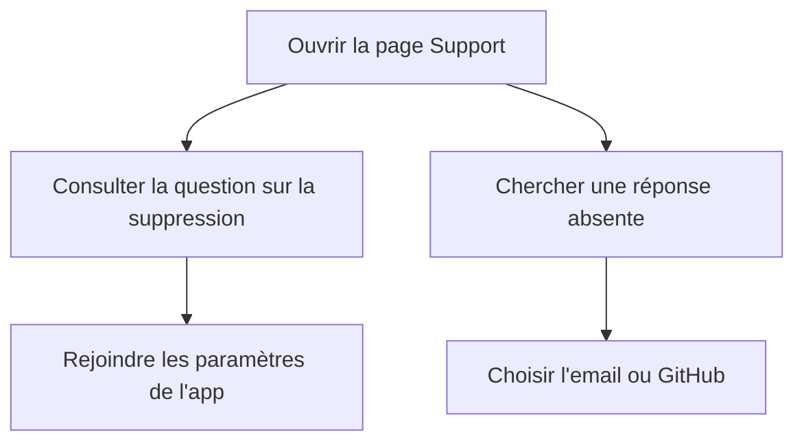

# Instruction: Fermer les findings de la page Support

## Architecture projection

> Tree of the final files. ✅ create · ✏️ modify · ❌ delete

```txt
landing
└── app
    ├── ✏️ accessibility.test.tsx
    └── support
        └── ✏️ page.tsx
```

- Création : aucune.
- Suppression : aucune.

## User Journey



## Wireframe

```txt
┌──────────────────────────────────────────────┐
│ (1) Liste des questions                     │
│     ┌────────────────────────────────────┐   │
│     │ Réponse avec destination intégrée │   │
│     └────────────────────────────────────┘   │
├──────────────────────────────────────────────┤
│ (2) Contact direct                           │
│     [Action email]  [Action dépôt public]    │
└──────────────────────────────────────────────┘
```

1. Questions : la réponse concernée contient un accès direct à la destination qu'elle cite.
2. Contact : les deux actions restent distinctes et utilisables au toucher comme au clavier.

## Tasks to do

### `1)` Verrouiller les trois corrections dans le test existant

> Étendre le contrat source de `/support` avant de modifier la page.

1. Attendre un lien suivi vers `/settings` avec un identifiant UTM dédié dans la réponse de suppression.
2. Attendre `min-h-11` sur les deux liens de contact sans l'ajouter à la classe des liens intégrés aux réponses.
3. Attendre que les réponses purement textuelles utilisent `plainAnswer` comme source visible par défaut.
4. Ajouter un contrôle ciblé des quatre réponses enrichies par un lien : sécurité, démo, gratuité et suppression.
5. Conserver le contrôle qui construit le JSON-LD depuis `plainAnswer`.

### `2)` Corriger la source des réponses et les cibles interactives

> Fermer les findings sans nouveau composant, fichier de données ou règle CSS.

1. Rendre `answer` optionnel dans `FaqItem` et fournir `plainAnswer` à `AccordionItem` lorsqu'aucun rendu enrichi n'est nécessaire.
2. Supprimer les duplications `answer` des réponses purement textuelles ; garder le JSX uniquement pour les réponses qui portent un lien.
3. Créer l'URL des paramètres avec `angularUrl("/settings", "faq_delete_account")`, rendre le mot « paramètres » cliquable et laisser `plainAnswer` sans URL.
4. Ajouter `inline-flex min-h-11 items-center` aux seuls liens email et GitHub de la section contact.
5. Ne modifier ni `AccordionItem`, ni `globals.css`, ni la composition générale de `/support`.

### `3)` Valider le correctif ciblé

> Prouver que la correction ferme la revue sans régression de landing.

1. Exécuter les tests, le lint et le contrôle de types du package landing.
2. Exécuter `pnpm quality` avant le commit.
3. Vérifier à 390 px que les deux actions de contact restent lisibles, sans débordement.
4. Repasser la revue sur `origin/preview...HEAD` et attendre un verdict `approve`.

## Test acceptance criteria

| Task | Acceptance criteria |
| ---- | ------------------- |
| 1 | Le test échoue si le lien vers les paramètres, la hauteur des actions de contact ou le fallback vers `plainAnswer` disparaît. |
| 1 | Les quatre réponses enrichies conservent les mêmes faits et libellés de lien dans leur rendu visible et leur `plainAnswer`. |
| 2 | Le mot « paramètres » mène à `/settings` via `angularUrl` avec `utm_content=faq_delete_account`, tandis que le JSON-LD reste du texte brut. |
| 2 | Chaque réponse sans lien ne déclare son texte qu'une fois et reste rendue par `AccordionItem`. |
| 2 | Les deux liens de contact offrent une hauteur minimale de 44 px ; les liens intégrés aux réponses gardent leur rendu inline. |
| 2 | Aucun composant, fichier de données ou style global n'est ajouté ou modifié. |
| 3 | Les tests, le lint, le contrôle de types et `pnpm quality` passent. |
| 3 | À 390 px, la section contact ne déborde pas et ses deux actions restent dans l'ordre attendu. |
| 3 | La revue finale ne contient plus de finding `fit`, `conform` ou `code` lié aux trois constats d'origine. |
