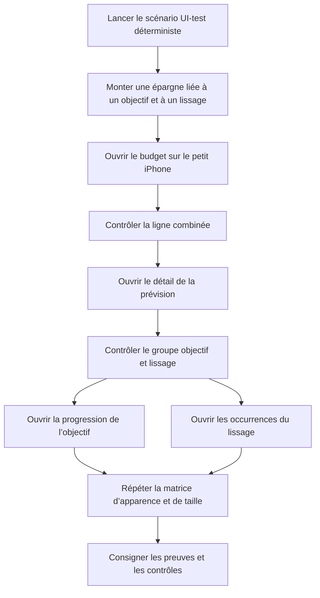

# Instruction: Prouver le rendu et les interactions sur petit iPhone

## Architecture projection

> Tree of the final files. ✅ create · ✏️ modify · ❌ delete

```txt
ios/
├── Pulpe/
│   └── App/
│       ├── ✏️ BudgetLongPressUITestHarness.swift  # ajoute le scénario déterministe Objectif + Lissé
│       ├── ✏️ PulpeApp.swift                      # route ce scénario vers le harness existant
│       └── ✏️ SavingsGoalIntervalUITestHarness.swift # garde son switch exhaustif
└── PulpeUITests/
    └── ✏️ BudgetLineLongPressTests.swift          # vérifie la matrice et les deux destinations

aidd_docs/tasks/2026_07/2026_07_29_valider-correctif-objectif-lissage-ios/
└── ✅ validation.md    # consigne la matrice Simulator, les interactions et les contrôles automatisés
```

Les vues de production restent inchangées. Le scénario est ajouté au harness UI-test déjà utilisé par l’application.

## User Journey



## Wireframe

### Liste du budget — taille standard

```txt
┌─────────────────────────────────────┐
│ (1) Navigation mensuelle            │
├─────────────────────────────────────┤
│ (2) Résumé et filtres               │
│                                     │
│ (3) Section épargne                 │
│ ┌─────────────────────────────────┐ │
│ │ point · type                    │ │
│ │ nom                montant · ›  │ │
│ │ métadonnées                    │ │
│ └─────────────────────────────────┘ │
└─────────────────────────────────────┘
```

1. Navigation mensuelle : période du scénario local.
2. Résumé et filtres : contexte existant conservé.
3. Section épargne : une carte combinée avec identité, métadonnées et montant.

### Liste du budget — grande taille de texte

```txt
┌─────────────────────────────────────┐
│ (1) Navigation mensuelle            │
├─────────────────────────────────────┤
│ (2) Section épargne                 │
│ ┌─────────────────────────────────┐ │
│ │ point · type                    │ │
│ │ nom                             │ │
│ │ métadonnées                     │ │
│ │                    montant · ›  │ │
│ └─────────────────────────────────┘ │
└─────────────────────────────────────┘
```

1. Navigation mensuelle : même période et même scénario.
2. Section épargne : le montant dispose d’une ligne séparée du texte.

### Détail de la prévision

```txt
┌─────────────────────────────────────┐
│ (1) Navigation et identité          │
├─────────────────────────────────────┤
│ (2) Montant et progression          │
├─────────────────────────────────────┤
│ (3) Destination objectif         ›  │
│ ─────────────────────────────────── │
│ (4) Destination lissage          ›  │
├─────────────────────────────────────┤
│ (5) Transactions ou état vide       │
├─────────────────────────────────────┤
│ (6) Action principale               │
└─────────────────────────────────────┘
```

1. Navigation et identité : contexte de la prévision.
2. Montant et progression : information principale avant les liens.
3. Destination objectif : première ligne contextuelle.
4. Destination lissage : seconde ligne contextuelle.
5. Contenu : transactions existantes ou état vide.
6. Action principale : action existante conservée.

## Tasks to do

### `1)` Préparer un scénario UI-test déterministe

> Réutiliser le harness existant et les vues de production, sans dépendre du backend.

1. Ajouter un scénario Objectif + Lissé à `UITestLaunchScenario`.
2. Alimenter `BudgetDetailCache` et `SavingsGoalStore` avec un budget, une prévision d’épargne lissée et son objectif.
3. Entrer par la vraie carte d’août de `BudgetsTab`, puis monter le détail et ses destinations via leurs routes réelles.
4. Confirmer la destination objectif par sa vue racine et la destination lissage par le titre de sa feuille.

### `2)` Exécuter la matrice visuelle

> Observer les deux écrans sur le plus petit simulateur iPhone disponible.

1. Lancer le test ciblé `PulpeUITests` sur l’iPhone SE isolé et ouvrir le budget du scénario.
2. Vérifier la liste puis le détail en taille standard claire et sombre.
3. Répéter sur les mêmes écrans à Accessibility 3 en clair et sombre.
4. Contrôler le reflow des contenus utiles et l’exploitabilité des cartes et des lignes d’action.

### `3)` Confirmer les interactions

> Prouver que les zones tactiles et les routes actuelles restent exploitables.

1. Ouvrir le détail depuis la carte combinée.
2. Activer la ligne objectif et confirmer la progression du bon objectif.
3. Revenir, activer la ligne lissage et confirmer les occurrences du bon groupe.
4. Vérifier que les lignes occupent au moins la hauteur tactile tokenisée.

### `4)` Consigner et fermer les contrôles

> Rendre la validation vérifiable par la prochaine revue.

1. Créer `validation.md` avec le commit, le device, l’OS, le scénario et les dix captures couvrant les huit cellules de la matrice.
2. Noter les deux destinations observées et les éventuels warnings préexistants.
3. Exécuter les tests ciblés, SwiftLint strict sur le diff, le build simulateur, `pnpm quality` et `git diff --check`.
4. Laisser le plan précédent à `implemented`, conformément au cycle AIDD après une revue `changes-requested`.

## Test acceptance criteria

| Task | Acceptance criteria |
| --- | --- |
| 1 | Le scénario UI-test affiche une même prévision d’épargne avec un objectif résolu et un `spreadGroupId` exploitable, sans réseau ni changement des vues de production. |
| 2 | Les huit cellules deux écrans × deux tailles × deux apparences sont observées sur le plus petit iPhone disponible et consignées comme lisibles. |
| 2 | À Accessibility 3, le nom, les métadonnées et le montant se réorganisent sans pill concurrente ; la carte et les deux actions restent exploitables. |
| 3 | La carte ouvre son détail, la ligne objectif ouvre le bon objectif et la ligne lissage ouvre les occurrences du bon groupe. |
| 3 | Les deux lignes contextuelles conservent une cible rectangulaire d’au moins 44 pt. |
| 4 | `validation.md` contient les paramètres reproductibles, la matrice complète, les destinations observées et les résultats des contrôles. |
| 4 | Les tests ciblés, l’architecture, SwiftLint strict sur les fichiers modifiés, le build, `pnpm quality` et `git diff --check` passent sans nouveau warning attribuable au correctif. |
