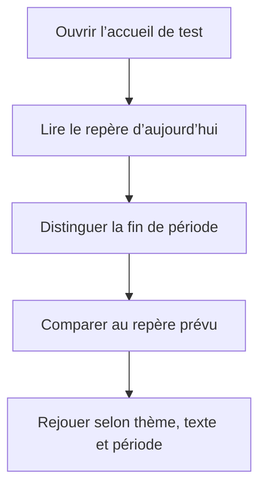

# Instruction: Prouver la matrice visuelle du chart

## Architecture projection

> Tree of the final files. ✅ create · ✏️ modify · ❌ delete

```txt
ios/
├── Pulpe/
│   ├── App/
│   │   └── ContextualCreationUITestHarness.swift               ✏️ rendre les variantes du chart déterministes
│   └── Features/CurrentMonth/Components/
│       └── HomeHeroCard.swift                                  ✏️ uniquement si la matrice reproduit un défaut
└── PulpeUITests/
    └── ContextualCreationUITests.swift                          ✏️ capturer et contrôler les huit variantes
```

Aucun fichier source n’est créé ou supprimé. `HomeHeroCard.swift` reste intact si les huit variantes passent.

## User Journey



## Tasks to do

### `1)` Paramétrer le harness existant

> Produire deux trajectoires déterministes sans réseau, authentification ni PIN.

1. Réutiliser le scénario `UITEST_CONTEXTUAL_CREATION_HOME` et activer son mode chart par variable d’environnement.
2. Générer avec `BudgetFormulas.calculateBalanceTrajectory(referenceDate:)` un cas civil et un cas décalé avec jour de paie, où la destination rejoint le prévu.
3. Réutiliser `UITEST_DYNAMIC_TYPE` et `UITEST_COLOR_SCHEME`, puis ajouter uniquement le choix civil ou décalé.
4. Appliquer le thème dans la vue avec `preferredColorScheme`, sans modifier globalement l’apparence du simulateur.
5. Conserver inchangé le parcours de création contextuelle lorsque le mode chart n’est pas demandé.

### `2)` Capturer la matrice complète

> Conserver une preuve nommée pour chaque combinaison réellement rendue.

1. Ajouter un seul UI test qui parcourt clair et sombre, `.large` et `.accessibility3`, puis période civile et décalée.
2. Relancer proprement l’application entre les huit variantes et attendre un élément stable du hero avant chaque capture.
3. Joindre chaque capture au `.xcresult` avec `keepAlways` et un nom contenant thème, taille de texte et période.
4. Exécuter le test en série sur un simulateur dédié par son identifiant, sans changer l’état des simulateurs utilisés par d’autres agents.

### `3)` Fermer le finding sur preuve

> Modifier le produit uniquement si une variante démontre un défaut.

1. Inspecter les huit captures pour les trois libellés, leur absence de collision et leur absence de troncature.
2. Si une variante échoue, ajuster seulement la position, l’alignement ou le libellé concerné dans `ChartAnnotationLayout`.
3. Rejouer la matrice entière après toute correction ; une seule capture claire standard ne suffit pas.
4. Vérifier que la courbe, le connecteur, les marqueurs, le masquage des montants et le résumé VoiceOver restent inchangés.

## Test acceptance criteria

| Task | Acceptance criteria |
| ---- | ------------------- |
| 1 | Les trajectoires civile et décalée sont déterministes, utilisent la formule de production et ne dépendent ni de la date d’exécution, ni du réseau, ni d’un compte connecté. |
| 1 | Sans le mode chart, les deux tests de création contextuelle conservent leur comportement actuel. |
| 2 | Le `.xcresult` réussi contient huit captures `keepAlways`, chacune nommée sans ambiguïté par thème, taille de texte et période. |
| 2 | La validation n’altère pas l’apparence globale d’un simulateur partagé et s’exécute sans parallélisme sur un appareil explicitement ciblé. |
| 3 | Sur les huit captures, `Aujourd’hui`, la destination et le prévu restent lisibles sur une ligne, sans collision ni troncature. |
| 3 | Le cas où la destination égale le prévu conserve deux voies verticales distinctes en clair et sombre, aux deux tailles de texte et dans les deux périodes. |
| 3 | La courbe, le connecteur pointillé, les deux marqueurs, le masquage et le résumé VoiceOver ne régressent pas. |
| 3 | Le test UI ciblé, `HomeHeroCardTests`, le build `PulpeLocal` et SwiftLint réussissent après l’éventuelle correction. |
