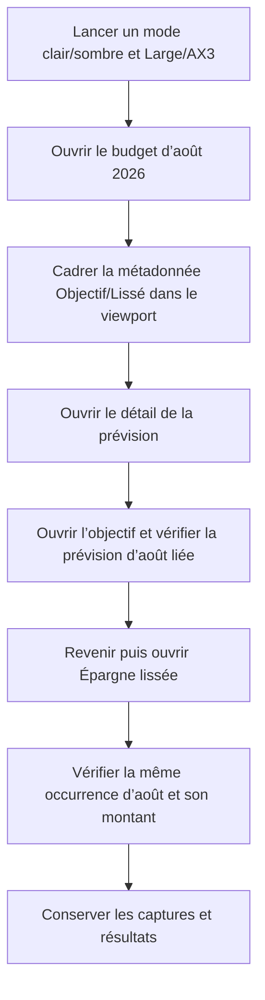

# Instruction: Aligner les fixtures et rendre la preuve AX3 vérifiable

## Architecture projection

> Tree of the final files. ✅ create · ✏️ modify · ❌ delete

```txt
ios/
├── Pulpe/App/
│   ├── ✏️ BudgetLongPressUITestHarness.swift       # expose l’occurrence d’août réellement ouverte
│   └── ✏️ SavingsGoalIntervalUITestHarness.swift   # rattache le plan semé à cette même prévision
└── PulpeUITests/
    └── ✏️ BudgetLineLongPressTests.swift            # cadre la métadonnée et affirme la cohérence des destinations

aidd_docs/tasks/2026_07/2026_07_29_valider-correctif-objectif-lissage-ios/
├── ✏️ journey.md
├── ✏️ validation.md
└── ✏️ journey-screenshots/*.png                     # remplace les preuves concernées
```

Aucune vue SwiftUI de production n’est modifiée. Aucun fichier d’implémentation n’est créé ou supprimé.

## User Journey



## Tasks to do

### `1)` Verrouiller les deux warnings avec des assertions rouges

> Faire échouer le scénario actuel sur les preuves précisément contestées.

1. Cibler le texte de métadonnée `Lissé · objectif Voyage au Japon`, faire défiler jusqu’à lui et vérifier que son cadre est entièrement compris entre la navigation et la barre d’onglets avant capture.
2. Affirmer que la destination objectif n’affiche pas `Aucune prévision rattachée` et contient une ligne de plan `Août 2026` à `413 CHF`.
3. Affirmer que la feuille `Épargne lissée` contient l’occurrence `Août 2026` à `413 CHF`, issue de la ligne ouverte.
4. Confirmer que ces assertions échouent sur les fixtures actuelles avant leur correction.

### `2)` Rendre les fixtures métier cohérentes

> Une seule prévision identifiée doit relier la carte, l’objectif et le groupe lissé.

1. Ajouter aux occurrences du groupe la ligne `goal-spread-line` du budget d’août 2026 avec son montant de `413 CHF`.
2. Pour le seul scénario `budgetGoalSpreadMetadata`, retourner un objectif avec un plan actif et un mois d’août 2026 contenant cette même ligne et ce même montant.
3. Laisser inchangées les données des autres scénarios de `SavingsGoalIntervalUITestService`.
4. Conserver les gardes strictes sur les identifiants de budget, d’objectif et de groupe afin qu’une mauvaise route échoue sans réseau.

### `3)` Produire des captures réellement probantes

> Une capture ne passe que si la cible qu’elle documente est entièrement visible.

1. Dans les quatre modes, cadrer la métadonnée avant de capturer la ligne ; si toute la carte ne tient pas en AX3, conserver une capture dédiée à la métadonnée et une seconde à la carte/action.
2. Avant les captures de destination, faire défiler jusqu’à la ligne d’août et vérifier son libellé et son montant.
3. Conserver les contrôles existants sur les deux actions distinctes, hittables, sans intersection et hautes d’au moins 44 pt.
4. Remplacer les captures invalidées et décrire uniquement les éléments effectivement visibles dans `journey.md`.

### `4)` Rejouer la validation ciblée

> Prouver le correctif sans élargir la suite.

1. Exécuter les deux UI tests Objectif/Lissage sur l’iPhone SE puis le build `PulpePreview` sur le simulateur Preview.
2. Vérifier les trois fichiers Swift modifiés avec SwiftLint, puis exécuter `pnpm quality` et `git diff --check`.
3. Mettre `validation.md` à jour avec les assertions de viewport, les fixtures alignées et les captures remplacées.

## Test acceptance criteria

| Task | Acceptance criteria |
| --- | --- |
| 1 | Les nouvelles assertions échouent sur la capture AX3 tronquée, le guidage vide de l’objectif et l’absence de l’occurrence d’août dans la feuille. |
| 2 | La carte, le plan de l’objectif et la feuille de lissage référencent tous `goal-spread-line`, août 2026 et `413 CHF`. |
| 2 | Les autres scénarios d’objectif gardent leurs fixtures actuelles et aucun appel réseau n’est déclenché. |
| 2 | Un identifiant de budget, d’objectif ou de groupe inattendu fait toujours échouer le scénario. |
| 3 | En Large, la capture montre la métadonnée compacte `Lissé · objectif` ; en Accessibility 3, clair et sombre, le reflow montre entièrement `Lissé · objectif Voyage au Japon`. |
| 3 | La destination objectif n’affiche plus le guidage vide et montre la prévision liée d’août 2026 à `413 CHF`. |
| 3 | La feuille `Épargne lissée` montre l’occurrence d’août 2026 à `413 CHF` correspondant à la ligne ouverte. |
| 3 | Les deux actions du détail restent distinctes, sans intersection et hautes d’au moins 44 pt. |
| 4 | Les deux UI tests ciblés, le build Preview, SwiftLint, `pnpm quality` et `git diff --check` passent. |
