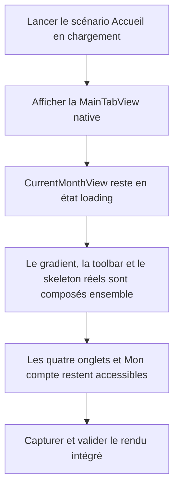

# Instruction: Fermer les findings iOS et valider le nouveau SHA

## Architecture projection

> Tree of the final files. ✅ create · ✏️ modify · ❌ delete

```txt
ios/
├── Pulpe/
│   ├── App/
│   │   └── ContextualCreationUITestHarness.swift                  ✏️
│   ├── Domain/
│   │   └── Store/
│   │       └── CurrentMonthStore.swift                            ✏️
│   ├── Features/
│   │   ├── Budgets/
│   │   │   ├── BudgetDetails/
│   │   │   │   └── BudgetDetailsSkeletonView.swift               ✏️
│   │   │   └── BudgetList/
│   │   │       └── BudgetListView.swift                           ✏️
│   │   └── Templates/
│   │       ├── TemplateDetails/
│   │       │   └── TemplateDetailsView.swift                      ✏️
│   │       └── TemplateList/
│   │           └── TemplateListView.swift                         ✏️
│   └── Shared/
│       └── Design/
│           └── DesignTokens.swift                                 ✏️
└── PulpeUITests/
    └── ContextualCreationUITests.swift                            ✏️
```

## User Journey



## Wireframe

```txt
┌────────────── Accueil en chargement ──────────────┐
│                                      (Mon compte) │
│  ┌──────── zone hero / gradient continu ───────┐  │
│  │ identité                                    │  │
│  │ montant · indicateurs                       │  │
│  │ ───────── trajectoire ─────────             │  │
│  └─────────────────────────────────────────────┘  │
│  action de contenu                                │
│  ┌──────── opération à pointer ────────────────┐  │
│  └─────────────────────────────────────────────┘  │
│  ┌──────── activité ───────────────────────────┐  │
│  └─────────────────────────────────────────────┘  │
├──────────────── barre d’onglets système ──────────┤
│   Accueil       Budgets       Objectifs  Modèles  │
└───────────────────────────────────────────────────┘
```

## Tasks to do

### `1)` Verrouiller la régression d’intégration

> Faire échouer le test tant que la capture contourne le conteneur livré.

1. Étendre le test UI contextuel avec un lancement `UITEST_HOME_SKELETON`.
2. Vérifier dans ce scénario le skeleton Accueil, l’action `Mon compte` et la barre système à quatre onglets.
3. Conserver une capture du rendu intégré dans les attachments XCUITest.

### `2)` Faire passer le skeleton par le vrai écran

> Réutiliser la navigation et le fond de production au lieu de recomposer une page de test.

1. Ajouter au `CurrentMonthStore` une fixture `#if DEBUG` minimale qui le maintient en état `.loading`.
2. Initialiser cette fixture uniquement pour `UITEST_HOME_SKELETON`.
3. Rendre `MainTabView` dans ce scénario et supprimer le rendu direct de `CurrentMonthSkeletonView` ainsi que son fond uni.
4. Laisser `CurrentMonthView` fournir le gradient continu, la toolbar et le skeleton existants.

### `3)` Ramener les skeletons dans le design system

> Remplacer les dimensions visuelles brutes par une petite échelle partagée, sans créer un token par écran.

1. Étendre `DesignTokens.Skeleton` avec des largeurs et hauteurs sémantiques couvrant les placeholders courts, moyens, longs, les légendes, les lignes et les contrôles.
2. Normaliser puis remplacer les largeurs, hauteurs et rayons bruts des skeletons Budget, détail Budget, Modèles et détail Modèle par cette échelle ou par les tokens existants.
3. Mettre à jour le commentaire de `BudgetDetailsSkeletonView` pour inclure la carte contextuelle entre le hero et les filtres.
4. Ne modifier ni le contenu chargé ni les règles fonctionnelles de ces écrans.

### `4)` Valider la CI sur le bon SHA

> Distinguer un échec ancien d’un défaut encore reproductible.

1. Exécuter les tests iOS ciblés, le test UI du skeleton, SwiftLint ciblé et la compilation du scheme `Preview`.
2. Exécuter `pnpm quality --force` sur le diff final ; les warnings backend existants restent hors scope tant qu’ils ne font pas échouer la commande.
3. Publier le correctif sur la branche existante puis attendre `Quality Checks (quality)` sur le nouveau SHA.
4. Si ce nouveau job échoue encore, récupérer d’abord la sous-commande fautive après réauthentification de `gh`, puis amender ce plan avant toute modification hors des fichiers projetés.

## Test acceptance criteria

| Task | Acceptance criteria |
| ---- | ------------------- |
| 1 | Le test UI `UITEST_HOME_SKELETON` échoue sans la toolbar ou la barre d’onglets, et conserve une capture du rendu. |
| 2 | Le harness ne rend plus directement `CurrentMonthSkeletonView` ; le scénario affiche le skeleton via `MainTabView` et `CurrentMonthView`. |
| 2 | Le skeleton, le gradient pleine page, `Mon compte` et les quatre onglets système sont présents simultanément. |
| 3 | Les skeletons touchés n’introduisent plus de dimensions ou de rayons visuels bruts ; ils utilisent `DesignTokens.Skeleton` ou un token existant. |
| 3 | Le commentaire du détail Budget décrit l’ordre `hero → carte contextuelle → filtres → section`. |
| 4 | Les tests ciblés passent, le scheme `Preview` compile et SwiftLint ne remonte aucune violation dans les fichiers modifiés. |
| 4 | `pnpm quality --force` passe sans cache et le job GitHub `Quality Checks (quality)` réussit sur le nouveau SHA. |
| 4 | Aucun workflow CI ni fichier backend n’est modifié sans un nouvel échec qui le désigne explicitement. |
