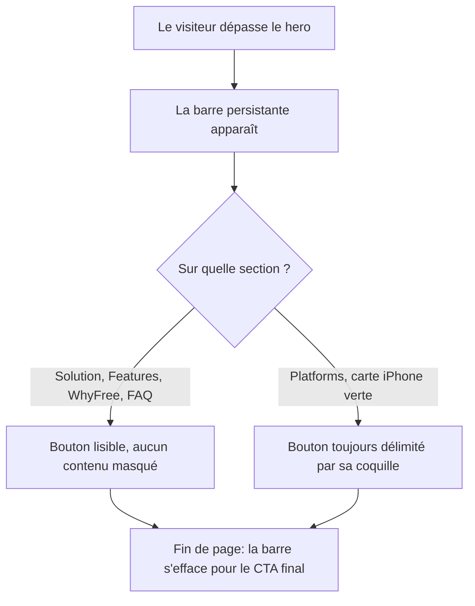

# Instruction: Sticky CTA lisible et non occultant

## Architecture projection

> Tree of the final files. ✅ create · ✏️ modify · ❌ delete

```txt
.
└── landing/
    ├── app/
    │   └── page.tsx                    ✏️ réserve la hauteur de la barre sous <main>
    └── components/
        └── ui/
            └── StickyCTA.tsx           ✏️ coquille opaque, indépendante du fond traversé
```

## User Journey



## Wireframe

```txt
┌────────────────────────────┐
│ (1) Carte iPhone verte      │
│                             │
│  ┌───────────────────────┐  │
│  │ (2) Coquille           │  │
│  │  ┌─────────────────┐   │  │
│  │  │ (3) Bouton       │   │  │
│  └──┴─────────────────┴───┘  │
├─────────────────────────────┤
│ (4) Réserve de bas de main   │
└─────────────────────────────┘
```

1. Carte `bg-primary` de `#platforms` : la surface qui absorbe aujourd'hui le bouton.
2. Coquille opaque neuve : c'est elle qui garantit la frontière du bouton quel que soit le fond dessous.
3. Bouton : inchangé, y compris ses attributs `data-cta-*`.
4. Réserve sous `<main>` : la barre ne recouvre plus rien.

## Tasks to do

### `1)` Donner au sticky CTA sa propre surface

> Le bouton doit rester délimité au-dessus de n'importe quelle section, y compris `bg-primary`.

1. Dans `StickyCTA.tsx`, envelopper le `Button` dans une coquille opaque tirée des tokens existants (`bg-surface` + ombre `--shadow-*`), pas un hex en dur.
2. Conserver `inset-x-4`, le `bottom: max(0.75rem, env(safe-area-inset-bottom))`, le `lg:hidden`, la transition et le `tabIndex` conditionnel.
3. Ne pas empiler bordure structurelle et ombre large diffuse sur la coquille : `landing/DESIGN.md` §4 l'interdit, une seule des deux.
4. Laisser les `data-cta-name`, `data-cta-location`, `data-cta-destination` du `Button` intacts.

### `2)` Réserver la hauteur de la barre

> Plus aucun contenu ne passe sous la barre.

1. Dans `page.tsx`, ajouter au `<main id="main-content">` un padding bas de la hauteur de la barre plus `env(safe-area-inset-bottom)`, annulé à `lg` où la barre n'existe pas.
2. Vérifier que le `scroll-padding-top: 112px` déjà présent dans `globals.css` reste suffisant : la réserve est en bas, elle ne concerne pas les ancres.

### `3)` Vérifier aux breakpoints où la barre existe

> La barre est rendue de 0 à 1023px, donc les deux bornes comptent.

1. Contrôler à 390px et à 834px : bouton délimité au-dessus de la carte iPhone, et deuxième ligne du h2 de `#solution` lisible.
2. Contrôler que la barre disparaît toujours sur `#hero` et sur `#final-cta`.

## Test acceptance criteria

| Task | Acceptance criteria                                                                                                       |
| ---- | ------------------------------------------------------------------------------------------------------------------------- |
| 1    | Au-dessus de la carte `bg-primary` de `#platforms`, le bouton garde une frontière visible à 390px et à 834px               |
| 1    | Le détecteur reste à 0 finding : aucune couleur en dur ajoutée hors `@theme`                                              |
| 2    | Le h2 de `#solution` est entièrement lisible à 390px pendant que la barre est affichée                                     |
| 2    | Le dernier paragraphe de la page reste atteignable sans que la barre le recouvre                                           |
| 3    | La barre reste absente sur `#hero` et sur `#final-cta`, et absente au-delà de 1024px                                       |
| 3    | Focus visible conservé sur le bouton, et non focusable quand la barre est masquée                                          |
