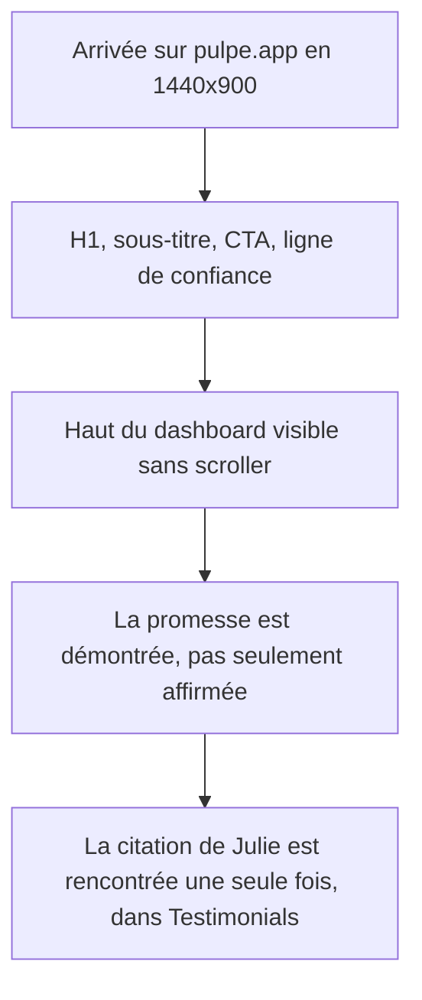

# Instruction: Preuve produit au-dessus de la ligne

## Architecture projection

> Tree of the final files. ✅ create · ✏️ modify · ❌ delete

```txt
.
└── landing/
    └── components/
        └── sections/
            └── Hero.tsx                ✏️ retire la citation dupliquée, resserre les paddings
```

## User Journey



## Wireframe

```txt
┌──────────────────────────────────────────────┐
│ (1) Header sticky                             │
│                                               │
│           (2) H1 + marqueur                   │
│           (3) Sous-titre                      │
│              (4) CTA                          │
│           (5) Ligne de confiance              │
│  ┌─────────────────────────────────────────┐  │
│  │ (6) Dashboard produit, haut visible      │  │
├──┴─────────────────────────────────────────┴──┤ ← 900px
```

1. Header : inchangé.
2. H1 : inchangé, marqueur inclus.
3. Sous-titre : inchangé.
4. CTA : inchangé, attributs `data-cta-*` inclus.
5. Ligne de confiance : inchangée.
6. Dashboard : son en-tête et son montant passent au-dessus de la ligne de flottaison.

## Tasks to do

### `1)` Retirer la citation dupliquée du hero

> Les mêmes mots sont déjà servis dans `Testimonials`, à 3000px d'écart.

1. Supprimer le `<blockquote>` `hidden md:block` de `Hero.tsx` et son `<footer>` d'attribution.
2. Vérifier que `Testimonials.tsx` conserve bien cette citation, sinon la déplacer plutôt que la supprimer.
3. Le `marker-highlight-proof` disparaît donc du hero : vérifier que la classe reste utilisée ailleurs avant de conclure quoi que ce soit sur son sort.

### `2)` Resserrer les paddings pour faire remonter le dashboard

> Objectif : le haut du dashboard franchit la ligne à 1440x900, sans écraser la composition.

1. Réduire le `lg:pt-[calc(11rem+...)]` du `<section id="hero">` et la marge `lg:mt-20` du bloc dashboard, en gardant les `env(safe-area-inset-top)`.
2. Ne pas toucher aux valeurs mobiles : `pb-12 pt-[calc(9rem+...)]` fonctionne déjà, la preuve est visible à 390px.
3. Garder `max-w-5xl` et le centrage : ce n'est pas une refonte de composition.

### `3)` Vérifier les trois viewports plutôt que le seul 1440

> Tablette n'a pas le même surplus vertical que desktop.

1. Contrôler 1440x900, 1280x720 et 834x1112 : le CTA reste entièrement visible et le dashboard entame la ligne.
2. Contrôler 390x844 : aucune régression, la preuve reste à la même place.
3. Contrôler que le marqueur du h1 se dessine toujours à l'entrée dans le viewport.

## Test acceptance criteria

| Task | Acceptance criteria                                                                                              |
| ---- | ---------------------------------------------------------------------------------------------------------------- |
| 1    | La citation « prévoir nos vacances sur l'année » n'apparaît qu'une fois sur la page, dans `#testimonials`          |
| 2    | En 1440x900, l'en-tête du dashboard et son montant sont visibles sans scroller                                     |
| 2    | En 1280x720, le CTA du hero reste entièrement au-dessus de la ligne                                                |
| 3    | En 834x1112 et 390x844, aucun élément du hero n'est coupé ni déplacé de façon visible                              |
| 3    | Le marqueur du h1 se dessine encore à l'entrée dans le viewport, et reste peint en `prefers-reduced-motion`        |
