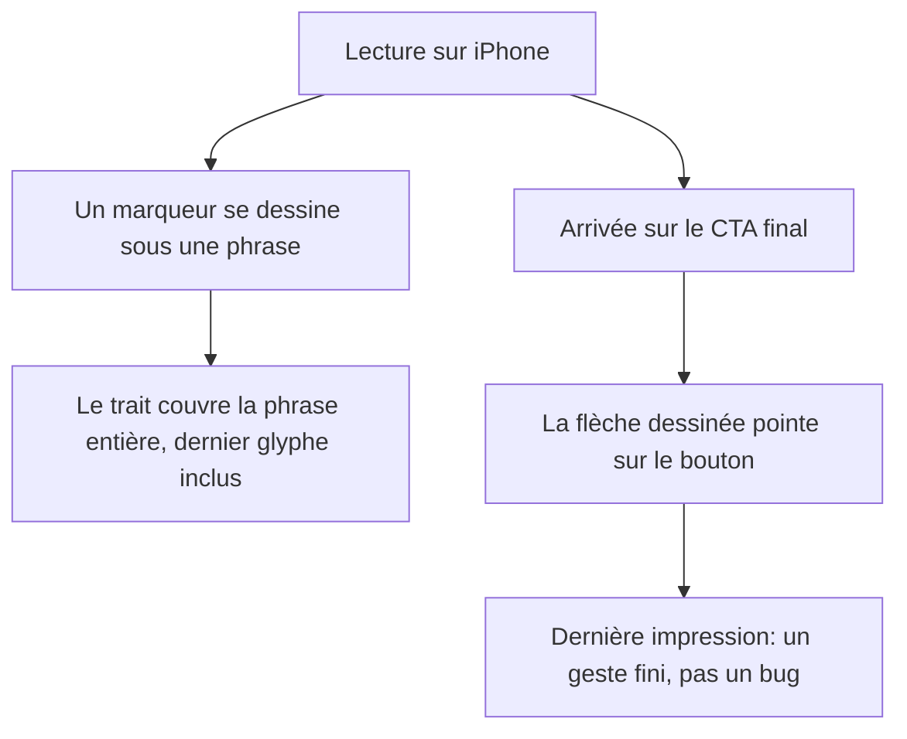

# Instruction: Marqueur et flèche corrects sur mobile

## Architecture projection

> Tree of the final files. ✅ create · ✏️ modify · ❌ delete

```txt
.
└── landing/
    ├── app/
    │   └── globals.css                 ✏️ axe du gradient marqueur, boîte du SVG flèche
    └── components/
        └── ui/
            └── ArrowNote.tsx           ✏️ tracé et pointe adaptés à la boîte mobile
```

## User Journey



## Tasks to do

### `1)` Faire couvrir au marqueur ses derniers glyphes

> Le manque est proportionnel à la longueur du segment, donc il est géométrique, pas séquentiel.

1. Cause : `globals.css:136-142` incline le gradient à `176.5deg`, donc la bande transparente `91%` à `92%` traverse la fin du trait en diagonale. Sur une boîte courte et large, elle emporte un glyphe entier.
2. Choisir un des deux correctifs, pas les deux : redresser l'angle sous `768px` (proche de `179deg`), ou repousser les arrêts transparents à `4%` et `96%`.
3. Ne pas toucher au `background-size: 0% 0.92em` initial ni à `box-decoration-break: clone` : c'est ce qui garantit que le texte est lisible en HTML serveur et que chaque ligne s'essuie ensemble.
4. Vérifier les trois variantes `marker-highlight`, `-strong`, `-proof` sur des segments longs et courts.

### `2)` Réparer la pointe de la flèche à petite taille

> `ArrowNote.tsx:41` garde un `viewBox 112x84` alors que `globals.css:210-211` rend la boîte à `96x72`.

1. Fournir un tracé et une pointe dont le terminus tombe sur le bord haut du bouton dans la boîte mobile, plutôt que de laisser le tracé desktop se réduire.
2. Épaissir le `stroke-width` de `arrow-note-path` à la taille mobile pour que la pointe survive à la réduction.
3. Conserver `aria-hidden="true"`, `role="presentation"` et le `pathLength={1}` dont dépend l'animation de tracé.
4. Conserver le court-circuit `prefers-reduced-motion` de `ArrowNote.tsx:10-14` : sans lui la flèche n'est jamais ajoutée.

### `3)` Vérifier le rendu aux deux tailles de boîte

> La flèche a deux géométries, la bascule est à `768px`.

1. Contrôler à 390px : pointe visible, terminus sur le bouton.
2. Contrôler à 834px et 1440px : aucune régression du tracé desktop existant.
3. Contrôler en `prefers-reduced-motion` : marqueur peint, flèche présente et non animée.

## Test acceptance criteria

| Task | Acceptance criteria                                                                                                    |
| ---- | ---------------------------------------------------------------------------------------------------------------------- |
| 1    | À 390px, les segments « les dépenses que je ne voyais pas venir », « où en est mon budget » et « prévoir nos vacances sur l'année » sont surlignés jusqu'à leur dernier caractère |
| 1    | Le texte marqué reste lisible dans le HTML serveur, avant tout script                                                   |
| 2    | À 390px, la pointe de la flèche est visible et son terminus touche le bord haut du bouton                                |
| 2    | À 834px et 1440px, le tracé et la pointe sont inchangés par rapport à aujourd'hui                                        |
| 3    | En `prefers-reduced-motion`, le marqueur est peint à 100% et la flèche est visible sans animation                        |
