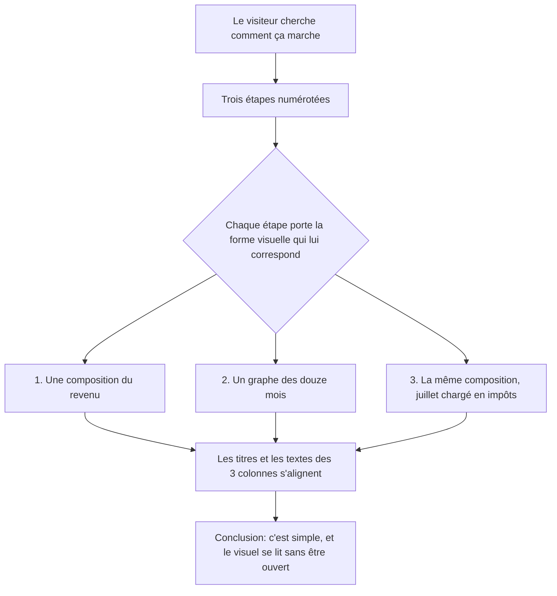

# Instruction: HowItWorks lisible dès 768px

## Architecture projection

> Tree of the final files. ✅ create · ✏️ modify · ❌ delete

```txt
.
└── landing/
    ├── app/
    │   └── accessibility.test.tsx        ✏️ contrat des visuels dessinés
    └── components/
        └── sections/
            ├── HowItWorks.tsx            ✏️ rangées partagées, visuels au lieu de captures
            └── HowItWorksVisuals.tsx     ✅ les trois visuels et leur cadre commun
```

## User Journey



## Wireframe

```txt
┌──────────────┬──────────────┬──────────────┐
│ Ton mois type│ Ton année    │ Juillet      │
│ Revenu  3 500│ 1 400        │ Revenu  3 500│
│ ▓▓▓▓▒▒│████  │ ██████ ▂▃ ███│ ▓▓▓▓▒▒│░░│██ │
│ ● légende    │  J..J A..D   │ ● légende    │
│              │              │              │
│ 1 400 CHF    │ juil, impôts │ 500 CHF      │
│ disponible   │ août, congés │ il te restera│
├──────────────┼──────────────┼──────────────┤
│ (2) ① Titre  │ (2) ② Titre  │ (2) ③ Titre  │
├──────────────┼──────────────┼──────────────┤
│ (3) Texte    │ (3) Texte    │ (3) Texte    │
└──────────────┴──────────────┴──────────────┘
```

1. Visuels : une forme par étape, dessinée en code. La barre de l'étape 1 revient à l'étape 3, chargée, pour que la comparaison se fasse sans additionner.
2. Titres : rangée partagée, donc alignés même quand un titre passe sur deux lignes.
3. Textes : rangée partagée, tous démarrant à la même hauteur.

## Tasks to do

### `1)` Dessiner un visuel par étape

> Trois captures d'app rendues à 341px : leur texte tombe sous 4px, et le recadrage ne fait que troquer ça contre des cartes amputées et des mois atténués.

1. Créer `HowItWorksVisuals.tsx` avec un cadre commun et trois visuels : composition du revenu, graphe des douze mois, composition rechargée.
2. Faire porter une seule arithmétique aux trois, et la figer par un test : les parts d'une barre redonnent le revenu, le juillet du graphe vaut le disponible de l'étape 3.
3. Masquer les visuels aux lecteurs d'écran : le `figcaption` sr-only de la section décrit déjà chacun d'eux.
4. N'employer que les tokens existants, aucune valeur visuelle brute.

### `2)` Brancher les visuels dans la section

> `HowItWorks` importait `Screenshot` et lui passait des dimensions d'assets qui n'existent plus.

1. Remplacer les trois blocs `<Screenshot>` par les trois visuels, et retirer l'import devenu inutile.
2. Réécrire les trois `figcaption` sr-only pour décrire ce qui est dessiné, montants compris.
3. Conserver la forme de `STEPS` (`image: { caption, content }`) et la sémantique `<ol>` / `<li>` / `<figure>` / `<figcaption class="sr-only">`.

### `3)` Aligner les trois colonnes

> À 834px les titres passent sur 2, 1 et 2 lignes, donc les trois textes démarrent à trois hauteurs différentes.

1. Donner aux trois `<li>` des rangées partagées, par `grid-template-rows` sur le `<ol>` et `subgrid` sur les `<li>`.
2. Conserver l'ordre de lecture mobile, copie puis visuel, et l'ordre desktop, visuel puis copie, via les classes `md:order-*`.
3. Faire remplir la rangée aux trois cartes, pour qu'aucune ne flotte plus court que ses voisines.

## Test acceptance criteria

| Task | Acceptance criteria                                                                                                       |
| ---- | ------------------------------------------------------------------------------------------------------------------------- |
| 1    | À 1440px, chaque visuel se lit sans être agrandi : le plus petit texte est à 10px, la valeur clé de chaque étape à 30px     |
| 1    | Les trois visuels racontent le même mois, et un test échoue si un montant est édité sans les autres                        |
| 1    | Aucune zone atténuée, aucun bord coupé, aucun libellé tronqué, à 1440, 834 et 768px                                        |
| 2    | Aucun décalage de mise en page au chargement, aux trois breakpoints                                                        |
| 2    | Un lecteur d'écran annonce la composition de chaque étape, montants compris, sans lire le visuel deux fois                  |
| 3    | À 834px, les trois titres et les trois paragraphes démarrent à la même hauteur, quel que soit le nombre de lignes du titre  |
| 3    | Aux trois breakpoints desktop, les trois cartes ont exactement la même hauteur                                             |
| 3    | À 390px, l'ordre copie puis visuel est conservé, et aucun visuel ne bave sur le texte de l'étape précédente                 |
