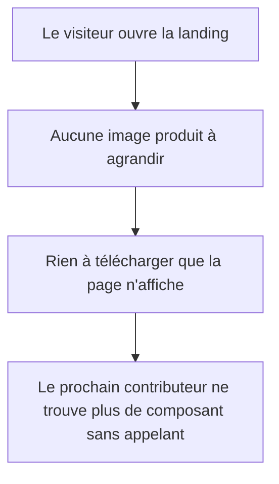

# Instruction: Retirer la pile de captures devenue morte

## Architecture projection

> Tree of the final files. ✅ create · ✏️ modify · ❌ delete

```txt
.
└── landing/
    ├── README.md                          ✏️ arborescence et liste de composants
    ├── app/
    │   ├── accessibility.test.tsx         ✏️ ré-pointer les contrats des composants retirés
    │   └── page.tsx                       ✏️ plus de provider de lightbox à envelopper
    ├── components/
    │   └── ui/
    │       ├── ImageLightbox.tsx          ❌ n'était ouverte que par Screenshot
    │       ├── Screenshot.tsx             ❌ plus aucun appelant depuis la phase 4
    │       └── index.ts                   ✏️ deux exports en moins
    ├── contexts/                          ❌ le dossier entier ne servait que la lightbox
    │   ├── ImageLightboxContext.ts        ❌
    │   ├── ImageLightboxProvider.tsx      ❌
    │   └── useImageLightbox.ts            ❌
    └── public/
        └── screenshots/                   ❌ 15 fichiers, 723 Ko, plus aucune référence
```

## User Journey



## Tasks to do

### `1)` Retirer les composants sans appelant

> `Screenshot` et la lightbox ne sont plus rendus par personne, et le provider de `page.tsx` enveloppe une page qui n'ouvre plus rien.

1. Supprimer `components/ui/Screenshot.tsx`, `components/ui/ImageLightbox.tsx` et les trois fichiers de `contexts/`, avec `git rm` pour garder l'historique — jamais `rm -r`.
2. Retirer les deux exports correspondants de `components/ui/index.ts` et le `ImageLightboxProvider` de `app/page.tsx`.
3. Vérifier qu'aucun import ne pointe encore vers un fichier supprimé avant de lancer le build.

### `2)` Retirer les assets que plus rien ne sert

> Les quinze `.webp` de `public/screenshots/` partent au CDN à chaque déploiement sans qu'une seule requête les demande. Les quatre de `mobile/` étaient déjà morts avant la phase 4.

1. Supprimer `public/screenshots/` en entier, avec `git rm -r`.
2. Confirmer qu'aucune source, script ou métadonnée du dépôt ne référence ces chemins.

### `3)` Ré-pointer les contrats de test, sans perdre leur intention

> Deux tests visent les composants retirés. Les supprimer ferait disparaître une intention qui reste vraie de la page.

1. Dans « uses targeted reduced-motion states », retirer la seule assertion qui visait `Screenshot`, garder les autres.
2. Dans « adds inset neutral outlines to product images », faire porter le contour inset sur les surfaces qui le portent encore, plutôt que supprimer le test.
3. Retirer les deux entrées mortes de `componentSources`.

### `4)` Remettre le README d'accord avec l'arborescence

> Le README décrit encore un dossier `contexts/`, un dossier `screenshots/` et une lightbox.

1. Corriger l'arborescence et la liste des composants mémoïsés.
2. Retirer la ligne de fonctionnalité « Image Lightbox ».

## Test acceptance criteria

| Task | Acceptance criteria                                                                                           |
| ---- | ------------------------------------------------------------------------------------------------------------- |
| 1    | Le build passe et aucun import ne résout vers un fichier supprimé                                              |
| 1    | La page se charge sans erreur console, et les sections restantes s'affichent à l'identique                      |
| 2    | Aucune recherche du dépôt ne renvoie de référence à `public/screenshots/`                                      |
| 2    | Le déploiement n'expédie plus les 723 Ko d'images que la page ne demandait pas                                  |
| 3    | La suite de tests est verte, et le contrat des contours inset porte sur un composant encore rendu               |
| 4    | Un contributeur qui lit le README y trouve l'arborescence réelle du dossier                                     |
| 1-4  | Les quatre acquis mesurés tiennent toujours : 0 violation axe, 0 texte sous AA, focus visible partout, 0 finding détecteur |
