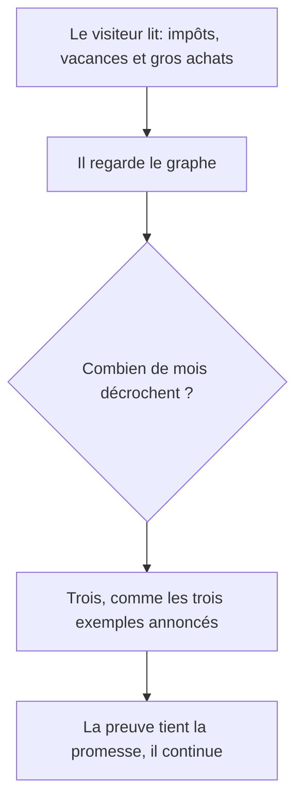

# Instruction: Aligner le graphe annuel sur la promesse de la copie

## Architecture projection

> Tree of the final files. ✅ create · ✏️ modify · ❌ delete

```txt
.
└── landing/
    ├── app/
    │   └── accessibility.test.tsx         ✏️ le test d'arithmétique couvre le troisième évènement
    └── components/
        └── sections/
            ├── HowItWorks.tsx             ✏️ le figcaption sr-only décrit le troisième évènement
            └── HowItWorksVisuals.tsx      ✏️ un mois de plus décroche, légende étendue
```

## User Journey



## Wireframe

```txt
Ton année
1 400
                    500  700              900
████ ████ ████ ████  ▂▂   ▃▃  ████ ████ ████ ▅▅
 J    F    M    A    J    A    S    O    N    D

juillet, les impôts · août, les vacances · décembre, un gros achat
```

## Tasks to do

### `1)` Poser le troisième évènement

> La copie de l'étape 2 annonce trois catégories, le graphe n'en montre que deux. Un lecteur qui vérifie trouve l'écart.

1. Faire décrocher décembre dans le graphe, sur un montant qui laisse un disponible plausible et distinct des deux autres décrochages.
2. Étendre la légende sous le graphe au troisième évènement, et le `figcaption` sr-only de l'étape 2 avec.
3. Étendre le test d'arithmétique au nouveau mois, pour qu'un montant édité seul fasse échouer la suite.

## Test acceptance criteria

| Task | Acceptance criteria                                                                                            |
| ---- | -------------------------------------------------------------------------------------------------------------- |
| 1    | Les trois catégories citées par la copie de l'étape 2 apparaissent dans le graphe                               |
| 1    | Les trois décrochages se distinguent entre eux et de la ligne de référence, sans étiquette qui en chevauche une autre |
| 1    | À 768px la légende tient sur deux lignes au plus et rien n'est tronqué                                          |
| 1    | Le lecteur d'écran annonce les trois évènements de l'année                                                      |
