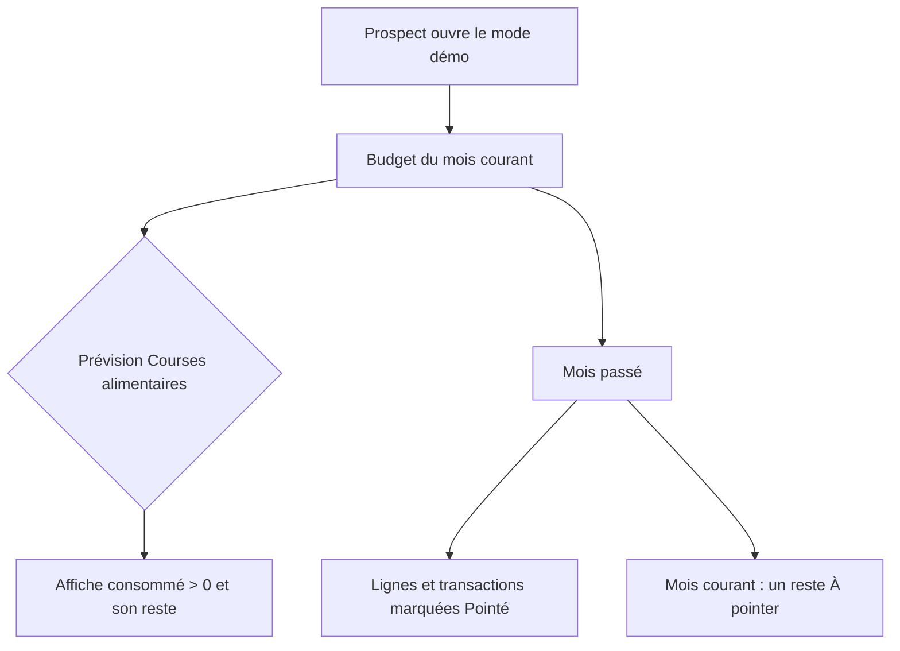

# Instruction: Réel rattaché et pointé

## Architecture projection

```txt
.
└── backend-nest/src/modules/demo/
    ├── domain/
    │   ├── demo.entity.ts                                    ✏️ `DemoSeededBudgetLine`, `budgetLineId` + `checkedAt` sur le seed transaction
    │   └── ports/demo-repository.port.ts                     ✏️ `insertBudgetLines` renvoie les lignes insérées ; nouvelle méthode de pointage des lignes
    ├── application/
    │   ├── generate-demo-data.use-case.ts                    ✏️ rattache chaque transaction à sa prévision, pointe le passé
    │   └── generate-demo-data.use-case.spec.ts               ✏️ couvre le rattachement et la frontière de pointage
    └── infrastructure/persistence/
        ├── supabase-demo.repository.ts                       ✏️ `.select()` sur l'insert des lignes, écrit `budget_line_id` et `checked_at`
        └── supabase-demo.repository.spec.ts                  ✏️ couvre les colonnes nouvellement écrites
```

## User Journey



## Tasks to do

### `1)` Exposer les lignes insérées

> Sans les ids générés, rien ne peut être rattaché.

1. Ajouter `DemoSeededBudgetLine` à `demo.entity.ts` : `id`, `budgetId`, `name`, `kind`, `amount`.
2. Passer `insertBudgetLines` de `Promise<void>` à `Promise<DemoSeededBudgetLine[]>` dans le port et le repo.
3. Dans le repo, ajouter `.select()` à l'insert et mapper les lignes (déchiffrer `amount` comme le fait déjà `toSeededTemplateLine`).

### `2)` Rattacher le réel au prévu

> Une transaction orpheline ne consomme aucune enveloppe.

1. Ajouter `budgetLineId: string | null` à `DemoTransactionSeed`.
2. Dans `buildTransactionSeeds`, recevoir les lignes du budget et résoudre pour chaque transaction la prévision `expense` cible par son nom canonique : `Migros - Courses` et `Coop - Courses` → `Courses alimentaires`, `Restaurant Molino` → `Restaurants/Sorties`.
3. Laisser `null` quand le budget du mois ne porte pas la ligne cible (mois vacances et fêtes n'ont pas les mêmes prévisions) — l'orpheline reste un cas légitime à montrer.
4. Écrire `budget_line_id` dans l'insert du repo à la place du `null` actuel.

### `3)` Pointer le passé, laisser le mois courant ouvert

> Le contraste « Pointé / À pointer » est la démonstration ; tout pointer l'efface autant que ne rien pointer.

1. Ajouter `checkedAt: string | null` à `DemoTransactionSeed`, renseigné à la date de transaction pour tout mois **strictement antérieur** au mois courant.
2. Ajouter au port une méthode qui pointe les lignes de budget des mois strictement antérieurs, appelée après `insertBudgetLines`.
3. Laisser intégralement le mois courant non pointé, et les mois futurs sans transaction.
4. Vérifier que `recalculateAllBudgetBalances` reste le dernier appel de `execute`.

## Test acceptance criteria

| Task | Acceptance criteria                                                                                             |
| ---- | ----------------------------------------------------------------------------------------------------------------- |
| 1    | `insertBudgetLines` renvoie une ligne par insert, chacune portant l'id généré et son montant en clair              |
| 2    | Dans un budget standard, la prévision `Courses alimentaires` du mois courant affiche un consommé égal à la somme des courses du mois, et non 0 |
| 3    | Un mois passé n'affiche aucun reste « À pointer » ; le mois courant en affiche au moins un                        |
| 3    | Le solde de fin de chaque budget reste cohérent après recalcul, inchangé par rapport au comportement actuel hors consommation |
