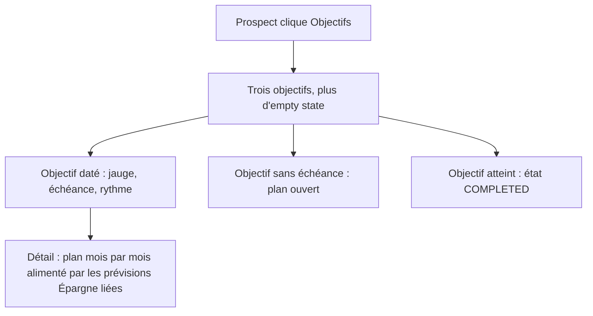

# Instruction: Objectifs d'épargne

## Architecture projection

```txt
.
└── backend-nest/src/modules/demo/
    ├── domain/
    │   ├── demo.entity.ts                                    ✏️ `DemoSavingsGoalSeed`, `DemoSeededSavingsGoal`
    │   └── ports/demo-repository.port.ts                     ✏️ `insertSavingsGoals`, rattachement des lignes d'épargne
    ├── application/
    │   ├── generate-demo-data.use-case.ts                    ✏️ étape `seedSavingsGoals` avant le recalcul
    │   └── generate-demo-data.use-case.spec.ts               ✏️ couvre les états d'objectif seedés
    └── infrastructure/persistence/
        ├── demo-savings-goal-specs.ts                        ✅ specs canoniques des objectifs, à côté de `demo-template-specs.ts`
        ├── supabase-demo.repository.ts                       ✏️ insert `savings_goal` chiffré, update `budget_line.savings_goal_id`
        └── supabase-demo.repository.spec.ts                  ✏️ couvre le chiffrement et le rattachement
```

## User Journey



## Tasks to do

### `1)` Décrire les objectifs

> Trois objectifs suffisent à couvrir les états que l'UI sait rendre.

1. Créer `demo-savings-goal-specs.ts` sur le modèle de `demo-template-specs.ts` : une fonction pure renvoyant les specs, aucun accès DB.
2. Décrire trois objectifs, chacun couvrant un état distinct :
   - **Apport logement** — `ACTIVE`, `priority: HIGH`, échéance dans 18 mois, `initialAmount` non nul, alimenté par la prévision `Épargne logement`.
   - **Fonds d'urgence** — `ACTIVE`, `priority: MEDIUM`, sans `target_date` (plan ouvert), alimenté par `Fonds d'urgence`.
   - **Nouveau vélo** — `COMPLETED`, cible déjà atteinte, échéance passée.
3. Ancrer les dates sur le mois courant, jamais en dur, comme le fait déjà `buildBudgetSeeds`.

### `2)` Écrire les objectifs

> `target_amount` et `initial_amount` sont des colonnes `text` porteuses de chiffré.

1. Ajouter `insertSavingsGoals` au port, entrée entité en nombres clairs.
2. Dans le repo, chiffrer `target_amount` et `initial_amount` via `encryptAmount` avec la DEK démo, exactement comme `insertBudgetLines`.
3. Laisser `original_target_amount`, `original_currency`, `target_currency` et `exchange_rate` à `null` — le seed démo est mono-devise.
4. Renvoyer les ids générés.

### `3)` Lier les prévisions Épargne

> Un objectif sans ligne liée n'a pas de plan à afficher.

1. Ajouter au port une méthode rattachant une liste de lignes de budget à un objectif.
2. Dans le use case, apparier par nom de ligne : chaque prévision `saving` dont le nom correspond à la spec reçoit le `savings_goal_id` de son objectif.
3. Ne rattacher que les lignes des budgets couvrant l'objectif — pas d'échéance dépassée, sans quoi le plan est incohérent avec l'horizon.
4. Insérer l'étape entre `seedBudgetLines` et `recalculateAllBudgetBalances`.

## Test acceptance criteria

| Task | Acceptance criteria                                                                                    |
| ---- | -------------------------------------------------------------------------------------------------------- |
| 1    | Les trois objectifs couvrent respectivement un plan daté, un plan ouvert et un objectif atteint            |
| 2    | Les colonnes `target_amount` et `initial_amount` en base ne contiennent aucun montant lisible en clair     |
| 3    | La page Objectifs du mode démo affiche trois objectifs et aucun empty state                                |
| 3    | L'objectif daté affiche une progression strictement positive, cohérente avec les prévisions pointées de la phase 1 |
| 3    | Aucun objectif n'affiche de mois de plan au-delà de son échéance                                            |
