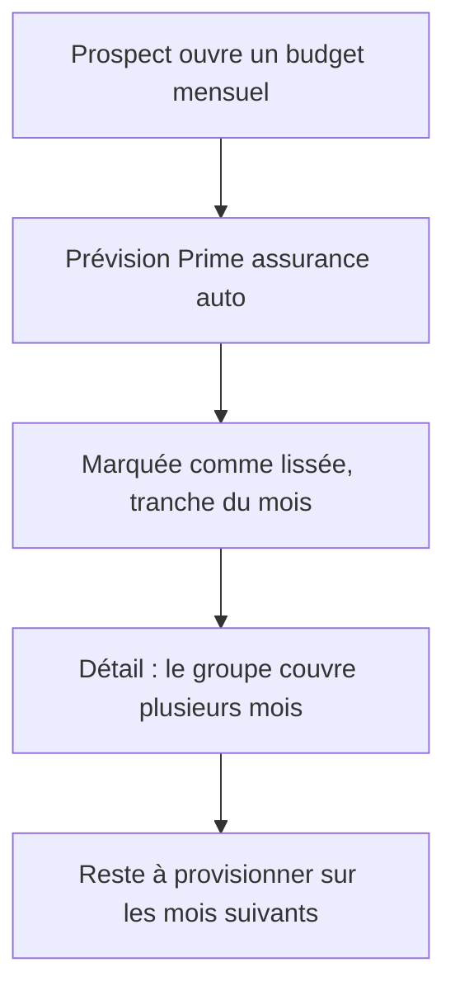

# Instruction: Lissage d'une dépense

## Architecture projection

```txt
.
└── backend-nest/src/modules/demo/
    ├── domain/
    │   ├── demo.entity.ts                                    ✏️ `spreadGroupId` sur le seed de ligne de budget
    │   └── ports/demo-repository.port.ts                     ✏️ documente la tranche lissée acceptée par `insertBudgetLines`
    ├── application/
    │   ├── generate-demo-data.use-case.ts                    ✏️ génère les tranches d'un groupe de lissage
    │   └── generate-demo-data.use-case.spec.ts               ✏️ couvre la répartition et l'identité du groupe
    └── infrastructure/persistence/
        ├── supabase-demo.repository.ts                       ✏️ écrit `spread_group_id`
        └── supabase-demo.repository.spec.ts                  ✏️ couvre la colonne écrite
```

## User Journey



## Tasks to do

### `1)` Décrire la dépense lissée

> Une seule dépense lissée suffit à rendre la capacité visible.

1. Choisir une dépense annuelle crédible absente des templates actuels : `Prime assurance auto`, montant total réparti sur 6 mois consécutifs.
2. Ancrer la fenêtre sur le mois courant, de sorte qu'elle chevauche du passé et du futur — c'est ce chevauchement qui rend le « reste à provisionner » non nul.
3. Répartir le total sans perte de centime, en cohérence avec la règle de répartition décrite dans `docs/SPREAD.md`.

### `2)` Écrire les tranches

> Ce qui fait un lissage, c'est l'identité de groupe partagée.

1. Ajouter `spreadGroupId: string | null` à `DemoBudgetLineSeed`.
2. Générer un identifiant de groupe unique par exécution du seed, partagé par les six tranches.
3. Marquer chaque tranche `kind: 'expense'`, `recurrence: 'one_off'`, sans `template_line_id` — une tranche lissée n'est pas issue du Mois Type.
4. Écrire `spread_group_id` dans l'insert du repo.

## Test acceptance criteria

| Task | Acceptance criteria                                                                              |
| ---- | ---------------------------------------------------------------------------------------------------- |
| 1    | La somme des six tranches égale exactement le total annoncé, au centime                              |
| 2    | Les six tranches partagent un même `spread_group_id`, distinct à chaque nouvelle session démo         |
| 2    | Le budget du mois courant affiche la prévision comme lissée, avec un reste à provisionner non nul     |
| 2    | Aucune tranche ne porte de `template_line_id`                                                         |
