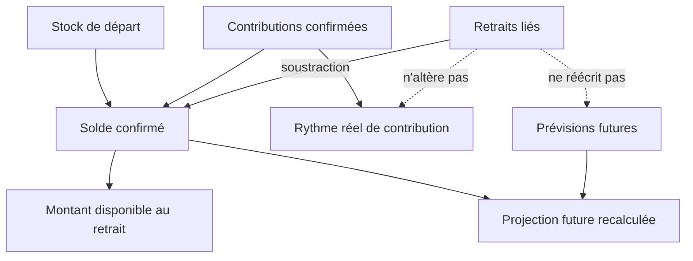

# Instruction: figer le contrat métier et les formules de progression

## Architecture projection

> Tree of the final files. ✅ create · ✏️ modify · ❌ delete

```txt
.
├── shared/
│   ├── schemas.ts                                             ✏️ contrats transaction, options, retraits et suppression
│   └── src/
│       ├── calculators/
│       │   ├── savings-goal-progress.ts                       ✏️ retraits dans le stock et la chronologie
│       │   └── savings-goal-progress.spec.ts                  ✏️ formules stock/flux/projection
│       ├── error-codes.ts                                     ✏️ erreurs publiques dédiées à l'objectif
│       ├── savings-goal-withdrawal-schema.spec.ts             ✅ contrats stricts et cardinalité
│       └── schemas-strict-inheritance.spec.ts                 ✏️ champs source refusés sur les PATCH
└── docs/
    ├── SAVINGS.md                                             ✏️ règles métier canoniques
    └── diagrams/savings-goals.c4                              ✏️ flux objectif ↔ transaction
```

## User Journey



## Tasks to do

### `1)` Écrire le vocabulaire et les invariants partagés

> Une transaction doit pouvoir raconter son origine sans rendre le lien éditable.

1. Ajouter à `Transaction` les champs de lecture `sourceSavingsGoalId: string | null` et `sourceSavingsGoalName: string | null`.
2. Autoriser uniquement `sourceSavingsGoalId` dans `transactionCreateSchema`; ne l'ajouter ni au PATCH ni aux formulaires d'édition partagés.
3. Définir les invariants de contrat : source présente uniquement sur un `income`, transaction libre sans `budgetLineId`, un seul objectif, montant strictement positif.
4. Définir `SavingsGoalWithdrawalOption` avec identifiant, nom, statut, solde disponible et devise du compte.
5. Définir `SavingsGoalWithdrawal` avec identifiants transaction/budget, libellé, date et montant positif de transport ; les clients seuls ajoutent le signe négatif de présentation.
6. Définir les réponses de liste d'options et d'historique, ainsi que l'extension de l'impact de suppression avec la liste et le total des retraits préservés.
7. Ajouter des codes distincts de PUL-292 : solde insuffisant, conflit de révision et transaction liée invalide.

### `2)` Faire des retraits une entrée explicite du calculateur

> Le calcul partagé reste la seule définition de la progression d'un objectif.

1. Ajouter les retraits datés à `SavingsGoalProgressInput` sans les confondre avec les transactions allouées aux prévisions d'épargne.
2. Calculer `withdrawn = somme des retraits` et `confirmed = initialAmount + linesConfirmed - withdrawn`.
3. Garder `confirmedPace` fondé uniquement sur les contributions confirmées : un retrait diminue le stock, pas la capacité mensuelle à épargner.
4. Déduire les retraits de `projected`, de la série chronologique et de l'écart cumulé à partir de leur période budgétaire payDay-aware.
5. Ne jamais modifier `plannedCumulative`, les montants des prévisions ou le calendrier futur à cause d'un retrait.
6. Ne pas clamper silencieusement un solde négatif dans le calculateur : l'écriture l'interdit, mais une incohérence historique doit rester visible aux diagnostics.

### `3)` Verrouiller les cas métier par les tests partagés

> Les formules servent ensuite au backend, au web et à iOS.

1. Cas principal : 10'000 confirmés moins 4'500 retirés donnent 5'500 disponibles et une projection abaissée de 4'500.
2. Vérifier que le rythme confirmé reste identique avant et après le retrait.
3. Vérifier que le plan futur et ses contributions prévues restent identiques.
4. Vérifier la position du retrait dans la chronologie autour du jour de paie.
5. Vérifier que le schéma accepte un seul identifiant source à la création et refuse toute tentative de le modifier ou de le supprimer par PATCH.
6. Vérifier les formes active et cassée : identifiant + nom, puis identifiant nul + nom conservé.

### `4)` Documenter la règle avant l'implémentation

> La distinction stock, flux et ancien PUL-292 doit être lisible sans ouvrir le code.

1. Ajouter à `docs/SAVINGS.md` les définitions de contribution, retrait, solde disponible, lien cassé et statut inchangé.
2. Documenter le traitement des devises : le retrait utilise le montant cible normalisé dans la devise du compte.
3. Documenter que pointé/non pointé ne change pas l'effet d'un retrait sur le stock : l'effet est immédiat dès la création du revenu lié.
4. Documenter les effets d'édition, suppression du revenu, suppression/renommage de l'objectif et absence de réécriture du plan.
5. Mettre à jour le diagramme C4 avec la lecture des options, l'écriture transactionnelle et l'historique des retraits.

## Test acceptance criteria

| Task | Acceptance criteria |
| ---- | ------------------- |
| 1 | Une création de revenu peut porter exactement un `sourceSavingsGoalId`; un PATCH ne peut ni fournir ni effacer ce champ. |
| 1 | Les contrats distinguent sans ambiguïté un lien actif, un lien cassé et une transaction ordinaire. |
| 2 | Pour 10'000 CHF confirmés et 4'500 CHF retirés, `confirmed` et la projection partent de 5'500 CHF. |
| 2 | La contribution mensuelle confirmée et le plan futur sont strictement identiques avant et après le retrait. |
| 2 | Un retrait apparaît dans le bon cycle budgétaire selon le jour de paie, sans être compté comme une contribution négative. |
| 3 | Les tests échouent si un retrait augmente le solde, modifie le rythme ou devient éditable par le contrat PATCH. |
| 4 | `docs/SAVINGS.md` permet de distinguer le retrait permanent d'un objectif du mécanisme avec remboursement PUL-292. |
