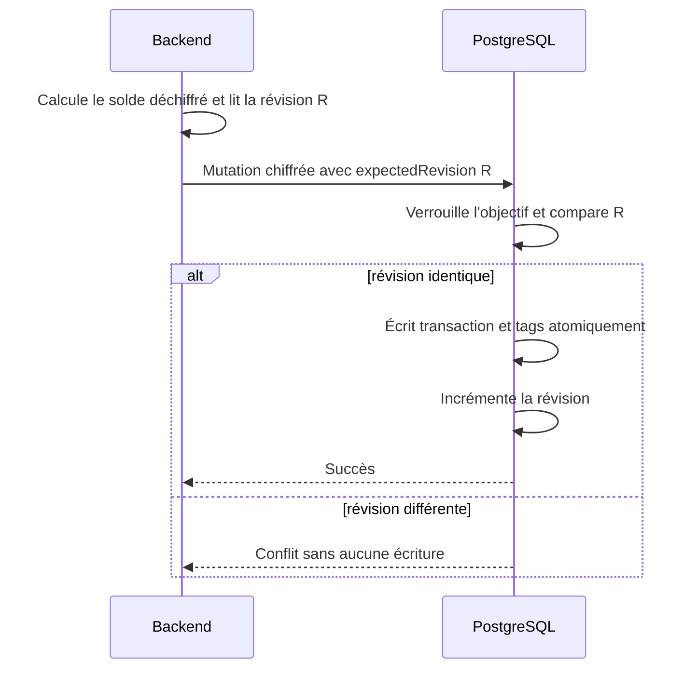

# Instruction: poser le modèle PostgreSQL et les mutations atomiques

## Architecture projection

> Tree of the final files. ✅ create · ✏️ modify · ❌ delete

```txt
backend-nest/
├── supabase/
│   ├── migrations/
│   │   └── 20260802120000_add_savings_goal_withdrawals.sql    ✅ colonnes, contraintes, révision, RPC et suppression
│   └── tests/
│       └── savings_goal_withdrawal_atomicity.sql              ✅ concurrence, ownership et conservation du lien cassé
└── src/types/
    └── database.types.ts                                      ✏️ types générés depuis la base locale
```

## User Journey



## Tasks to do

### `1)` Ajouter un lien source durable sur `transaction`

> Le schéma doit rendre les états actif, cassé et absent explicites.

1. Ajouter `source_savings_goal_id uuid null` avec clé étrangère `ON DELETE SET NULL` et `source_savings_goal_name text null`.
2. Ajouter l'index de lecture par objectif, date et transaction pour l'historique chronologique.
3. Contraindre une transaction portant un nom source à rester `income`, libre et sans `budget_line_id`.
4. Contraindre un identifiant source à exiger un snapshot non vide ; autoriser le snapshot sans identifiant uniquement pour l'état cassé après suppression.
5. Laisser les deux colonnes nulles pour toutes les transactions historiques et ordinaires : aucun backfill fonctionnel.
6. Ne jamais stocker de montant financier supplémentaire en clair ; `transaction.amount` reste l'unique montant du retrait et reste chiffré AES-256-GCM.

### `2)` Versionner tout changement susceptible de périmer le solde

> PostgreSQL ne déchiffre pas les montants ; il garantit que le calcul backend est encore contemporain.

1. Ajouter `savings_goal.balance_revision bigint not null default 0`, sans l'exposer aux clients.
2. Incrémenter la révision lors d'un changement de `initial_amount`.
3. Incrémenter la révision des anciens et nouveaux objectifs lors d'une insertion, modification ou suppression de prévision liée susceptible de changer le confirmé.
4. Incrémenter la révision lorsque les transactions allouées à ces prévisions changent, ainsi que pour toute mutation d'un revenu source.
5. Inclure les changements de date/budget d'un revenu source : ils ne changent pas le total instantané, mais changent la chronologie et les projections.
6. Accepter une invalidation conservative quand la mutation s'avère neutre ; elle peut provoquer un retry, jamais un solde faux.
7. Traiter un deadlock ou un échec de sérialisation provoqué par une mutation concurrente comme un conflit retryable, avec rollback complet de l'une des deux transactions.

### `3)` Créer trois RPC d'écriture à résultat tout-ou-rien

> Le contrôle métier reste en clair côté backend ; la base verrouille le contexte exact de ce contrôle.

1. RPC de création : vérifier propriétaire, objectif existant, révision attendue, type revenu et transaction libre ; insérer transaction chiffrée et `transaction_tag` dans la même transaction SQL.
2. RPC d'édition : verrouiller transaction et objectif, vérifier que la source n'a pas changé, appliquer montant/libellé/date/devises/tags, puis laisser le trigger avancer la révision.
3. RPC de suppression : verrouiller les deux lignes, supprimer le revenu lié et ses tags, puis avancer la révision.
4. Toutes les RPC acquièrent le verrou advisory de l'objectif avant les row locks, dans le même ordre que les RPC d'objectif existantes.
5. Une révision périmée renvoie un conflit typé et ne produit aucune écriture partielle.
6. Retirer l'exécution à `public`, `anon` et `authenticated`; les RPC sont réservées au rôle backend qui a déjà validé et chiffré le montant.

### `4)` Préserver le contexte pendant le cycle de vie de l'objectif

> Renommer ou supprimer un objectif ne doit jamais rendre l'historique trompeur.

1. Synchroniser `source_savings_goal_name` vers le nom courant lors d'un renommage tant que le lien est actif.
2. Étendre la fonction d'impact de suppression pour retourner séparément les revenus sources, même s'ils ne sont pas des transactions allouées.
3. Redéfinir `apply_savings_goal_deletion` dans la nouvelle migration : conserver ces revenus dans tous les modes, figer le dernier nom, puis laisser la FK mettre l'identifiant à null.
4. Exclure explicitement ces transactions des ensembles supprimables et de leurs contrôles de révision, tout en les incluant dans la preview fraîche présentée à l'utilisateur.
5. Ne jamais créer de cascade inverse : supprimer le revenu annule le retrait, supprimer l'objectif ne supprime pas le revenu.

### `5)` Prouver les garde-fous au niveau SQL

> Les tests de base protègent la partie que les mocks Nest ne peuvent pas démontrer.

1. Refuser un objectif d'un autre utilisateur, un revenu alloué, un type non `income`, un snapshot vide et une révision périmée.
2. Lancer deux mutations avec la même révision : une seule réussit, l'autre ne laisse ni transaction ni tag partiel.
3. Vérifier rollback complet quand l'insertion d'un tag échoue.
4. Vérifier qu'une édition et une suppression avancent la révision.
5. Faire concourir une contribution confirmée et un retrait : si la contribution commit d'abord, le retrait relit le solde ; si le retrait commit d'abord, la contribution est ordonnée après lui sans écriture partielle.
6. Renommer puis supprimer l'objectif et vérifier que le revenu survit avec identifiant nul et dernier nom conservé, quel que soit le mode de suppression.
7. Appliquer la migration localement sans `db reset`, puis régénérer `database.types.ts` avec `bun run generate-types:local`.

## Test acceptance criteria

| Task | Acceptance criteria |
| ---- | ------------------- |
| 1 | Une transaction liée ne peut exister qu'en revenu libre avec un snapshot non vide ; une transaction ordinaire conserve les deux champs à null. |
| 1 | La base ne contient aucun nouveau montant financier en clair. |
| 2 | Toute mutation committée pouvant changer le stock ou sa chronologie rend une révision précédemment lue invalide ; les conflits de verrou sont rollbackés puis rejouables. |
| 3 | Deux écritures portant la même révision ne peuvent pas toutes les deux réussir. |
| 3 | Une erreur d'écriture des tags annule aussi la transaction et l'avancement de révision. |
| 4 | Après renommage puis suppression, le revenu existe encore, `source_savings_goal_id` vaut null et le dernier nom reste disponible. |
| 4 | Les modes de suppression qui retirent des transactions allouées ne retirent jamais les revenus provenant de l'objectif. |
| 5 | Les tests SQL couvrent concurrence, ownership, contraintes et rollback sur une base locale migrée sans commande destructive. |
