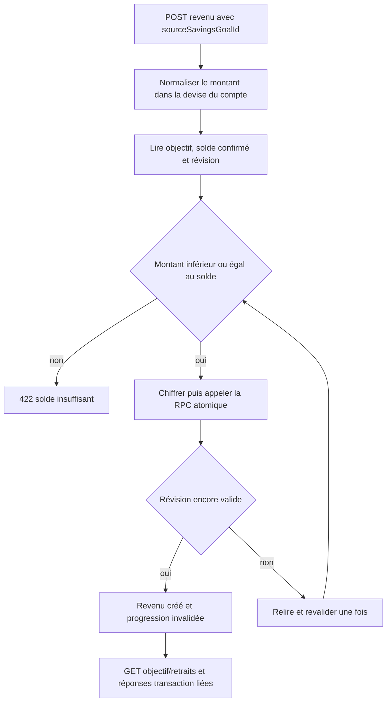

# Instruction: exposer les parcours backend et protéger toutes les mutations

## Architecture projection

> Tree of the final files. ✅ create · ✏️ modify · ❌ delete

```txt
backend-nest/src/
├── common/
│   ├── constants/error-definitions.ts                          ✏️ erreurs solde, conflit et invariant
│   └── utils/transaction-api.mapper.ts                         ✏️ source active ou cassée dans toutes les réponses
└── modules/
    ├── savings-goal/
    │   ├── application/
    │   │   ├── get-savings-goal-progress.use-case.ts          ✏️ injecte les retraits au calculateur
    │   │   ├── get-savings-goal-progress.use-case.spec.ts     ✏️ stock net, plan et rythme
    │   │   ├── get-savings-goal-withdrawal-options.use-case.ts      ✅ options positives en lecture groupée
    │   │   ├── get-savings-goal-withdrawal-options.use-case.spec.ts ✅ statuts et soldes
    │   │   ├── get-savings-goal-withdrawals.use-case.ts       ✅ historique trié
    │   │   ├── get-savings-goal-withdrawals.use-case.spec.ts  ✅ mapping et ownership
    │   │   ├── savings-goal-withdrawal-policy.service.ts      ✅ solde/révision pour les mutations transaction
    │   │   ├── savings-goal-withdrawal-policy.service.spec.ts ✅ insuffisant, retry et statut neutre
    │   │   ├── get-savings-goal-deletion-impact.use-case.ts   ✏️ revenus préservés et total
    │   │   ├── get-savings-goal-deletion-impact.use-case.spec.ts ✏️ preview complète
    │   │   ├── remove-savings-goal.use-case.ts                ✏️ résultat et invalidation
    │   │   └── remove-savings-goal.use-case.spec.ts           ✏️ conservation garantie
    │   ├── domain/
    │   │   ├── savings-goal.entity.ts                         ✏️ retraits, options et révision interne
    │   │   └── ports/
    │   │       ├── savings-goal-repository.port.ts            ✏️ lectures groupées et impact
    │   │       └── savings-goal-withdrawal-policy.port.ts     ✅ seam exporté vers transaction
    │   ├── infrastructure/
    │   │   ├── http/
    │   │   │   ├── dto/savings-goal-swagger.dto.ts            ✏️ nouvelles réponses documentées
    │   │   │   └── savings-goal.controller.ts                 ✏️ options et historique
    │   │   ├── mappers/savings-goal.mapper.ts                 ✏️ réponses partagées
    │   │   └── persistence/
    │   │       ├── schemas/rpc-payload.schemas.ts             ✏️ parse strict des RPC révisées
    │   │       ├── schemas/rpc-payload.schemas.spec.ts        ✏️ payloads actifs/cassés
    │   │       ├── supabase-savings-goal.repository.ts        ✏️ déchiffrement batch, retraits et révision
    │   │       └── supabase-savings-goal.repository.spec.ts   ✏️ aucun montant en clair ou N+1
    │   ├── savings-goal.module.ts                             ✏️ providers et port exporté
    │   ├── savings-goal.tokens.ts                             ✏️ token de politique
    │   └── savings-goal-withdrawal.integration.spec.ts       ✅ progression, concurrence et suppression
    └── transaction/
        ├── application/
        │   ├── create-transaction.use-case.ts                 ✏️ création liée atomique
        │   ├── create-transaction.use-case.spec.ts            ✏️ montant cible, limite et retry
        │   ├── update-transaction.use-case.ts                 ✏️ synchronisation du retrait
        │   ├── update-transaction.use-case.spec.ts            ✏️ différence de montant et lien immuable
        │   ├── remove-transaction.use-case.ts                 ✏️ restitution du solde
        │   └── remove-transaction.use-case.spec.ts            ✏️ actif et cassé
        ├── domain/
        │   ├── transaction.entity.ts                          ✏️ métadonnées source
        │   ├── transaction.invariants.ts                      ✏️ revenu libre et type immuable
        │   ├── transaction.invariants.spec.ts                 ✏️ cas refusés
        │   └── ports/transaction-repository.port.ts           ✏️ trois mutations RPC
        ├── infrastructure/
        │   ├── http/
        │   │   ├── dto/transaction-swagger.dto.ts             ✏️ source création/lecture
        │   │   ├── transaction.controller.ts                  ✏️ codes HTTP et contrats
        │   │   └── transaction.controller.spec.ts             ✏️ aucune API de reliaison
        │   ├── mappers/transaction.mapper.ts                  ✏️ snapshot actif/cassé
        │   └── persistence/
        │       ├── supabase-transaction.repository.ts         ✏️ chiffrement puis RPC
        │       └── supabase-transaction.repository.spec.ts    ✏️ payload chiffré et tags atomiques
        └── transaction.module.ts                              ✏️ dépendance vers la politique objectif
```

## User Journey



## Tasks to do

### `1)` Exposer deux lectures dédiées sans alourdir la liste générale

> Le sélecteur et le détail d'objectif ont des besoins différents de `GET /savings-goals`.

1. Ajouter `GET /v1/savings-goals/withdrawal-options` avant les routes paramétrées.
2. Calculer les soldes dans une lecture groupée, filtrer côté backend les objectifs dont `confirmed <= 0`, et conserver `ACTIVE`, `PAUSED` et `COMPLETED`.
3. Retourner le montant disponible et la devise du compte pour que les clients n'inventent aucun calcul de sélection.
4. Ajouter `GET /v1/savings-goals/:id/withdrawals`, contrôlé par ownership, trié du plus récent au plus ancien.
5. Retourner pour chaque retrait la transaction, le budget cible, la date, le libellé et le montant déchiffré.
6. Garder `GET /savings-goals` léger : ne pas y injecter une progression calculée pour chaque carte.

### `2)` Intégrer les retraits à toutes les progressions serveur

> La disponibilité, le détail et le graphique doivent raconter le même stock.

1. Faire charger au repository les retraits actifs en plus des contributions liées.
2. Déchiffrer leurs montants uniquement dans l'adapter de persistance et alimenter le calculateur partagé.
3. Utiliser la période du budget pour la chronologie et la date de transaction pour l'ordre dans la section « Retraits ».
4. Invalider les caches de progression, retraits et options après toute création, édition, suppression ou déplacement d'un revenu source.
5. Recalculer le budget comme aujourd'hui après la transaction, sans transformer le retrait en prévision d'épargne.

### `3)` Brancher la création liée sur le POST transaction existant

> Le formulaire ajoute un revenu ; il ne doit pas orchestrer deux écritures.

1. Accepter `sourceSavingsGoalId` dans `POST /v1/transactions` uniquement.
2. Appliquer d'abord la conversion existante ; comparer le montant cible en devise du compte au solde disponible.
3. Refuser objectif introuvable ou étranger, type différent de `income`, transaction allouée, solde nul et montant supérieur au disponible.
4. Chiffrer le montant, figer le nom courant de l'objectif et appeler la RPC de création avec la révision lue.
5. Sur révision périmée, deadlock ou échec de sérialisation, relire et revalider une fois ; retourner ensuite soit `SAVINGS_GOAL_WITHDRAWAL_INSUFFICIENT_BALANCE`, soit un conflit 409 stable.
6. N'exposer aucun champ de snapshot dans le body client : le serveur en reste propriétaire.

### `4)` Synchroniser édition, suppression et actions existantes

> Une transaction liée reste une transaction normale, sauf pour son origine immuable et son effet sur le stock.

1. À l'édition d'un lien actif, calculer le disponible avant édition comme `confirmed + ancienMontant`, puis valider le nouveau montant et appeler la RPC d'édition.
2. Autoriser nom, montant, date, devise et tags ; interdire changement de type, allocation, retrait ou remplacement du lien.
3. À la suppression d'un lien actif, appeler la RPC de suppression : le retrait disparaît et le solde augmente du montant exact.
4. Pour un lien cassé, autoriser édition de nom/montant/date/tags et suppression sans contrôle de solde, tout en gardant le type `income` et le snapshot historique.
5. Le pointage ne modifie jamais le stock retiré ; le report vers une autre période conserve le lien, le montant et le snapshot, puis invalide la chronologie.
6. Les recherches, listes budget, dashboard et détails transaction retournent tous les deux champs source via le mapper commun.

### `5)` Étendre la suppression d'objectif au niveau application

> La popup doit être fondée sur le même instantané que la mutation qu'elle autorise.

1. Déchiffrer les montants des revenus préservés renvoyés par l'impact SQL.
2. Ajouter la liste chronologique et son total à `SavingsGoalDeletionImpact` et au Swagger.
3. Conserver la révision fraîche de l'impact dans la commande existante afin qu'un revenu créé après la preview provoque un conflit, jamais une suppression sur une liste obsolète.
4. Après commit, retourner le succès de suppression même si les revenus restent dans leurs budgets ; les recalculs post-commit suivent la sémantique existante.
5. Vérifier qu'aucune option de suppression ne peut demander la suppression de ces revenus.

### `6)` Verrouiller l'API par des tests unitaires et d'intégration

> Les tests doivent couvrir la règle financière, pas seulement le mapping HTTP.

1. Reproduire 10'000 → retrait 4'500 → 5'500 sur l'API de progression et l'historique.
2. Tester un retrait égal au solde, un dépassement de 0.01, un objectif de chaque statut et un objectif à zéro.
3. Tester deux créations concurrentes dont la somme dépasse le solde : jamais deux succès.
4. Tester édition à la hausse et à la baisse, suppression/restauration, pointage sans effet et report avec chronologie mise à jour.
5. Tester conversion de devise : la limite porte sur `amount` cible, pas sur `originalAmount`.
6. Tester suppression d'objectif : transaction conservée, lien cassé nommé, édition/suppression encore possibles et aucune reliaison possible.

## Test acceptance criteria

| Task | Acceptance criteria |
| ---- | ------------------- |
| 1 | Le sélecteur reçoit en un appel uniquement les objectifs de l'utilisateur dont le solde disponible est positif, quel que soit leur statut. |
| 1 | L'historique est trié du plus récent au plus ancien et chaque entrée permet d'identifier exactement son budget et sa transaction. |
| 2 | Progression, graphique, options et historique utilisent tous le même total de retraits déchiffré. |
| 3 | Un POST direct dépassant le solde est refusé côté backend même si le client ne fait aucun contrôle. |
| 3 | Deux retraits concurrents qui dépasseraient ensemble le disponible ne peuvent pas tous les deux réussir. |
| 4 | Passer un retrait de 4'500 à 3'500 restitue 1'000 ; supprimer le revenu restitue ensuite les 3'500 restants. |
| 4 | Pointage et dépointage ne changent pas le solde de l'objectif ; un lien actif ou cassé ne peut pas changer de type ni être reliaisonné. |
| 5 | La preview de suppression contient les revenus préservés et refuse une commande devenue obsolète. |
| 5 | Après suppression de l'objectif, les revenus liés survivent avec le dernier nom et sans identifiant navigable. |
| 6 | Les montants envoyés aux RPC et stockés en base sont chiffrés ; aucune erreur ou log ne contient le montant en clair. |
