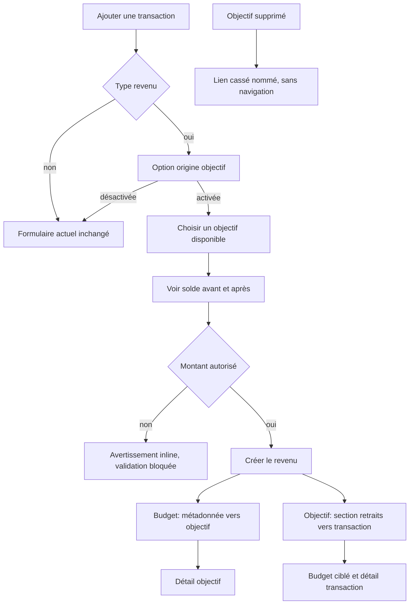

# Instruction: livrer le parcours web et ses liens actifs ou cassés

## Architecture projection

> Tree of the final files. ✅ create · ✏️ modify · ❌ delete

```txt
frontend/
├── projects/webapp/
│   ├── public/i18n/fr.json                                      ✏️ libellés, aides, erreurs et renommage PUL-292
│   └── src/app/
│       ├── core/
│       │   ├── api/
│       │   │   ├── api-error-localizer.ts                      ✏️ erreurs objectif/retrait
│       │   │   └── api-error-localizer.spec.ts                 ✏️ messages stables
│       │   ├── savings-goal/
│       │   │   ├── savings-goal-api.ts                         ✏️ options et historique
│       │   │   └── savings-goal-api.spec.ts                    ✏️ validation des réponses
│       │   └── transaction/
│       │       ├── transaction-api.ts                          ✏️ source à la création et cache
│       │       └── transaction-api.spec.ts                     ✏️ body create, jamais patch
│       ├── pattern/savings-goal-picker/
│       │   ├── savings-goal-picker-field.ts                    ✏️ mode retrait avec solde/statut
│       │   └── savings-goal-picker-field.spec.ts               ✏️ filtrage et libellés longs
│       └── feature/
│           ├── current-month/
│           │   ├── components/
│           │   │   ├── add-transaction-form.schema.ts          ✏️ option source conditionnelle
│           │   │   ├── add-transaction-form.schema.spec.ts     ✏️ revenu, devise et limite
│           │   │   ├── add-transaction-form.ts                 ✏️ sélecteur et preview
│           │   │   ├── add-transaction-form.spec.ts            ✏️ parcours accessible
│           │   │   ├── add-transaction-dialog.ts               ✏️ données d'options
│           │   │   ├── add-transaction-bottom-sheet.ts         ✏️ même contenu responsive
│           │   │   ├── add-transaction-bottom-sheet.spec.ts    ✏️ comportement mobile
│           │   │   ├── dashboard-recent-transactions.ts        ✏️ métadonnée source compacte
│           │   │   └── dashboard-recent-transactions.spec.ts   ✏️ actif, cassé, tags
│           │   └── services/
│           │       ├── add-transaction-dialog.service.ts       ✏️ chargement et invalidation
│           │       └── add-transaction-dialog.service.spec.ts  ✏️ création liée pessimiste
│           ├── budget/
│           │   ├── budget.routes.ts                            ✏️ query de transaction ciblée
│           │   ├── budget-details/
│           │   │   ├── budget-details-page.ts                 ✏️ ouvre la transaction ciblée une fois
│           │   │   ├── budget-details-page.spec.ts            ✏️ deep link depuis l'objectif
│           │   │   ├── components/
│           │   │   │   ├── budget-items-container.ts          ✏️ métadonnée compacte
│           │   │   │   ├── budget-items-container.spec.ts     ✏️ ellipse et nom accessible
│           │   │   │   ├── budget-table/cells/name-cell.ts    ✏️ source dans la table
│           │   │   │   ├── budget-table/cells/name-cell.spec.ts ✏️ actif/cassé
│           │   │   │   └── edit-transaction-form/
│           │   │   │       ├── edit-transaction-form.ts       ✏️ contexte immuable et navigation
│           │   │   │       ├── edit-transaction-form.spec.ts  ✏️ nom complet et absence de reliaison
│           │   │   │       └── edit-transaction-dialog.ts     ✏️ lien vers l'objectif
│           │   │   └── view-models/transaction.view-model.ts  ✏️ présentation source partagée
│           │   └── budget-list/search-transactions-dialog/
│           │       ├── search-transactions-dialog.ts           ✏️ résultat lié ou cassé
│           │       └── search-transactions-dialog.spec.ts      ✏️ métadonnée compacte
│           └── savings-goals/
│               ├── detail/
│               │   ├── components/
│               │   │   ├── goal-withdrawals-list.ts           ✅ section chronologique
│               │   │   ├── goal-withdrawals-list.spec.ts      ✅ montant négatif et navigation
│               │   │   ├── goal-deletion-dialog.ts            ✏️ retraits toujours conservés
│               │   │   ├── goal-deletion-dialog.spec.ts       ✏️ preview et total
│               │   │   └── goal-deletion-dialog/
│               │   │       ├── goal-deletion-dialog.html      ✏️ section responsive
│               │   │       └── goal-deletion-dialog.scss      ✏️ overflow et noms longs
│               │   ├── savings-goal-detail-page.ts            ✏️ progression nette et section retraits
│               │   └── savings-goal-detail-page.spec.ts       ✏️ chargement, vide, erreur et statut
│               └── services/
│                   ├── savings-goals-store.ts                  ✏️ resources/options/retraits/invalidation
│                   └── savings-goals-store.spec.ts             ✏️ cache après mutations
```

## User Journey



## Wireframe

```txt
┌──────────────────────────────────────────────────────┐
│ (1) En-tête du formulaire de transaction             │
├──────────────────────────────────────────────────────┤
│ (2) Type · montant · libellé · date · tags           │
│                                                      │
│ (3) Option d'origine d'épargne                       │
│ ┌──────────────────────────────────────────────────┐ │
│ │ (4) Sélecteur d'objectif · solde disponible      │ │
│ │ (5) Aperçu avant → après · message de validation │ │
│ └──────────────────────────────────────────────────┘ │
├──────────────────────────────────────────────────────┤
│ (6) Actions du formulaire                            │
└──────────────────────────────────────────────────────┘

1. En-tête : contexte d'ajout dans le budget ouvert.
2. Formulaire principal : champs de transaction déjà existants.
3. Origine : bloc conditionnel réservé aux revenus.
4. Objectif : choix unique avec statut et montant disponible.
5. Aperçu : effet du montant normalisé et zone d'erreur inline.
6. Actions : annulation et validation du revenu.

┌──────────────────────────────────────────────────────┐
│ (1) Liste des transactions du budget                 │
│ ┌──────────────────────────────────────────────────┐ │
│ │ (2) Libellé                              Montant │ │
│ │     Métadonnée source · tags                     │ │
│ └──────────────────────────────────────────────────┘ │
├──────────────────────────────────────────────────────┤
│ (3) Détail / édition de la transaction               │
│ ┌──────────────────────────────────────────────────┐ │
│ │ (4) Contexte source actif ou cassé               │ │
│ └──────────────────────────────────────────────────┘ │
│ (5) Champs éditables existants                       │
└──────────────────────────────────────────────────────┘

1. Liste : vue compacte du budget, du dashboard ou de la recherche.
2. Ligne : une seule ligne de métadonnées sous le libellé.
3. Détail : surface existante d'édition de la transaction.
4. Contexte : destination active ou information statique si cassée.
5. Champs : montant, libellé, date et tags sans sélecteur de source.

┌──────────────────────────────────────────────────────┐
│ (1) En-tête et progression de l'objectif             │
├──────────────────────────────────────────────────────┤
│ (2) Plan et contributions                            │
├──────────────────────────────────────────────────────┤
│ (3) Section des retraits                             │
│ ┌──────────────────────────────────────────────────┐ │
│ │ (4) Date · revenu · montant · accès transaction  │ │
│ └──────────────────────────────────────────────────┘ │
└──────────────────────────────────────────────────────┘

1. En-tête : identité, statut et solde net de l'objectif.
2. Plan : surfaces de projection et de contributions existantes.
3. Retraits : historique séparé, chronologique et repliable selon l'existant.
4. Entrée : contexte complet et accès au budget concerné.

┌──────────────────────────────────────────────────────┐
│ (1) En-tête de suppression                           │
├──────────────────────────────────────────────────────┤
│ (2) Impact existant et choix sur le plan             │
├──────────────────────────────────────────────────────┤
│ (3) Revenus liés toujours conservés                  │
│ ┌──────────────────────────────────────────────────┐ │
│ │ (4) Date · libellé · montant                     │ │
│ └──────────────────────────────────────────────────┘ │
│ (5) Total                                            │
├──────────────────────────────────────────────────────┤
│ (6) Annulation · confirmation                         │
└──────────────────────────────────────────────────────┘

1. En-tête : objectif visé par l'action destructive.
2. Impact : options de suppression déjà prises en charge.
3. Revenus : groupe séparé dont la conservation est explicite.
4. Entrée : détail lisible sans troncature de contenu essentiel.
5. Total : somme déchiffrée de la preview fraîche.
6. Actions : sortie sûre et confirmation destructive.
```

## Tasks to do

### `1)` Charger les options et l'historique avec les stores existants

> Le formulaire et le détail ne doivent ni faire de N+1 ni conserver un solde périmé.

1. Ajouter les méthodes API validées par les schémas partagés pour options et retraits.
2. Ajouter des resources ziflux avec des clés distinctes `withdrawal-options` et `withdrawals/:goalId`.
3. Invalider liste, progression, options et retraits après succès ou erreur ambiguë d'une mutation liée ; invalider aussi le budget courant.
4. Garder les mutations pessimistes : aucun solde optimiste n'est affiché avant le commit atomique.
5. Préserver le comportement responsive dialog/bottom sheet via le service existant.

### `2)` Ajouter l'origine dans le formulaire de revenu

> La formulation finale décrit d'où vient l'argent, sans créer une deuxième action concurrente.

1. Afficher uniquement pour le type `income` l'option « Ce revenu vient d'un objectif d'épargne ».
2. Afficher l'aide « Le montant sera retiré de l'objectif choisi. ».
3. Quand l'option est active, rendre « Objectif utilisé » obligatoire et présenter les objectifs éligibles avec statut et solde.
4. Étendre le picker existant par un mode explicite de retrait ; ne pas modifier son mode actuel d'association d'une prévision d'épargne.
5. Désactiver et effacer la sélection si le type quitte `income` avant soumission.
6. Conserver le CTA « Ajouter le revenu » et envoyer un unique POST transaction avec `sourceSavingsGoalId`.

### `3)` Prévisualiser et bloquer avec le montant réellement retiré

> Le contrôle client aide ; le backend reste l'autorité.

1. Calculer la preview avec le montant cible produit par le convertisseur existant, pas avec le montant original saisi.
2. Afficher `nom · disponible → restant` dans la devise du compte, par exemple 10'000 → 5'500 CHF.
3. Bloquer la soumission si le montant dépasse le disponible ou si options/conversion ne sont pas résolues.
4. Localiser le 422 backend en avertissement calme près du sélecteur, rafraîchir les options et conserver les autres champs du formulaire.
5. Localiser un conflit de révision persistant comme une invitation à réessayer après rafraîchissement, sans double POST.
6. Pour un objectif `COMPLETED` qui passera sous la cible, indiquer qu'il restera atteint et pourra être rouvert depuis son détail.

### `4)` Rendre le lien visible et navigable depuis les transactions

> Les listes restent compactes ; le détail porte toute l'explication.

1. Ajouter au view-model transaction une métadonnée active « Pris sur · nom » avec icône épargne, ou cassée « Objectif supprimé · nom » avec icône lien indisponible neutre.
2. Réutiliser une seule ligne de métadonnées pour la source et les tags dans dashboard, budget et recherche ; ne pas empiler de chips.
3. Appliquer l'ellipse uniquement aux listes compactes, conserver le nom complet dans le nom accessible et offrir un tooltip web explicatif au lien cassé.
4. Dans l'édition/détail, afficher le nom complet. Le lien actif navigue vers `/savings-goals/:id`; le lien cassé est statique, sans chevron ni rouge.
5. Ne jamais afficher de picker de source dans l'édition : montant, libellé, date et tags restent modifiables, pas l'origine.
6. Après une erreur de solde à l'édition, conserver le formulaire, rafraîchir le contexte et afficher l'erreur près du montant.

### `5)` Ajouter la section « Retraits » au détail objectif

> Les sorties d'argent ne sont pas mélangées aux contributions positives.

1. Charger l'historique en parallèle de la progression et des contributions, avec états chargement, vide et erreur indépendants.
2. Afficher date, libellé du revenu et montant signé négativement, sans couleur rouge.
3. Trier du plus récent au plus ancien conformément au serveur.
4. Au clic, naviguer vers le budget concerné avec `transactionId` en query param.
5. Dans `budget-details-page`, attendre le chargement de la transaction, ouvrir le détail existant une seule fois, puis consommer la query par `replaceUrl`.
6. Garder le plan futur inchangé dans l'UI ; la progression et le graphique reflètent seulement le nouveau stock net.

### `6)` Prévenir avant la suppression de l'objectif

> La confirmation doit montrer ce qui restera et pourquoi le lien deviendra cassé.

1. Ajouter un groupe « Retraits vers tes budgets » séparé des transactions allouées et des prévisions.
2. Afficher chaque revenu avec date, nom, montant négatif et total ; expliquer qu'ils seront conservés dans leurs budgets avec un objectif supprimé.
3. Afficher ce groupe dans tous les modes de suppression et ne proposer aucune case permettant de les supprimer.
4. Dans le détail de la popup, laisser les noms longs se répartir sur plusieurs lignes ; réserver l'ellipse aux éventuels résumés compacts.
5. Si la preview est devenue obsolète, recharger l'impact et redemander confirmation au lieu de réutiliser l'ancien choix.

### `7)` Lever la collision de vocabulaire et tester les surfaces web

> Les deux usages de l'épargne doivent rester impossibles à confondre.

1. Renommer la CTA PUL-292 en « Couvrir ce mois avec mon épargne » et afficher « À remettre le mois prochain » dans sa carte/description.
2. Ne pas changer son API, sa paire revenu M + épargne M+1 ou ses tests métier existants.
3. Couvrir le formulaire revenu simple inchangé, le revenu lié, le dépassement, la conversion, l'objectif complété, le lien actif et le lien cassé.
4. Couvrir la navigation dans les deux sens et la consommation unique du query param.
5. Couvrir la suppression avec revenus préservés, les noms très longs, le viewport mobile et les labels accessibles.

## Test acceptance criteria

| Task | Acceptance criteria |
| ---- | ------------------- |
| 1 | Ouvrir le formulaire n'émet qu'une lecture d'options et une création liée invalide toutes les vues de solde concernées. |
| 2 | L'option n'apparaît que pour un revenu, exige exactement un objectif et disparaît sans donnée résiduelle si le type change. |
| 3 | Une saisie de 4'500 sur 10'000 affiche 5'500 CHF avant validation ; 10'000.01 bloque le formulaire et un POST forcé reçoit aussi une erreur backend. |
| 3 | Pour un revenu en devise étrangère, la preview et la limite utilisent le montant converti en devise du compte. |
| 4 | Une liste compacte montre au maximum une ligne de métadonnées ; un nom long est ellipsé visuellement mais reste complet pour le tooltip et le lecteur d'écran. |
| 4 | Le détail actif navigue vers l'objectif ; le détail cassé affiche le dernier nom sans rouge, lien ni faux chevron. |
| 5 | La section « Retraits » est séparée des contributions, triée et ouvre directement la transaction du budget ciblé. |
| 6 | La popup de suppression montre liste et total des revenus qui resteront, quel que soit le mode choisi. |
| 6 | Après confirmation, ces revenus restent éditables/supprimables et s'affichent comme liens cassés. |
| 7 | « Couvrir ce mois avec mon épargne » continue de créer son remboursement M+1 ; le nouveau revenu lié n'en crée jamais. |
