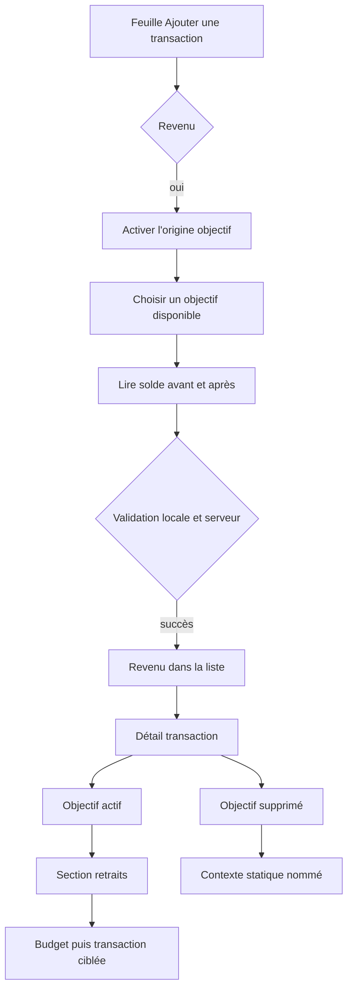

# Instruction: livrer le parcours iOS natif et accessible

## Architecture projection

> Tree of the final files. ✅ create · ✏️ modify · ❌ delete

```txt
ios/
├── Pulpe/
│   ├── App/
│   │   ├── AppState+Navigation.swift                           ✏️ destination budget + transaction ciblée
│   │   └── MainTabView.swift                                  ✏️ destinations croisées et router dans Objectifs
│   ├── Core/Network/
│   │   ├── APIError.swift                                     ✏️ erreurs retrait d'objectif
│   │   └── Endpoints.swift                                    ✏️ options et historique
│   ├── Domain/
│   │   ├── Models/
│   │   │   ├── Transaction.swift                              ✏️ source active/cassée et create DTO
│   │   │   ├── SavingsGoalDeletion.swift                      ✏️ retraits conservés dans l'impact
│   │   │   └── SavingsGoalWithdrawal.swift                    ✅ option et entrée d'historique
│   │   ├── Services/
│   │   │   ├── SavingsGoalService.swift                       ✏️ options et historique
│   │   │   └── TransactionService.swift                       ✏️ source à la création seulement
│   │   └── Store/SavingsGoalStore.swift                       ✏️ cache d'options et invalidation
│   ├── Shared/Components/
│   │   ├── SavingsGoalPickerField.swift                       ✏️ mode retrait, statut et solde
│   │   └── ContextLinkRow.swift                               ✏️ état statique sans chevron
│   └── Features/
│       ├── CurrentMonth/Components/
│       │   ├── AddTransactionSheet.swift                      ✏️ option, picker, preview et erreur
│       │   └── TransactionSection.swift                       ✏️ métadonnée compacte active/cassée
│       ├── Budgets/BudgetDetails/
│       │   ├── BudgetDetailsView.swift                        ✏️ transaction initiale ciblée
│       │   ├── BudgetDetailsView+Routing.swift                ✏️ push différé vers l'édition
│       │   ├── BudgetDetailsFreeTransactionsList.swift        ✏️ métadonnée source et tags
│       │   ├── EditTransactionLogic.swift                     ✏️ invariants d'édition liée
│       │   ├── EditTransactionPage.swift                      ✏️ contexte actif/cassé complet
│       │   ├── Routing/BudgetDetailsRouter.swift              ✏️ navigation vers objectif
│       │   └── SavingsWithdrawal/
│       │       ├── TightMonthCard.swift                       ✏️ nouveau nom du parcours remboursé
│       │       └── SavingsWithdrawalSheet.swift               ✏️ titre et sous-titre distinctifs
│       └── SavingsGoals/
│           ├── GoalWithdrawalsSection.swift                   ✅ historique et accès transaction
│           ├── SavingsGoalDetailView.swift                    ✏️ chargement, stock net et réouverture suggérée
│           └── Components/GoalDeletionSheet.swift             ✏️ revenus conservés et lien cassé expliqué
└── PulpeTests/
    ├── Domain/
    │   ├── Models/
    │   │   ├── TransactionTests.swift                         ✏️ décodage actif/cassé
    │   │   └── SavingsGoalWithdrawalTests.swift               ✅ contrats option/historique
    │   ├── Services/SavingsGoalServiceTests.swift             ✅ routes et décodage
    │   └── Store/SavingsGoalStoreTests.swift                  ✏️ cache et invalidation
    ├── Features/
    │   ├── CurrentMonth/AddTransactionSheetTests.swift        ✅ visibilité, preview et validation
    │   ├── Budgets/BudgetDetails/
    │   │   ├── EditTransactionLogicTests.swift                ✏️ type/source immuables
    │   │   └── BudgetDetailsRouterTests.swift                 ✏️ route transaction ciblée
    │   └── SavingsGoals/
    │       ├── SavingsGoalDetailViewModelTests.swift          ✏️ retraits, erreurs et tri
    │       └── GoalDeletionSheetTests.swift                   ✅ conservation et Dynamic Type
    ├── Helpers/
    │   ├── MockSavingsGoalService.swift                       ✏️ options, retraits et impact
    │   └── MockTransactionService.swift                       ✏️ source à la création
    └── Shared/Components/SavingsGoalPickerFieldTests.swift    ✏️ mode retrait et VoiceOver
```

## User Journey



## Wireframe

```txt
┌───────────────────────────────────────┐
│ (1) Barre de navigation de la feuille │
├───────────────────────────────────────┤
│ (2) Type · montant · libellé          │
│ (3) Date · tags                       │
│                                       │
│ (4) Option d'origine d'épargne        │
│ ┌───────────────────────────────────┐ │
│ │ (5) Objectif · statut · solde     │ │
│ │ (6) Aperçu avant → après          │ │
│ │ (7) Validation contextuelle       │ │
│ └───────────────────────────────────┘ │
├───────────────────────────────────────┤
│ (8) Action principale                 │
└───────────────────────────────────────┘

1. Navigation : titre de la feuille et fermeture native.
2. Transaction : saisie principale existante.
3. Contexte : date et tags existants.
4. Origine : bloc visible uniquement pour un revenu.
5. Objectif : choix unique avec contexte financier.
6. Aperçu : effet dans la devise du compte.
7. Validation : erreur inline ou information de statut.
8. Action : validation sticky existante.

┌───────────────────────────────────────┐
│ (1) Liste des transactions            │
│ ┌───────────────────────────────────┐ │
│ │ (2) Libellé              Montant │ │
│ │     Métadonnée source · tags      │ │
│ └───────────────────────────────────┘ │
├───────────────────────────────────────┤
│ (3) Page d'édition                    │
│ ┌───────────────────────────────────┐ │
│ │ (4) Lien contextuel ou état cassé│ │
│ └───────────────────────────────────┘ │
│ (5) Champs éditables                  │
└───────────────────────────────────────┘

1. Liste : accueil ou détail du budget.
2. Ligne : une seule métadonnée compacte sous le libellé.
3. Édition : page push existante, pas une nouvelle feuille.
4. Contexte : carte navigable active ou information statique.
5. Champs : contenu éditable sans commande de reliaison.

┌───────────────────────────────────────┐
│ (1) En-tête objectif et progression   │
├───────────────────────────────────────┤
│ (2) Graphique et plan                 │
├───────────────────────────────────────┤
│ (3) Contributions                     │
├───────────────────────────────────────┤
│ (4) Retraits                          │
│ ┌───────────────────────────────────┐ │
│ │ (5) Date · revenu · montant      │ │
│ └───────────────────────────────────┘ │
└───────────────────────────────────────┘

1. En-tête : statut et solde net de l'objectif.
2. Projection : surfaces existantes alimentées par le stock net.
3. Contributions : entrées positives existantes.
4. Retraits : section autonome sous les contributions.
5. Entrée : contexte complet et accès à la transaction.

┌───────────────────────────────────────┐
│ (1) En-tête de suppression            │
├───────────────────────────────────────┤
│ (2) Choix d'impact existants          │
├───────────────────────────────────────┤
│ (3) Revenus conservés                 │
│ ┌───────────────────────────────────┐ │
│ │ (4) Date · libellé · montant     │ │
│ └───────────────────────────────────┘ │
│ (5) Total                             │
├───────────────────────────────────────┤
│ (6) Annuler · confirmer               │
└───────────────────────────────────────┘

1. En-tête : objectif de l'action destructive.
2. Impact : comportements de suppression déjà disponibles.
3. Revenus : groupe distinct toujours préservé.
4. Entrée : contenu complet adaptable à Dynamic Type.
5. Total : somme de la preview fraîche.
6. Actions : boutons natifs avec rôle sémantique.
```

## Tasks to do

### `1)` Décoder les nouveaux contrats sans dupliquer les règles

> iOS affiche des données calculées par le serveur ; il ne reconstruit pas la progression.

1. Ajouter les deux champs optionnels au modèle `Transaction` et à ses fixtures, avec compatibilité des réponses qui les omettent encore pendant le déploiement.
2. Ajouter les modèles `SavingsGoalWithdrawalOption` et `SavingsGoalWithdrawal`, en `Decimal` pour les montants.
3. Étendre l'impact de suppression avec liste et total des retraits conservés.
4. Ajouter les endpoints options/historique au service objectif et `sourceSavingsGoalId` uniquement au DTO de création transaction.
5. Mettre en cache les options sur une durée courte et les invalider avec progression, objectifs et budgets après mutation.
6. Ajouter les erreurs localisées distinctes de `savingsWithdrawal*` qui appartient au remboursement PUL-292.

### `2)` Étendre `AddTransactionSheet` pour les revenus liés

> Le parcours reste dans la feuille d'ajout actuelle et suit ses composants natifs.

1. Afficher « Ce revenu vient d'un objectif d'épargne » uniquement quand `kind == .income`, avec l'aide validée.
2. Étendre `SavingsGoalPickerField` avec un mode retrait alimenté par les options du serveur, tout en gardant intact son mode prévision.
3. Présenter nom, statut et solde disponible ; accepter les objectifs actifs, en pause ou atteints quand le solde est positif.
4. Rendre le choix obligatoire quand l'option est active et effacer le choix si le type change.
5. Envoyer une seule création transaction et conserver l'action « Ajouter le revenu ».
6. Ne jamais exposer de contrôle de source dans `EditTransactionPage`.

### `3)` Afficher la preview financière et ses erreurs au bon endroit

> Le montant visible doit être exactement celui que le backend retirera.

1. Réutiliser la conversion existante pour obtenir le montant cible en devise du compte.
2. Afficher le nom et `disponible → restant`, formatés avec les conventions locales suisses et la devise du compte.
3. Désactiver l'action si le montant dépasse le disponible, si la conversion est en échec ou si l'option n'a pas de sélection.
4. Après un refus backend, garder les saisies, rafraîchir les options et afficher le message près de la preview.
5. Sur conflit persistant, proposer de réessayer sans lancer automatiquement une deuxième création côté vue.
6. Si l'objectif atteint descend sous sa cible, afficher une information calme : son statut restera atteint et il pourra être rouvert.

### `4)` Suivre les patterns liste, tags et détail pour le lien transaction

> Une ligne compacte informe ; la page de détail explique et navigue.

1. Dans `TransactionSection` et `BudgetDetailsFreeTransactionsList`, ajouter une seule ligne de métadonnées partagée avec les tags.
2. État actif : icône épargne et teinte `financialSavings`, texte « Pris sur · nom ».
3. État cassé : icône de lien indisponible neutre, texte « Objectif supprimé · nom », jamais rouge.
4. En taille standard, limiter uniquement cette métadonnée compacte à une ligne ; en catégorie Dynamic Type accessibility, autoriser le retour à la ligne.
5. Fournir à VoiceOver le nom complet même quand l'affichage standard est tronqué.
6. Dans `EditTransactionPage`, placer un `ContextLinkRow` complet avant les champs. L'état actif a une action et un chevron ; l'état cassé est statique, sans chevron, avec explication visible et accessible.
7. Geler le type `income` dans l'édition d'un lien actif ou cassé ; garder montant, description, date et tags éditables.

### `5)` Naviguer réellement dans les deux sens

> Les liens ne doivent pas seulement ressembler à des liens.

1. Résoudre un objectif actif depuis `SavingsGoalStore`; charger/rafraîchir le store au besoin avant le push.
2. Réutiliser `BudgetDetailsRouter.pushSavingsGoal` depuis la page transaction et les destinations déjà enregistrées.
3. Ajouter une destination `BudgetDestination.transaction(budgetId:transactionId:)` sans casser la destination `details` existante.
4. Enregistrer cette destination dans les trois stacks susceptibles de l'héberger, notamment `SavingsGoalsTab`, et y injecter un router lié à l'`AppState`.
5. Permettre à `BudgetDetailsView` de recevoir un identifiant initial, attendre la donnée puis pousser une seule fois `.editTx`.
6. Depuis une entrée de retrait, pousser cette destination sur la stack active : retour arrière vers l'objectif, pas changement silencieux d'onglet.

### `6)` Ajouter les retraits et la suppression au détail objectif

> La section et la popup utilisent les mêmes données fraîches que le backend.

1. Faire charger au `SavingsGoalDetailViewModel` progression, contributions et retraits avec états indépendants.
2. Ajouter `GoalWithdrawalsSection` après les contributions : date, libellé, montant négatif non rouge, tri serveur et action vers la transaction.
3. Laisser le nom complet se répartir dans le détail ; aucune ellipse sur cette section à Dynamic Type élevé.
4. Dans `GoalDeletionSheet`, ajouter « Retraits vers tes budgets », la liste et le total, en expliquant qu'ils resteront avec un lien cassé.
5. Afficher ce bloc pour tous les choix de suppression, sans action de suppression individuelle.
6. Après suppression, laisser les budgets se rafraîchir pour rendre immédiatement l'état cassé.
7. Quand un objectif `COMPLETED` passe sous la cible, conserver le badge et rendre l'action existante de réouverture facile à trouver, sans changement automatique.

### `7)` Renommer l'ancien parcours et vérifier l'accessibilité native

> Le remboursement programmé garde son comportement mais perd le vocabulaire ambigu.

1. Remplacer « Piocher dans mon épargne » par « Couvrir ce mois avec mon épargne » dans la carte et le titre de feuille PUL-292.
2. Afficher « À remettre le mois prochain » dans son contexte, sans toucher à la création revenu M + épargne M+1.
3. Tester les contrats actifs/cassés, le picker, la preview, les erreurs backend, l'édition et la navigation ciblée.
4. Tester suppression et total, objectif complété, conversion de devise, liens très longs et Dynamic Type accessibility.
5. Vérifier VoiceOver : type de lien, nom complet, destination annoncée pour l'actif et absence de hint « ouvre » pour le cassé.

## Test acceptance criteria

| Task | Acceptance criteria |
| ---- | ------------------- |
| 1 | Les réponses avec lien actif, lien cassé ou aucun lien se décodent sans ambiguïté et sans convertir les montants en `Double`. |
| 2 | L'option n'existe que pour un revenu et le picker ne propose que les objectifs au solde strictement positif renvoyés par le serveur. |
| 3 | 10'000 moins 4'500 affiche 5'500 CHF ; un dépassement bloque localement puis reste refusé si l'appel est forcé. |
| 3 | Une saisie en devise étrangère utilise le montant cible pour la preview et le contrôle de limite. |
| 4 | Les lignes standard restent compactes ; à Dynamic Type accessibility le texte essentiel se réorganise sans chevauchement ni perte du nom VoiceOver. |
| 4 | Un lien cassé est neutre, sans rouge ni chevron, et explique avec le nom complet pourquoi l'objectif ne peut plus être ouvert. |
| 5 | Depuis l'objectif, toucher un retrait ouvre directement sa transaction et Retour revient à l'objectif ; depuis la transaction active, le lien ouvre l'objectif. |
| 6 | La section « Retraits » est distincte des contributions et la suppression annonce toujours les revenus conservés avec leur total. |
| 6 | Un objectif atteint reste `COMPLETED` après retrait et expose une action manuelle de réouverture. |
| 7 | Le parcours « Couvrir ce mois avec mon épargne » conserve exactement sa paire M/M+1, tandis qu'un retrait d'objectif ne programme aucun remboursement. |
