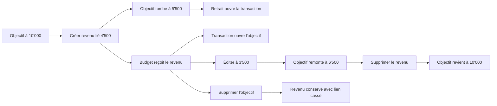

# Instruction: prouver le parcours de bout en bout et fermer les régressions

## Architecture projection

> Tree of the final files. ✅ create · ✏️ modify · ❌ delete

```txt
frontend/e2e/
├── helpers/api-mocks.ts                                      ✏️ mutations et lectures objectif/retraits
├── mocks/api-responses.ts                                    ✏️ états actif, cassé et insuffisant
├── pages/
│   ├── current-month.page.ts                                 ✏️ ajout de revenu lié
│   ├── budget-details.page.ts                                ✏️ transaction ciblée et lien source
│   └── savings-goals.page.ts                                 ✅ détail, retraits et suppression
└── tests/features/
    └── savings-goal-withdrawals.spec.ts                      ✅ scénario principal et lien cassé
```

## User Journey



## Tasks to do

### `1)` Construire un scénario E2E déterministe

> Le test doit suivre un seul argent de bout en bout, sans dépendre de l'horloge ou d'un taux externe.

1. Ajouter un page object objectifs qui sait ouvrir le détail, lire le solde, parcourir les retraits et confirmer une suppression.
2. Étendre les pages accueil/budget pour activer l'origine, sélectionner un objectif et ouvrir une transaction ciblée.
3. Figer devise, jour de paie, budget, dates, objectif et taux de conversion dans les fixtures.
4. Prévoir des réponses mock actives et cassées strictement conformes aux schémas partagés.
5. Garder les sélecteurs sur rôles et noms accessibles ; ne pas sélectionner par classes de style.

### `2)` Prouver le parcours principal dans les deux sens

> Le scénario nominal couvre création, lecture et navigation avant d'explorer les erreurs.

1. Partir d'un objectif avec 10'000 CHF confirmés et d'un budget courant.
2. Ajouter un revenu de 4'500 CHF avec l'option source et vérifier la preview 10'000 → 5'500.
3. Vérifier le revenu dans le budget, sa métadonnée « Pris sur » et le solde objectif à 5'500.
4. Ouvrir l'objectif depuis la transaction, puis la transaction depuis la section « Retraits ».
5. Vérifier que le retour navigateur revient au détail objectif et que la transaction ciblée ne se rouvre pas en boucle.

### `3)` Vérifier les mutations financières et la concurrence

> Chaque modification doit conserver l'équation du stock.

1. Modifier le revenu de 4'500 à 3'500 et vérifier que le solde passe de 5'500 à 6'500.
2. Supprimer le revenu et vérifier retour à 10'000 ainsi que disparition de l'entrée d'historique.
3. Recréer un retrait égal au solde et vérifier qu'aucun autre objectif à zéro n'est proposé ensuite.
4. Dépasser le solde de 0.01 côté UI puis appeler directement l'API : les deux chemins refusent.
5. Exécuter le test d'intégration backend de deux retraits concurrents ; un seul peut être commité si leur somme dépasse le disponible.
6. Vérifier qu'un changement de pointage ne modifie pas le stock et qu'un montant en devise étrangère est contrôlé après conversion.

### `4)` Prouver la suppression et le lien cassé

> La réalité du budget survit à la disparition de son objectif.

1. Prévisualiser la suppression avec au moins un retrait et vérifier la section séparée, les dates, montants et total.
2. Confirmer chacun des modes existants au niveau des tests backend ; le revenu source reste toujours présent.
3. Côté UI, supprimer l'objectif puis vérifier « Objectif supprimé · nom » dans la liste et dans le détail transaction.
4. Vérifier le tooltip web, le nom accessible complet et l'absence de lien/chevron/couleur d'erreur.
5. Modifier puis supprimer la transaction cassée ; aucune validation de solde ou tentative de reliaison n'est envoyée.

### `5)` Fermer les régressions autour des objectifs et de PUL-292

> La nouvelle soustraction ne doit pas déplacer les règles déjà livrées.

1. Rejouer les suites progression, montant initial, plan, génération, suppression d'objectif et transactions allouées.
2. Vérifier qu'un retrait ne change aucune prévision future ni `confirmedPace`.
3. Vérifier qu'un objectif `COMPLETED` reste atteint après retrait et peut être rouvert manuellement.
4. Rejouer les tests PUL-292 : « Couvrir ce mois avec mon épargne » crée toujours un revenu M et une épargne M+1.
5. Vérifier qu'un revenu provenant d'un objectif ne crée jamais de remboursement M+1.
6. Vérifier qu'aucun objectif d'un autre compte n'apparaît ni n'est accepté par l'API.

### `6)` Passer les gates de livraison dans l'ordre compatible

> Les ajouts sont compatibles pendant le déploiement si la base et le backend précèdent les clients.

1. Exécuter les tests ciblés shared, SQL, backend, web et iOS après chaque phase, puis la suite complète de chaque package touché.
2. Exécuter `pnpm quality` avant tout commit et corriger sans refactor hors périmètre.
3. Vérifier manuellement les viewports web mobile/desktop, les noms très longs, le clavier, le tooltip et le focus après navigation.
4. Vérifier iOS en taille standard et Dynamic Type accessibility avec VoiceOver pour les états actif et cassé.
5. Livrer dans l'ordre migration additive → backend → web/iOS ; les anciens clients ignorent les nouveaux champs et le backend accepte toujours un revenu sans source.
6. Ne marquer le plan `implemented` que lorsque toutes les phases et tous les critères observables sont satisfaits ; la revue reste une étape distincte.

## Test acceptance criteria

| Task | Acceptance criteria |
| ---- | ------------------- |
| 1 | Le scénario est déterministe en CHF, ne dépend d'aucun taux ou calendrier externe et utilise des sélecteurs accessibles. |
| 2 | Le même revenu est navigable du budget vers l'objectif et de l'objectif vers sa transaction exacte. |
| 3 | Création, édition et suppression conservent l'équation du stock à chaque étape ; un dépassement ou une concurrence ne produit jamais de solde négatif. |
| 4 | Supprimer l'objectif conserve le revenu dans tous les modes et transforme seulement son lien en contexte cassé nommé. |
| 5 | Plan futur, rythme, statuts manuels, ownership et mécanisme PUL-292 restent inchangés. |
| 6 | Les suites ciblées, les suites complètes et `pnpm quality` passent ; les audits mobile, Dynamic Type et VoiceOver ne révèlent ni troncature essentielle ni faux lien. |
| 6 | Le déploiement backend reste compatible avec un client qui ne connaît pas `sourceSavingsGoalId`, et les clients restent compatibles avec des transactions ordinaires aux deux champs source nuls. |
