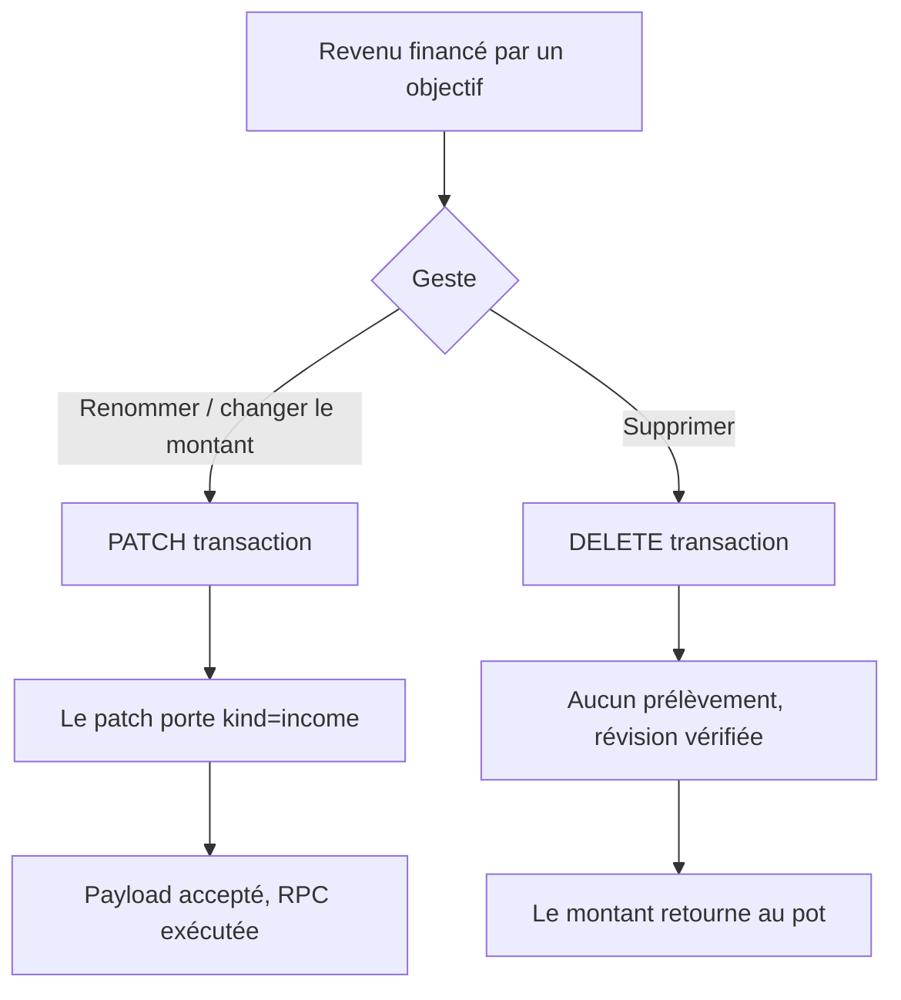

# Instruction: Chemins retour du retrait (backend)

Les gardes du retrait d'objectif d'épargne ont été écrites pour la création et jamais rejouées sur l'édition ni sur la suppression. Les deux défauts sont indépendants ; ils tombent dans le même module et se vérifient avec la même commande.

## Architecture projection

> Tree of the final files. ✅ create · ✏️ modify · ❌ delete

```txt
backend-nest/src/modules
├── transaction/infrastructure/persistence
│   ├── supabase-transaction.repository.ts        ✏️ retirer `kind` de la row avant le parse strict du patch retrait
│   ├── supabase-transaction.repository.spec.ts   ✏️ repro : un patch portant `kind: 'income'` atteint la RPC
│   └── schemas
│       ├── rpc-payload.schemas.ts                (inchangé — le contrat est juste)
│       └── rpc-payload.schemas.spec.ts           ✅ spec compagnon manquant, exigé par la règle supabase.md
└── savings-goal/application
    ├── savings-goal-withdrawal-policy.service.ts      ✏️ sortie anticipée quand rien n'est prélevé
    └── savings-goal-withdrawal-policy.service.spec.ts ✏️ repro : `debit: 0` sur un stock négatif
```

## User Journey



## Tasks to do

### `1)` Reproduire les deux refus

> Deux tests rouges avant la moindre ligne de correctif.

1. Dans `supabase-transaction.repository.spec.ts`, patcher un retrait avec `{ name, kind: 'income' }` et attendre que la RPC `update_savings_goal_withdrawal` soit appelée. Le mock d'use-case ne suffit pas : le parse Zod ne s'exécute que dans le repository.
2. Créer `schemas/rpc-payload.schemas.spec.ts` sur le modèle des specs existants du même nom dans `budget-template/` et `encryption/` : payload valide, ciphertext nullable, rejet des clés inconnues, validation d'UUID.
3. Dans `savings-goal-withdrawal-policy.service.spec.ts`, poser un `confirmed` négatif et appeler `runAgainstBalance` avec `debit: 0` ; attendre que l'écriture passe.

### `2)` Laisser passer l'édition d'un retrait

> `kind` ne change jamais sur un retrait — l'invariant le vérifie déjà en amont.

1. Dans `updateWithdrawal`, retirer `kind` de la row au même endroit que `updated_at`, avec le commentaire qui dit pourquoi (l'invariant l'a déjà refusé si ce n'était pas `income`).
2. Ne pas élargir `updateSavingsGoalWithdrawalPayloadSchema` : la RPC n'écrit pas cette colonne, le schéma dit donc la vérité.

### `3)` Ne défendre le solde que quand il y a prélèvement

> Un stock négatif est un état légitime que la suppression du retrait vient réparer.

1. Dans `assertSufficient`, sortir tôt quand `input.debit <= 0`, commentaire à l'appui : la révision porte seule la garantie de concurrence sur ce chemin.
2. Vérifier qu'aucun appelant ne comptait sur ce refus : `runAgainstBalance` est appelé depuis la création, l'édition et la suppression de transaction.

## Test acceptance criteria

| Task | Acceptance criteria                                                                                                             |
| ---- | ------------------------------------------------------------------------------------------------------------------------------- |
| 1    | Les trois tests échouent sur `preview` avant correctif, chacun sur le symptôme décrit et non sur une erreur de montage.          |
| 2    | Renommer ou changer le montant d'un revenu financé par un objectif renvoie 200 et la transaction porte la nouvelle valeur.       |
| 3    | Supprimer un retrait dont l'objectif affiche un stock négatif réussit et rend son montant au pot ; un retrait normal reste refusé quand le solde est réellement insuffisant. |
| 1-3  | `bun test` passe dans `backend-nest`, `bun run quality` reste vert.                                                              |
