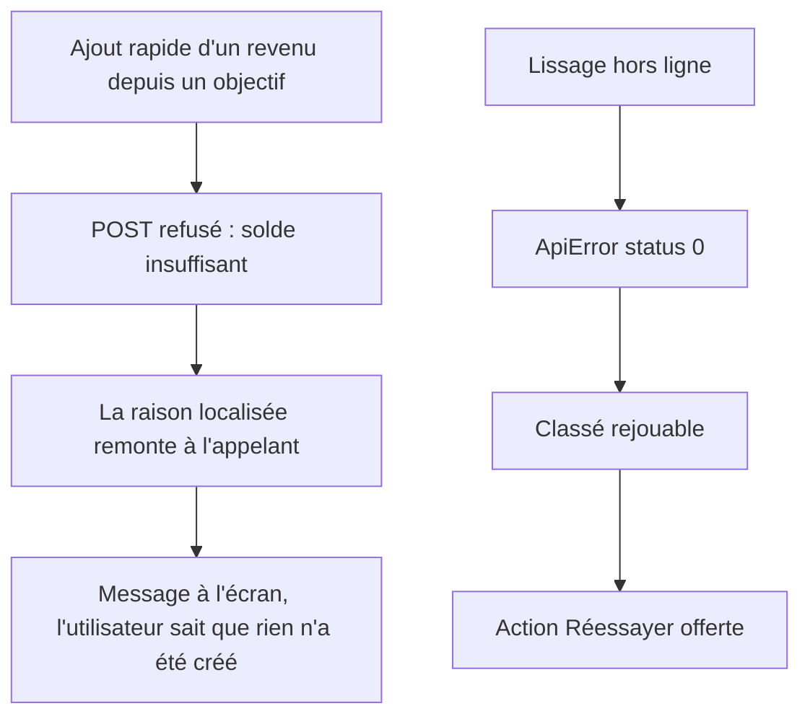

# Instruction: Un refus serveur atteint l'utilisateur

Deux fuites d'échec sur la webapp : le formulaire rapide du tableau de bord avale les refus de retrait, et une coupure réseau est classée définitive alors que c'est le seul cas pour lequel le rejeu a été construit.

## Architecture projection

> Tree of the final files. ✅ create · ✏️ modify · ❌ delete

```txt
frontend/projects/webapp/src/app/feature
├── current-month
│   ├── services/dashboard-store.ts          ✏️ `addTransaction` rend la raison localisée au lieu d'une constante muette
│   ├── services/dashboard-store.spec.ts     ✏️ un refus de retrait ressort de l'appel
│   ├── current-month.ts                     ✏️ l'appelant lit l'issue et la porte à l'écran
│   └── current-month.spec.ts                ✏️ un refus affiche un message, la sheet ne ment plus
└── budget/budget-details/store
    ├── budget-details-store.ts              ✏️ `isRetryableFailure` couvre le transport (`status === 0`)
    └── budget-details-store-integration.spec.ts ✏️ cas `status: 0` à côté des 422 et 503 existants
```

## User Journey



## Tasks to do

### `1)` Reproduire les deux silences

> Les tests d'abord, comme pour tout bug rapporté.

1. Dans le spec du dashboard, refuser un ajout avec un code de retrait (solde insuffisant) et attendre qu'un message atteigne l'écran. Aujourd'hui la constante `'transaction-add-failed'` part dans un signal que rien ne rend.
2. Dans le spec d'intégration de `budget-details-store`, rejouer un échec `status: 0` et attendre `retryable: true`, à côté des cas 422 et 503 déjà couverts.

### `2)` Rendre la raison au lieu de la perdre

> Le contrat existe déjà partout ailleurs dans budget-details : l'aligner ici.

1. Localiser l'erreur dans le `onError` du dashboard via `ApiErrorLocalizer`, comme le fait budget-details, plutôt que d'écrire une constante.
2. Faire remonter cette raison à l'appelant (`addTransaction` rend la raison ou `null`) et l'afficher côté page. Réutiliser le chemin de snackbar déjà en place, ne pas en inventer un second.
3. Vérifier que les trois clés d'erreur de retrait ajoutées à `fr.json` sont bien atteintes — c'est leur seul point d'entrée.
   - Vérification faite : elles ne l'étaient pas. L'édition et la suppression d'une transaction dans `budget-details-store` écrasaient le code serveur par un message passe-partout, alors que ce sont les deux gestes que la phase 1 vient de rouvrir côté serveur. Les deux `fail(...)` passent par `#localizeError`, comme leurs six voisins. La création n'est pas concernée : budget-details ne crée que des transactions ALLOUÉES, et un retrait ne s'alloue jamais.

### `3)` Traiter le transport comme un verdict manquant

> Une requête sans réponse n'est pas un refus.

1. Ajouter `error.status === 0` à `isRetryableFailure`, et garder le commentaire existant à jour : il décrit déjà le comportement voulu.
2. Vérifier que `#logUnexpectedFailure` reprend bien les échecs hors ligne une fois le prédicat élargi.

## Test acceptance criteria

| Task | Acceptance criteria                                                                                                       |
| ---- | ------------------------------------------------------------------------------------------------------------------------- |
| 1    | Les deux tests échouent avant correctif, sur le silence décrit.                                                            |
| 2    | Un retrait refusé depuis l'ajout rapide affiche la raison serveur traduite ; l'utilisateur ne peut plus croire le revenu créé. |
| 3    | Hors ligne, un lissage ou une pioche échoue en proposant « Réessayer » et non « Fermer », et le rejeu réutilise la même clé d'idempotence. |
| 1-3  | `pnpm test` passe dans `frontend`, `pnpm quality` reste vert.                                                              |
