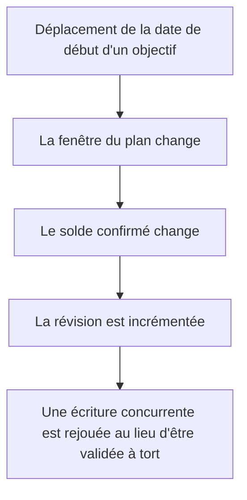

# Instruction: Ce que plus personne ne lit

Du code livré sans lecteur, et un compteur de révision qui ignore un champ capable de déplacer le solde qu'il protège. Rien d'urgent : à faire quand les quatre phases précédentes sont vertes.

## Architecture projection

> Tree of the final files. ✅ create · ✏️ modify · ❌ delete

```txt
.
├── shared
│   ├── schemas.ts                                       ✏️ retirer `withdrawn` du contrat de progression
│   └── src/calculators/savings-goal-progress.ts         ✏️ retirer le champ du type et de la valeur rendue
├── backend-nest
│   ├── src/modules/savings-goal/infrastructure/mappers/savings-goal.mapper.spec.ts ✏️ fixtures sans le champ
│   └── supabase/migrations/<horodatage>_bump_savings_goal_revision_on_start_date.sql ✅ nouvelle migration, jamais d'édition d'une existante
└── ios
    ├── Pulpe/Domain/Store/CurrentMonthStore.swift        ✏️ supprimer les six membres orphelins de la refonte home
    └── PulpeTests/Domain/Store/CurrentMonthStoreAlertAndFilterTests.swift ✏️ retirer les cas qui n'appellent que leur propre copie de la règle
```

## User Journey



## Tasks to do

### `1)` Retirer le champ que personne ne décode

> Aucun lecteur web (zéro occurrence), et iOS ne le liste pas dans ses clés de décodage.

1. Supprimer `withdrawn` du schéma partagé, du type du calculateur et de la valeur rendue.
2. Nettoyer les fixtures qui ne le portaient que pour satisfaire le type.
3. Suppression non cassante : le champ a une valeur par défaut, aucun client ne dépend de sa présence. Vérifier que les deux clients construisent bien leur historique depuis l'endpoint dédié aux retraits.

### `2)` Supprimer les membres orphelins du store home

> Huit composants ont disparu à la refonte et ont emporté tous leurs lecteurs.

1. Vérifier une dernière fois l'absence de lecteur en production pour chacun des six membres avant de supprimer.
2. Supprimer les cas de test correspondants : ils réimplémentent le filtre en local et ne couvrent donc rien une fois le membre parti. Garder ce qui est réellement exercé ailleurs.

### `3)` Faire bouger la révision quand la fenêtre bouge

> La date de début décide quelles lignes comptent dans le solde ; elle doit donc incrémenter le compteur qui protège ce solde.

1. Nouvelle migration élargissant la condition du déclencheur existant à la date de début, à côté du montant initial.
2. Régénérer les types après application locale, puis relancer le formatage.
3. Étendre la suite pgTAP existante d'une assertion sur ce champ, dans le style des assertions voisines.

## Test acceptance criteria

| Task | Acceptance criteria                                                                                                    |
| ---- | ------------------------------------------------------------------------------------------------------------------------ |
| 1    | La progression d'un objectif s'affiche à l'identique sur web et iOS après suppression du champ.                          |
| 2    | Le tableau de bord iOS se comporte à l'identique ; aucun symbole supprimé n'a de référence restante.                     |
| 3    | Déplacer la date de début d'un objectif incrémente sa révision ; une écriture concurrente est rejouée au lieu de valider un solde périmé. |
| 1-3  | `pnpm quality`, `bun test` et la suite `PulpeTests` restent verts.                                                        |
